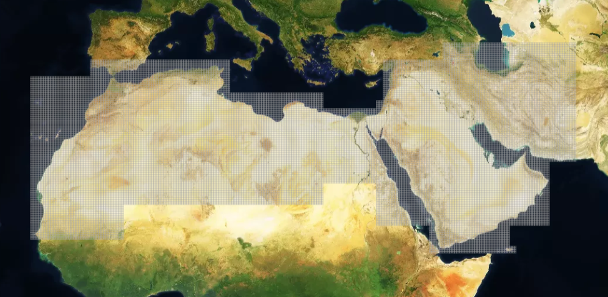
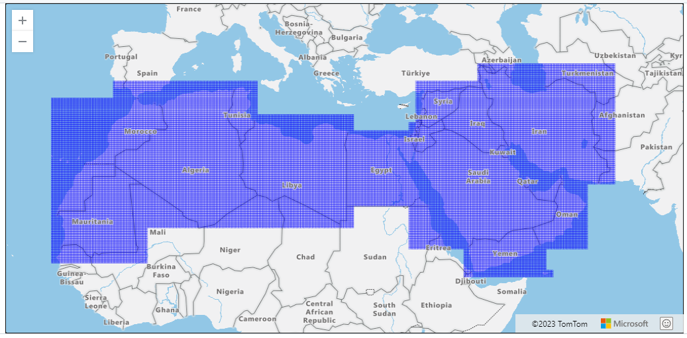
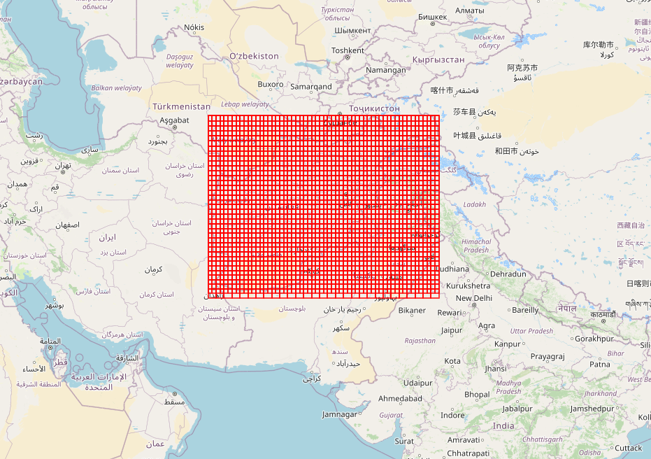

# Features

[Heritage Places](#heritage-places), [Grids](#grids), Built components, etc.

## Heritage Places

### MDS
> Minimum Data Standards. Completness of data

Minimum Data Standards (MDS) of Heritage Places

#### Files

##### Templates

* [mds-template-readonly.tsv](https://github.com/eamena-project/eamena-arches-dev/blob/main/dev/data_quality/mds-template-readonly.tsv):
	- a read-ony TSV file with the list of HP fields with their UUID and a "Yes" mark if these fields belong to the mds. This files results from the automatic export of [mds-template.xlsx](https://github.com/eamena-project/eamena-arches-dev/blob/main/dev/data_quality/mds-template.xlsx), it will be overwrite each time 'mds-template.xlsx' is updated.
* [mds-template.xlsx](https://github.com/eamena-project/eamena-arches-dev/blob/main/dev/data_quality/mds-template.xlsx):
	- an editable XLSX file with the list of HP fields with their UUID and a "Yes" mark if these fields belong to the mds. This file is considered to be the authorative document for mds.

**Level of aggregation**

It means that fields, and field and field values (`level3`) can be aggregated and sum up into broader categories (`level1` and `level2`). 

#### Scripts

* [mds.ipynb](https://github.com/eamena-project/eamena-arches-dev/blob/main/dev/data_quality/mds.ipynb):
	- a Jupyter/Python document to run mds assessement
* [convert_xlsx_to_tsv.py](https://github.com/eamena-project/eamena-arches-dev/blob/main/dev/data_quality/convert_xlsx_to_tsv.py):
	- a Python simple script to convert 'mds-template.xlsx' into 'mds-template-readonly.tsv'. This script is run automatically, in a GitHub Action with [mds-to-tsv.yml](https://github.com/eamena-project/eamena-arches-dev/blob/main/.github/workflows/mds-to-tsv.yml), each time 'mds-template.xlsx' is updated.

  
   
    <em>A screenshot of the editable 'mds-template.xlsx'</em>

#### Interactivity

Check the MDS fields in this HTML circular plot ([here](https://eamena-project.github.io/eamena-arches-dev/www/arches-v7-hp-data-mds-pie.html))

  
   
    <em>A screenshot of the HTML file showing the 98 fields of the Heritage Places with the MDS fields (highlighted)</em>

#### Bulk

[Bulk Upload](https://github.com/eamena-project/eamena-arches-dev/tree/main/data/bulk)

## Grids

~~[Grids](https://github.com/eamena-project/eamena-arches-dev/tree/main/data/grids#grids)~~
[README](https://github.com/eamena-project/eamena-arches-dev/tree/main/data/grids/qdgc_#readme)

### Database

#### Geometries

These grids come from the Grid Square Ressource Model

  
   
    <em>EAMENA v4 grids (in the database)</em>

#### List of grids with 0 HPs and in GE only

* The Google Sheet list of Grids:
  - assessed in EAMENA but having 0 Heritage Places, and
  - managed in Google Earth but not yet uploaded in EAMENA
here: https://docs.google.com/spreadsheets/d/1r2VLLiyJMaCl8l7C4sKilQ4ZMqEfAwhQAwYC7wGzmk0/edit#gid=1376319544

#### List of grids registered in HP

* The CSV list of all the grids registered in the Heritage Places Resource Model is available here: https://github.com/eamena-project/eamena-arches-dev/blob/main/data/grids/data-1688403740400-1.csv

### File

Grids are strored as a GeoJSON file here: https://github.com/eamena-project/eamena-arches-dev/blob/main/data/grids/EAMENA_Grid.geojson

  
   
    <em>EAMENA v4 grids (GeoJSON)</em>

### GIS

#### QGIS project

The QGIS project is here: https://github.com/eamena-project/eamena-arches-dev/blob/main/data/grids/grids_nb_hp.qgz. But you can also use the QGIS project associated with the GeoServer [projet_gesoserver.qgz](https://github.com/eamena-project/eamena-arches-dev/blob/main/gis/qgis/projet_gesoserver.qgz)

  
   
    <em>Number of Heritage Places by EAMENA v4 grids (QGIS)</em>

The SLD file, for the layer style, is here: https://github.com/eamena-project/eamena-arches-dev/blob/main/data/grids/grids_nb_hp_230704.sld

### Create new grids

see the [QDGC folder](https://github.com/eamena-project/eamena-arches-dev/tree/main/data/grids/qdgc_#readme) 

| Name 	| File 	|
|------	|-----	|
|  Afghanistan    	| https://github.com/eamena-project/eamena-arches-dev/blob/main/data/grids/grid_afghanistan.geojson    	|

### Leaflet

Use the R script [eamena-grid.R](https://github.com/eamena-project/eamena-arches-dev/blob/main/data/grids/eamena-grid.R) to create an interactive web map like [this one](https://eamena-project.github.io/eamena-arches-dev/data/grids/grid_afghanistan)

  
   
    <em>New grids for Afghanisthan (here in HTML)</em>

### Spatial

[Spatial](https://github.com/eamena-project/eamena-arches-dev/tree/main/spatial)

