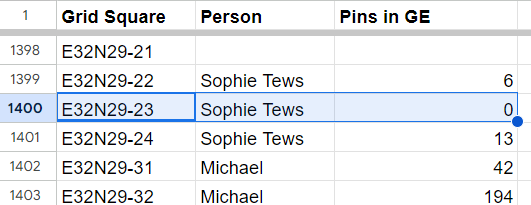

# Features

[Heritage Places](#heritage-places), [Grids](#grids), Built components, etc.

## Heritage Places

### Bulk

[Bulk Upload](https://github.com/eamena-project/eamena-arches-dev/tree/main/data/bulk)


## Grids

~~[Grids](https://github.com/eamena-project/eamena-arches-dev/tree/main/data/grids#grids)~~
[README](https://github.com/eamena-project/eamena-arches-dev/tree/main/data/grids/qdgc_#readme)

### Database

#### Geometries

These grids come from the Grid Square Ressource Model

<p align="center">
  
  <br>
    <em>EAMENA v4 grids (in the database)</em>
</p>

#### List of grids with 0 HPs and in GE only

* The Google Sheet [EAMENA Final Grid Squares](https://docs.google.com/spreadsheets/d/1r2VLLiyJMaCl8l7C4sKilQ4ZMqEfAwhQAwYC7wGzmk0/edit#gid=1376319544) list of Grids:
  - assessed in EAMENA but having 0 Heritage Places, and
  - managed in Google Earth but not yet uploaded in EAMENA

<p align="center">
  
  <br>
    <em>'E32N29-23' grid square has been surveyed but doesn't have any Heritage places</em>
</p>

  
* The Python script [gs_with_0_hp.py](https://github.com/eamena-project/eamena-arches-dev/blob/main/data/gs_with_0_hp.py) parse this Google Sheet and collect all Grid Square having 0 in the column `Pins in GE`. The result is a list that can be used in a GIS to highlight the Grid Squares that have been surveyed but show 0 Heritage Places (n = 210 on the 2023-12-12).

```
Grid Square values where 'Pins in GE' is 0: ['E32N29-23', 'E34N26-12', 'E34N27-32', 'E39N32-21', 'E39N32-33', 'E39N33-11', 'E39N33-12', 'E40N32-13', 'E38N33-24', 'E39N32-11', 'E39N32-12', ..., 'E45N15-33', 'E45N16-11', 'E45N16-13', 'E46N13-24', 'E46N13-33', 'E46N13-44', 'E46N14-41', 'E47N13-41', 'E49N17-34', 'E49N17-41', 'E49N17-43', 'E49N17-44']
```

#### List of grids registered in HP

* The CSV list of all the grids registered in the Heritage Places Resource Model is available. Some have typos.

here: https://github.com/eamena-project/eamena-arches-dev/blob/main/data/grids/data-1688403740400-1.csv

### File

Grids are strored as a GeoJSON file here: https://github.com/eamena-project/eamena-arches-dev/blob/main/data/grids/EAMENA_Grid.geojson

<p align="center">
  
  <br>
    <em>EAMENA v4 grids (GeoJSON)</em>
</p>

### GIS

#### QGIS project

The QGIS project is here: https://github.com/eamena-project/eamena-arches-dev/blob/main/data/grids/grids_nb_hp.qgz. But you can also use the QGIS project associated with the GeoServer [projet_gesoserver.qgz](https://github.com/eamena-project/eamena-arches-dev/blob/main/gis/qgis/projet_gesoserver.qgz)

<p align="center">
  
  <br>
    <em>Number of Heritage Places by EAMENA v4 grids (QGIS)</em>
</p>

The SLD file, for the layer style, is here: https://github.com/eamena-project/eamena-arches-dev/blob/main/data/grids/grids_nb_hp_230704.sld

### Create new grids

see the [QDGC folder](https://github.com/eamena-project/eamena-arches-dev/tree/main/data/grids/qdgc_#readme) 

| Name 	| File 	|
|------	|-----	|
|  Afghanistan    	| https://github.com/eamena-project/eamena-arches-dev/blob/main/data/grids/grid_afghanistan.geojson    	|


### Leaflet

Use the R script [eamena-grid.R](https://github.com/eamena-project/eamena-arches-dev/blob/main/data/grids/eamena-grid.R) to create an interactive web map like [this one](https://eamena-project.github.io/eamena-arches-dev/data/grids/grid_afghanistan)

<p align="center">
  
  <br>
    <em>New grids for Afghanisthan (here in HTML)</em>
</p>

### Spatial

[Spatial](https://github.com/eamena-project/eamena-arches-dev/tree/main/spatial)


