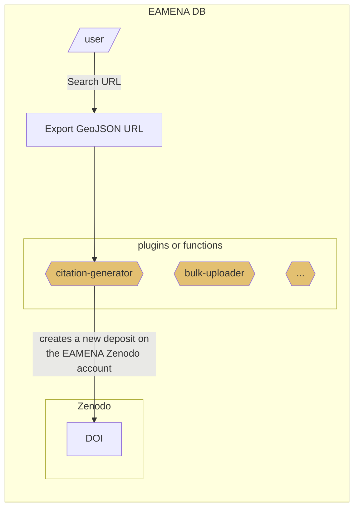

# citation-generator
> "How-to-cite" EAMENA database and datasets, Automate the generation of DOI and bibliographic references for the EAMENA sub-datasets 

Working with a GeoJSON URL only to create GeoJSON data, the user provide a GeoJSON URL ([example](https://github.com/eamena-project/eamena-arches-dev/tree/main/projects/sistan#dataset), [tutorial](https://raw.githubusercontent.com/eamena-project/eamena-arches-dev/main/www/geojson-export.png)).


During this workflow, the GeoJSON is converted into a GeoJSON file, and zipped. The core of the Python `citation-generator` function is currently hosted here: https://github.com/eamena-project/eamena-arches-dev/blob/main/dev/citations/citation-generator.ipynb

## Zenodo

Zenodo will host the data (the GeoJSON file itself) and its [metadata](https://github.com/eamena-project/eamena-arches-dev/blob/main/data/bibref/README.md#metadata)

### Metadata
> proposed metadata schema/layout

Metadata of published dataset could be: [free text](https://github.com/eamena-project/eamena-arches-dev/blob/main/data/bibref/README.md#free-text), [constant values](https://github.com/eamena-project/eamena-arches-dev/blob/main/data/bibref/README.md#constant-values), [calculated values](https://github.com/eamena-project/eamena-arches-dev/blob/main/data/bibref/README.md#calculated-values)

#### Free text

These values have to be entered manually (ie, can not be deduced from the GeoJSON data)

* `title`: *free text*. Name for the dataset (mandatory).
* `description`: *free text*. Dataset description (mandatory).

#### Constant values

These metadata values are always the same (constant):

* `upload_type`: `'dataset'` (constant)
* `creators` (constant):
 ```
'creators': [{'name': "EAMENA database",
			  'affiliation': "University of Oxford, University of Southampton"}]
```
* `license`: `'cc-by'` (constant)
* `grants`: (constant)[^4]
```
'grants': [{'id': '051z6e826::4178'}]
```

##### implicit
> By default on a Zenodo upload

* `access_right`: `open` (constant)


#### Calculated values
> Calculated from the GeoJSON data

These metadata values:

2. are calculated (variable) from the GeoJSON data using [zenodo.py](https://github.com/eamena-project/eamena-functions/blob/main/zenodo/zenodo.py), OR 
3. change, based of previous published dataset (calculated), OR
4. are mixed (mixed): partly constant (constant), partly calculated (calculated) 

* `contributors` (calculated, example)[^6]:
 ```
'contributors': [{'name': "Thomas, Huet",
				  "type": "DataCollector"},
				  {'name': "Ash, Smith",
			  	  "type": "DataCollector"}]
```
* `dates`: creation dates (calculated, example)[^2]
```
'dates': [{'type': 'created', 'start': '2021-08-01', 'end': '2022-05-01'}]
```
* `related_identifiers`:  (mixed)[^3]  

with this constant (constant):
```
[{'relation': 'isDescribedBy', 'identifier':'https://zenodo.org/doi/10.5281/zenodo.10142706'}] 
```
and this calculated value (calculated, example)[^5]:
```
[{'relation': 'isContinuedBy', 'identifier':'a_previously_published_dataset'}] 
```
* `keywords`: (mixed)
`'EAMENA', MaREA` + locations ("Country Type"[^1]) + periods ("Cultural Period Type[^1]")


## TODO


| Zenodo field | Description |
|------|-------------|
| `contributors` | add keys `affiliation`, `orcid` |


[^2]: the min and max of the EAMENA field "Assessment Activity Date"
[^1]: All unique values from this EAMENA field. For example in a given GeoJSON export, the EAMENA field "Country Type" gathers these values: "Iran (Islamic Republic of)", "Afghanistan", "Islamic (Iran)"
[^3]: constant: `isDescribedBy`: `https://zenodo.org/doi/10.5281/zenodo.10142706` is the Zenodo GitHub release of the refrence data (resource models, etc.) and calculated: `isContinuedBy` : the DOI of already published datasets
[^4]: this is the ID of 'Arcadia fund, num 4178'
[^5]: assuming that all dataset will be stored on Zenodo, we can use the Zenodo API to collect DOI of already published datasets, see: https://developers.zenodo.org/#oai-pmh
[^6]: `name` is calculated, `type` is constant (`DataCollector`)