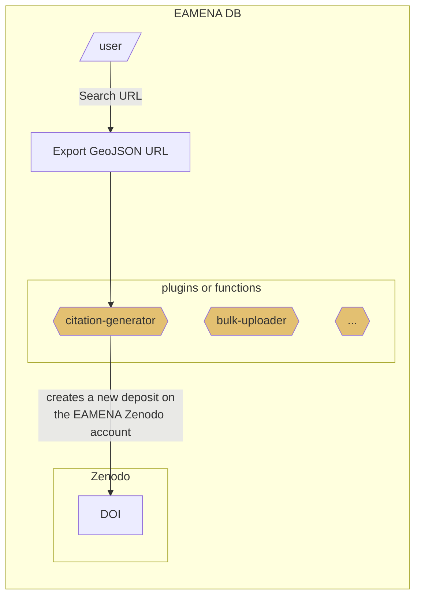

# citation-generator
> "How-to-cite" EAMENA database and datasets, Automate the generation of DOI and bibliographic references for the EAMENA sub-datasets 

Working with a GeoJSON URL only to create GeoJSON data
  

  

## Workflow

An user provide a GeoJSON URL ([example](https://github.com/eamena-project/eamena-arches-dev/tree/main/projects/sistan#dataset)).



The core of the Python `citation-generator` function is currently hosted here: https://github.com/eamena-project/eamena-arches-dev/blob/main/dev/citations/citation-generator.ipynb

## Zenodo

[OAI-PMH compliant](https://developers.zenodo.org/#oai-pmh)

### Metadata
> proposed metadata

#### Free text

These values have to be entered manually (ie, can not be deduced from the GeoJSON data)

* `title`: *free text*. Name for the dataset (mandatory).
* `description`: *free text*. Dataset description (mandatory).

#### Calculted from the GeoJSON data

* `upload_type`: `'dataset'` (always)
* `creators` (always):
 ```
'creators': [{'name': "EAMENA database",
			  'affiliation': "University of Oxford, University of Southampton"}]
```
* `contributors` (example):
 ```
'contributors': [{'name': "Thomas, Huet",
				  "type": "DataCollector"},
				  {'name': "Ash, Smith",
			  	  "type": "DataCollector"}]
```
* `license`: `'cc-by'` (always)
* `dates`: creation dates[^2]
```
'dates': [{'type': 'created', 'start': '2021-08-01', 'end': '2022-05-01'}],
```
* `grants`: (always, = Arcadia fund, num 4178)
```
'grants': [{'id': '051z6e826::4178'}],
```
* `keywords`: `'EAMENA', MaREA` + locations ("Country Type"[^1]) + periods ("Cultural Period Type[^1]")


#### others or by default

* `access_right`: 'open' (other options in the [documentation](https://help.zenodo.org/docs/about/whats-changed/#deposit-access))


## TODO


| Zenodo field | Description |
|------|-------------|
| `contributors` | add keys `affiliation`, `orcid` |


[^2]: the min and max of the EAMENA field "Assessment Activity Date"
[^1]: All unique values from this EAMENA field. For example in a given GeoJSON export, the EAMENA field "Country Type" gathers these values: "Iran (Islamic Republic of)", "Afghanistan", "Islamic (Iran)"