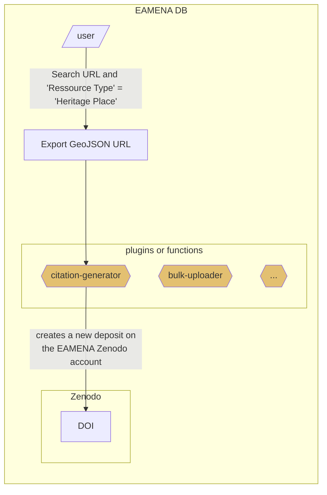

# citation-generator
> "How-to-cite" EAMENA database and datasets, Automate the generation of DOI and bibliographic references for the EAMENA sub-datasets 

Working with a GeoJSON URL only to create GeoJSON data, the user provide a GeoJSON URL ([search and GeoJSON URL examples](https://github.com/eamena-project/eamena-arches-dev/tree/main/projects/sistan#dataset), [how to export as GeoJSON](https://raw.githubusercontent.com/eamena-project/eamena-arches-dev/main/www/arches-v7-search-resource-type.png)).


During this workflow, the GeoJSON is converted into a GeoJSON file, and zipped, uploaded to Zenodo with its metadata. The core of the Python `citation-generator` function is currently hosted on Google Colab [here](https://github.com/eamena-project/eamena-arches-dev/blob/main/dev/citations/citation-generator.ipynb)

## Zenodo

Zenodo will host the data (the GeoJSON file itself) and its [metadata](https://github.com/eamena-project/eamena-arches-dev/blob/main/data/bibref/README.md#metadata) under the EAMENA database community ['eamena'](https://zenodo.org/communities/eamena). See for example the GitHub release of Ressource Models and collections ([here](https://zenodo.org/records/10142707))

### Metadata
> proposed metadata schema/layout

Metadata of published dataset could be: [free text](https://github.com/eamena-project/eamena-arches-dev/blob/main/data/bibref/README.md#free-text), [constant values](https://github.com/eamena-project/eamena-arches-dev/blob/main/data/bibref/README.md#constant-values), [calculated values](https://github.com/eamena-project/eamena-arches-dev/blob/main/data/bibref/README.md#calculated-values)

ℹ️ see the [list of Zenodo metadata](https://developers.zenodo.org/#depositions) 

#### Free text

These metadata values have to be entered manually (ie, can not be deduced from the GeoJSON data)

* `title`: *free text*. Name for the dataset (mandatory).
* `description`: *free text*. Dataset description (mandatory).

#### Constant values

These metadata values are always the same (constant):

* `'communities'`: `[{'identifier': 'eamena'}]`,
* `upload_type`: `'dataset'`
* `creators`:
 ```
'creators': [{'name': "EAMENA database",
			  'affiliation': "University of Oxford, University of Southampton"}]
```
* `license`: `'cc-by'`
* `grants`: this is the ID of 'Arcadia fund, num 4178'
```
'grants': [{'id': '051z6e826::4178'}]
```
* `subjects`:
```
[{"term": "Cultural property", "identifier": "https://id.loc.gov/authorities/subjects/sh97000183.html", "scheme": "url"}]
```
* `method`: `'EAMENA data entry methodology'`


##### implicit
> By default on a Zenodo upload

* `access_right`: `open`


#### Calculated values
> Calculated from the GeoJSON data

These metadata values:

1. are calculated (variable) from the GeoJSON data using [zenodo.py](https://github.com/eamena-project/eamena-functions/blob/main/zenodo/zenodo.py), OR 
2. change, based of previous published dataset (calculated), OR
3. are mixed (mixed): partly constant (constant), partly calculated (calculated) 

* `contributors` (mixed, example)[^6]:
 ```
'contributors': [{'name': "Thomas, Huet",
				  "type": "DataCollector"},
				  {'name': "Ash, Smith",
			  	  "type": "DataCollector"}]
```
* `dates`: creation dates (mixed), a list
with this constant keys/values:
```
'dates': {'type': 'Collected', 'description': 'Data creation and curation'}
```
with this calculated keys/values (example)[^2]:
```
'dates': {'start': '2021-08-01', 'end': '2022-05-01'}
```
result (example):
'dates': [{'start': '2021-08-01', 'end': '2022-05-01', 'type': 'Collected', 'description': 'Data creation and curation'}]

* `related_identifiers`:  (mixed) 

with this constant (constant)[^3]:
```
[{'relation': 'isDescribedBy', 'identifier':'https://zenodo.org/doi/10.5281/zenodo.10142706'}] 
```
and this calculated value (calculated, example)[^5]:
```
[{'relation': 'isContinuedBy', 'identifier':'a_previously_published_dataset'}] 
```
result (example):
```
[
	{'relation': 'isDescribedBy', 'identifier':'https://zenodo.org/doi/10.5281/zenodo.10142706'}, 
	{'relation': 'isContinuedBy', 'identifier':'a_previously_published_dataset'}
] 
```
* `keywords`: (mixed)
`'EAMENA', MaREA` + locations ("Country Type"[^1]) + periods ("Cultural Period Type[^1]")


## TODO
> Optional?

| Zenodo field | Description |
|------|-------------|
| `contributors` | add keys `affiliation`, `orcid` |
| `references` | add list of references, for ex: `["Doe J (2014). Title. Publisher. DOI", "Smith J (2014). Title. Publisher. DOI"]` |
| `communities` | maybe Arches-based projects |
| `locations` | mproblem, only accept point positions (not MBR)|


[^2]: the min and max of the EAMENA field "Assessment Activity Date"
[^1]: All unique values from this EAMENA field. For example in a given GeoJSON export, the EAMENA field "Country Type" gathers these values: "Iran (Islamic Republic of)", "Afghanistan", "Islamic (Iran)"
[^3]: constant: `isDescribedBy`: `https://zenodo.org/doi/10.5281/zenodo.10142706` refers to the Zenodo GitHub release of the refrence data (resource models, etc.), see: https://zenodo.org/doi/10.5281/zenodo.10142706
[^5]: calculated: `isContinuedBy` : the DOI of already published datasets. Assuming that all dataset will be stored on Zenodo, we can use the Zenodo API to collect DOI of already published datasets, see: https://developers.zenodo.org/#oai-pmh
[^6]: `name` is calculated, `type` is constant (`DataCollector`)