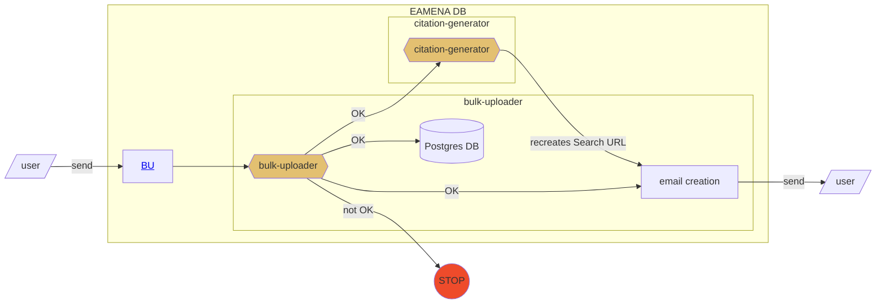
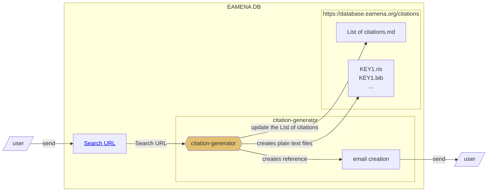
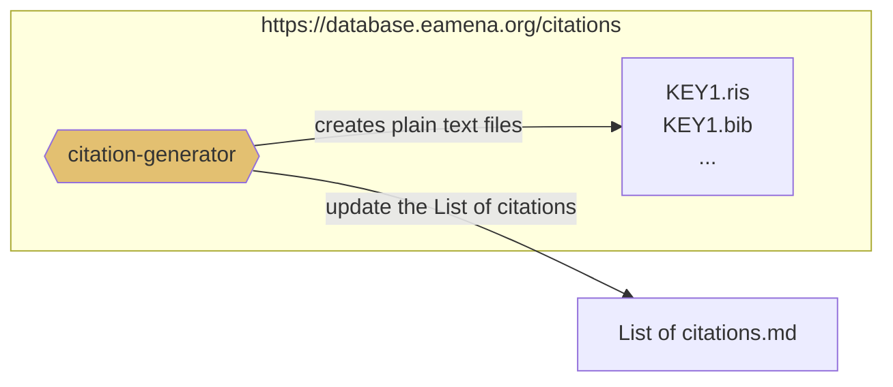

# How-to-cite EAMENA database and datasets

To reference a dataset, we are using this type of mention: 

- Contributor, A. (2023), 'KEY',  in *University of Oxford, University of Southampton EAMENA Database*. Retrieved from www.https://database.eamena.org (Accessed: 2023-06-01)

Where 'KEY' is a unique identifier which refers to a Search URL (see [List of citations](https://github.com/eamena-project/eamena-arches-dev/tree/main/data/bibref#list-of-citations))

## citation-generator

`citation-generator` will be a Python function

|   	| input	|  output 	|
|---	|---	|---	|
| [Data entry](https://github.com/eamena-project/eamena-arches-dev/tree/main/data/bibref#data-entry) 		|  BU	|   Search URL	|
| [Data output](https://github.com/eamena-project/eamena-arches-dev/tree/main/data/bibref#data-output)		|  Search URL 	|   Bibliographical references	|

The function will have an API (like the bulk-uploader) allowing users to access it directly
### Data entry

An user uploads a BU to EAMENA. He will recieved an email with the URL (search URL) referencing his/her dataset

### Data output

An user export data. He/she has to copy the URL (search URL) and paste the URL to `citation-generator`

#### https://database.eamena.org/citations

A folder, or a website, hosted on EAMENA AWS

#### List of citations

Exposed on GitHub. For example

|  **id** 	| **complete citation**	|  **citation downloads** 	|  **search URL** | 
|---	|---	|---	|---	|
| KEY1 	| Contributor, A. (2023), KEY1,  in *University of Oxford, University of Southampton EAMENA Database*. Retrieved from https:/database.eamena.org (Accessed: 2023-06-01)| [.ris](https://github.com/eamena-project/eamena-arches-dev/blob/main/data/bibref/citations/KEY1.ris), [.bib](https://github.com/eamena-project/eamena-arches-dev/blob/main/data/bibref/citations/KEY1.bib)  	| https://tinyurl.com/eamena-0001|  
|  KEY2	|   ...	| ...  	|  ... 	|

Where:

* **id**: unique identifier
* **complete citation**: APA-like citation
* **citation downloads**: links to downloadable .bib and .ris formats. These files are produced on-the-fly.
* **search url**: the shortened URL (here a 'tinyurl' one). The complete URL is listed in [this dataframe](https://github.com/eamena-project/eamena-arches-dev/blob/main/data/bibref/urls/urls.tsv). Shortening URL will be a service hosted locally (see IT solutions [here](https://github.com/awesome-selfhosted/awesome-selfhosted#url-shorteners))

## Glossary

- `data paper route`: a publication, upstream, of the dataset as a data paper
- `Search URL`: the URL of a search in EAMENA
- `Shared Dataset`: For example, how all the data from Nichole's and Jennie’s PhD theses were credited