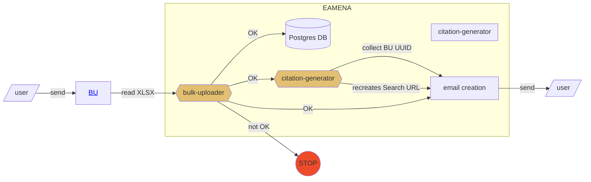
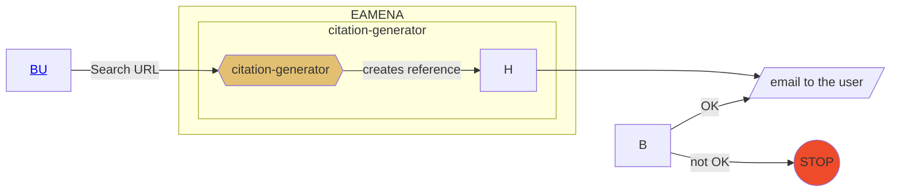

# How-to-cite EAMENA database and datasets

## Data entry

### Bulk-Upload process

Upload your BU to EAMENA

## Data output

When an user do an export, he/she has to copy the URL and send the URL to `citation-generator`

## Glossary

- `cff`: https://citation-file-format.github.io/

- `data paper route`: a publication, upstream, of the dataset as a data paper

- `Shared Dataset`: For example, how all the data from Nichole's and Jennie’s PhD theses were credited