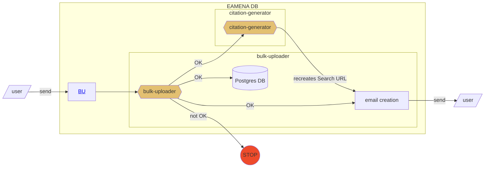
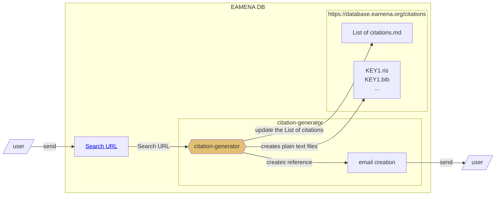
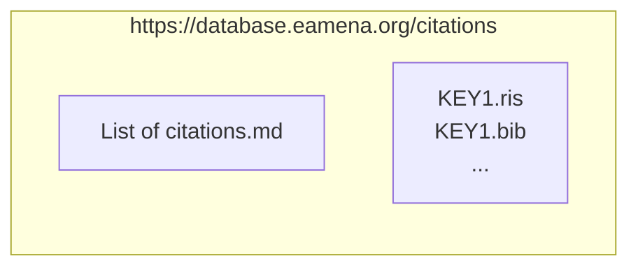

# "How-to-cite" EAMENA database and data

Objective: to make the EAMENA database and its specific datasets citable.
## citation-generator

`citation-generator` will be a function working with EAMENA resources (HP, IR, etc.), Search URL and bbibliographical references.

|   	| input	|  output 	|
|---	|---	|---	|
| [Data entry](https://github.com/eamena-project/eamena-arches-dev/tree/main/data/bibref#data-entry) 		|  BU	|   Search URL	|
| [Data output](https://github.com/eamena-project/eamena-arches-dev/tree/main/data/bibref#data-output)		|  Search URL 	|   Bibliographical references	|

The `citation-generator` Python function will have an API (like the bulk-uploader) enabling users to access it directly.

### Data entry

An user uploads a BU to EAMENA. He will recieved an email with the URL (search URL) referencing his/her dataset



### Data output

An user export data. He/she has to copy the URL (search URL) and paste the URL to the `citation-generator` API



#### `https://database.eamena.org/citations`

`https://database.eamena.org/citations` will be folder, or a website, hosted on EAMENA AWS, hosting a [List of citations](https://github.com/eamena-project/eamena-arches-dev/tree/main/data/bibref#list-of-citations) and several individual reference bibliographic files (.bib, .ris) 



#### List of citations

Exposed on GitHub. For example

|  **id** 	| **complete citation**	|  **citation downloads** 	|  **search URL** | 
|---	|---	|---	|---	|
| KEY1 	| Contributor, A. (2023), KEY1,  in *University of Oxford, University of Southampton EAMENA Database*. Retrieved from https:/database.eamena.org (Accessed: 2023-06-01)| [.ris](https://github.com/eamena-project/eamena-arches-dev/blob/main/data/bibref/citations/KEY1.ris), [.bib](https://github.com/eamena-project/eamena-arches-dev/blob/main/data/bibref/citations/KEY1.bib)  	| https://tinyurl.com/eamena-0001|  
|  KEY2	|   ...	| ...  	|  ... 	|


Where:

* **id**: unique identifier, which refers to a Search URL (see [List of citations](https://github.com/eamena-project/eamena-arches-dev/tree/main/data/bibref#list-of-citations)). For example: `eamena-dataset-1`, `eamena-dataset-2`, ...

* **complete citation**: APA-like citation
	- Contributor, A. (2023), 'KEY',  in *University of Oxford, University of Southampton EAMENA Database*. Retrieved from www.https://database.eamena.org (Accessed: 2023-06-01)

* **citation downloads**: links to downloadable .bib and .ris formats. One by entry. These files are produced on-the-fly.
* **search url**: the shortened URL (here a 'tinyurl' one). The complete URL is listed in [this dataframe](https://github.com/eamena-project/eamena-arches-dev/blob/main/data/bibref/urls/urls.tsv). Shortening URL will be a service hosted locally (see IT solutions [here](https://github.com/awesome-selfhosted/awesome-selfhosted#url-shorteners))

## API

Retrieve the results by changing the Search URL

```
https://database.eamena.org/search?paging-filter=1&tiles=true&format=tilecsv&reportlink=false&precision=6&total=1146&advanced-search=%5B%7B%22op%22%3A%22and%22%2C%2234cfea44-c2c0-11ea-9026-02e7594ce0a0%22%3A%7B%22op%22%3A%22%22%2C%22val%22%3A%22%22%7D%2C%2234cfea58-c2c0-11ea-9026-02e7594ce0a0%22%3A%7B%22op%22%3A%22%22%2C%22val%22%3A%223f6fc20d-c2a8-4291-b536-046a034e0be9%22%7D%7D%2C%7B%22op%22%3A%22and%22%2C%2234cfea43-c2c0-11ea-9026-02e7594ce0a0%22%3A%7B%22op%22%3A%22%22%2C%22val%22%3A%22c08b6e33-a244-415b-8bb1-b1f0949fc581%22%7D%2C%2234cfea5d-c2c0-11ea-9026-02e7594ce0a0%22%3A%7B%22op%22%3A%22%22%2C%22val%22%3A%22%22%7D%2C%2234cfea69-c2c0-11ea-9026-02e7594ce0a0%22%3A%7B%22op%22%3A%22%22%2C%22val%22%3A%22%22%7D%2C%2234cfea95-c2c0-11ea-9026-02e7594ce0a0%22%3A%7B%22op%22%3A%22~%22%2C%22lang%22%3A%22en%22%2C%22val%22%3A%22%22%7D%2C%2234cfea73-c2c0-11ea-9026-02e7594ce0a0%22%3A%7B%22op%22%3A%22%22%2C%22val%22%3A%22%22%7D%7D%5D
```

to:

```
https://database.eamena.org/api/search/export_results?paging-filter=1&tiles=true&format=geojson&reportlink=false&precision=6&total=1146&advanced-search=%5B%7B%22op%22%3A%22and%22%2C%2234cfea44-c2c0-11ea-9026-02e7594ce0a0%22%3A%7B%22op%22%3A%22%22%2C%22val%22%3A%22%22%7D%2C%2234cfea58-c2c0-11ea-9026-02e7594ce0a0%22%3A%7B%22op%22%3A%22%22%2C%22val%22%3A%223f6fc20d-c2a8-4291-b536-046a034e0be9%22%7D%7D%2C%7B%22op%22%3A%22and%22%2C%2234cfea43-c2c0-11ea-9026-02e7594ce0a0%22%3A%7B%22op%22%3A%22%22%2C%22val%22%3A%22c08b6e33-a244-415b-8bb1-b1f0949fc581%22%7D%2C%2234cfea5d-c2c0-11ea-9026-02e7594ce0a0%22%3A%7B%22op%22%3A%22%22%2C%22val%22%3A%22%22%7D%2C%2234cfea69-c2c0-11ea-9026-02e7594ce0a0%22%3A%7B%22op%22%3A%22%22%2C%22val%22%3A%22%22%7D%2C%2234cfea95-c2c0-11ea-9026-02e7594ce0a0%22%3A%7B%22op%22%3A%22~%22%2C%22lang%22%3A%22en%22%2C%22val%22%3A%22%22%7D%2C%2234cfea73-c2c0-11ea-9026-02e7594ce0a0%22%3A%7B%22op%22%3A%22%22%2C%22val%22%3A%22%22%7D%7D%5D
```

## Glossary

- `data paper route`: a publication, upstream, of the dataset as a data paper
- `Search URL`: the URL of a search in EAMENA
- `Shared Dataset`: For example, how all the data from Nichole's and Jennie’s PhD theses were credited