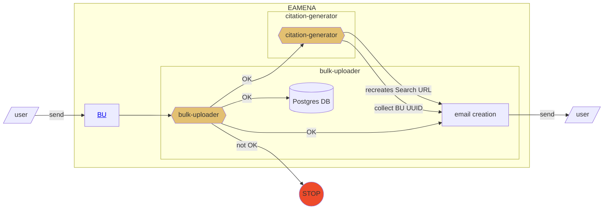
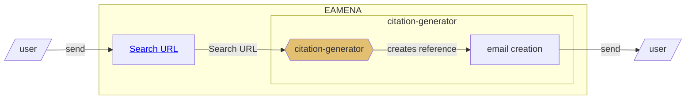

# How-to-cite EAMENA database and datasets

To reference a dataset, we are using this type of mention: 

- Contributor, A. (2023), 'KEY',  in *University of Oxford, University of Southampton EAMENA Database*. Retrieved from www.https://database.eamena.org (Accessed: 2023-06-01)

Where 'KEY' is a unique identifier which refers to a Search URL (see [List of citations](https://github.com/eamena-project/eamena-arches-dev/tree/main/data/bibref#list-of-citations))
## Data entry

Upload your BU to EAMENA

## Data output

When an user do an export, he/she has to copy the URL and send the URL to `citation-generator`

## List of citations

Exposed on GitHub. For example

|  id 	| complete citation 	|  citation downloads 	|  Search URL | 
|---	|---	|---	|---	|
| KEY1 	| Contributor, A. (2023), KEY1,  in *University of Oxford, University of Southampton EAMENA Database*. Retrieved from www.https://database.eamena.org (Accessed: 2023-06-01)| [.ris](https://github.com/eamena-project/eamena-arches-dev/blob/main/data/bibref/citations/KEY1.ris), [.bib](https://github.com/eamena-project/eamena-arches-dev/blob/main/data/bibref/citations/KEY1.bib)  	| https://database.eamena.org/search?paging-filter=1&tiles=true&format=tilecsv&reportlink=false&precision=6&total=1146&advanced-search=%5B%7B%22op%22%3A%22and%22%2C%2234cfea44-c2c0-11ea-9026-02e7594ce0a0%22%3A%7B%22op%22%3A%22%22%2C%22val%22%3A%22%22%7D%2C%2234cfea58-c2c0-11ea-9026-02e7594ce0a0%22%3A%7B%22op%22%3A%22%22%2C%22val%22%3A%223f6fc20d-c2a8-4291-b536-046a034e0be9%22%7D%7D%2C%7B%22op%22%3A%22and%22%2C%2234cfea43-c2c0-11ea-9026-02e7594ce0a0%22%3A%7B%22op%22%3A%22%22%2C%22val%22%3A%22c08b6e33-a244-415b-8bb1-b1f0949fc581%22%7D%2C%2234cfea5d-c2c0-11ea-9026-02e7594ce0a0%22%3A%7B%22op%22%3A%22%22%2C%22val%22%3A%22%22%7D%2C%2234cfea69-c2c0-11ea-9026-02e7594ce0a0%22%3A%7B%22op%22%3A%22%22%2C%22val%22%3A%22%22%7D%2C%2234cfea95-c2c0-11ea-9026-02e7594ce0a0%22%3A%7B%22op%22%3A%22~%22%2C%22lang%22%3A%22en%22%2C%22val%22%3A%22%22%7D%2C%2234cfea73-c2c0-11ea-9026-02e7594ce0a0%22%3A%7B%22op%22%3A%22%22%2C%22val%22%3A%22%22%7D%7D%5D|  
|  KEY2	|   ...	| ...  	|  ... 	|

## Glossary

- `data paper route`: a publication, upstream, of the dataset as a data paper
- `Search URL`: the URL of a search in EAMENA
- `Shared Dataset`: For example, how all the data from Nichole's and Jennie’s PhD theses were credited