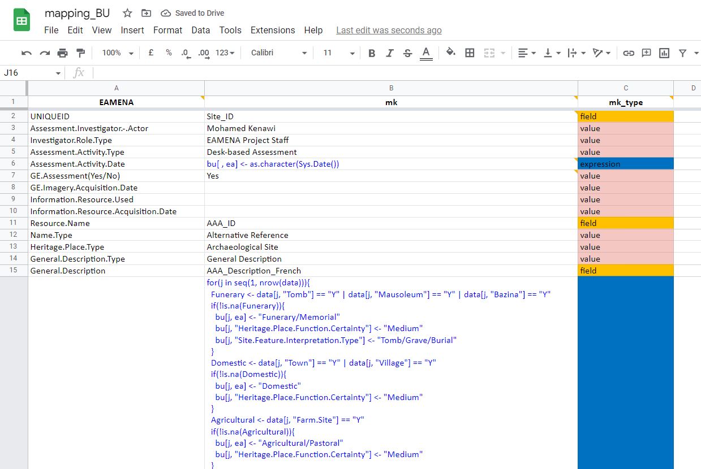
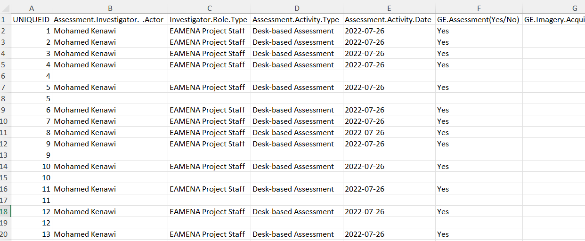

# Bulk Upload (BU)  

A Bulk Upload is a process allowing to upload **several XLSX files contained in a single folder**

  
   
    <em>The folder `2021-11-22-B-BIJAN` contains two XLSX files</em>

## BU file

The updated version of the BU file is shared on Google Drive:  
  

https://database.eamena.org/en/bulk-upload/templates/34cfe98e-c2c0-11ea-9026-02e7594ce0a0.xlsx
<s>https://drive.google.com/file/d/1KtZlCB_mdTOPxh1DpFdfeXddjJLTvF1k/view?usp=sharing</s>

## Data mapping
> Mapping a dataset (the source file) to the EAMENA BU (the taget file)

Reformat data from a source file, using an [R script](https://github.com/eamena-oxford/eamena-arches-dev/blob/main/data/bulk/functions/mapping_BU.R), and a mapping file

  
   
    <em>screenshot of Google sheet mapping file</em>

### Mapping file

The 'mapping_BU' online Google sheet establishes the correspondences between the source file and the BU. 
  

https://docs.google.com/spreadsheets/d/1nXgz98mGOySgc0Q2zIeT1RvHGNl4WRq1Fp9m5qB8g8k/edit?usp=sharing

  
This mapping file has three columns, one for the target (EAMENA BU template), two for the source (author's data):

1. EAMENA: names of the fields in the EAMENA BU spreadsheet in R format (spaces replaced by dots). Empty cells correspond to expressions that are not directly linked to an EAMENA field.
2. initials: or job, two letters for the initial of the author (e.g. 'mk' = Mohamed Kenawi)
3. initials_type: the type of action to perform on the source data (e.g. 'mk_type'). This can be: repeat a single value for the whole BU ('value'), get the different values of a source field and add these different values in a BU field ('field'), execute an R code ('expression'), etc.

The EAMENA column will always be the same, but the mapping file aims to have several authors columns. 

### Dataset

The source file, or original dataset, is assumed to be an XLSX file but it is possible to work with a SHP, or any other suitable format.

### Output

Export a new BU worksheet. 

  
   
    <em>screenshot of the output BU</em>

The data from this new worksheet can be copied/pasted into a [BU template](https://github.com/eamena-oxford/eamena-arches-dev/tree/main/data/bulk/templates) to retrieve the drop down menus and 3-line headers. Once done, the BU can be sent to EAMENA.

  
   
    <em>screenshot of the output BU once copied/pasted into the template</em>

  
## BU process
> step-by-step BU procedure from the user-side

Start by creating a root `examples/` folder on **your OneDrive**, or equivalent, create and authorise the DB Manager to write only in this folder. See the 'ideal' file/folder naming/structure on the [examples/](https://github.com/eamena-oxford/eamena-arches-dev/tree/main/output/bulk/examples) folder. 

1. choose short and self-explanatory names for your **XLSX file(s)**, like the format *`GridSquare-GridSquareSubpart-YourName`* (ex: `E61N31-23-Bijan.xlsx`), avoiding dots and spaces in the filename (~~`E61 N31 23.Bijan.xlsx`~~) 

2. add the BUs worksheets in a **folder** named *`YYYY-MM-DD-YourName`* (ex: `2021-11-23-Bijan`). If you run various BUs processes during the same day, you will have to name your folders with different suffixes (ex: Bulk 1: `2021-11-22-Bijan`; Bulk 2: `2021-11-22a-Bijan`)

3. add your BU folders in the root root `examples/` folder. Send a **Slack message** (eamena.slack.com) to the DB Manager with the **link to the folder(s)** 

:-1: if **the BU doesn't work**, because of errors, the DB Manager will send you an **error report** in the form of an error JSON file named in the same way as your BU files (ex: [`E61N31-22-Bijan.json`](https://github.com/eamena-oxford/eamena-arches-dev/blob/main/output/bulk/examples/2021-11-21-Bijan/E61N31-21-Bijan.json))
  - follow the recommendations of the error JSON file, correcting the content of your file. Once done, change the name of your file to something explicit, e.g. adding the suffix `-rev` (for `revised`) at the end of the file name (ex: `E61N31-22-Bijan.xlsx` -> `E61N31-22-Bijan-rev.xlsx`)

:+1: if **the BU works**, the DB Manager will send you a **confirmation** that your BU has been uploaded, and the JSON output will be uploaded into the **same OneDrive folder** as your BUs worksheets 
  - if you ask to, the DB Manager will send you a [BU summary](https://github.com/eamena-oxford/eamena-arches-dev/blob/main/output/bulk/BU.md#bu-summary) in the form of a JSON file named in the same way as your BU files with the suffix `-sum` (for `summary`), ex: [`E61N31-22-Bijan-rev-sum.json`](https://github.com/eamena-oxford/eamena-arches-dev/blob/main/output/bulk/examples/2021-11-21-Bijan/E61N31-21-Bijan-rev-sum.json)

4. once you received the confirmation that your BU has been uploaded into the DB, **move your BU folder into an archive folder** 

## BU summary
> After a successfull BU, render a short summary for the user

Once the BU process has been completed, a resume can be displayed with a Python command[^1]. The result is copied/pasted in a JSON file. A Search &Replace allows to convert the UUID into an URL[^2]

  
   
    <em>screenshot of the JSON with URL</em>

The URL opens the Resource Report

  
   
    <em>screenshot of the Resource Report</em>

The Resource name can be search in the map database

  
   
    <em>screenshot of the Resource Report</em>

[^1]: `python /opt/arches/eamena/manage.py bu -o summary -s "filename.json" | json_pp`
[^2]: Search: `"uuid" : "`, Replace by `"uuid" : "https://database.eamena.org/en/report/`
