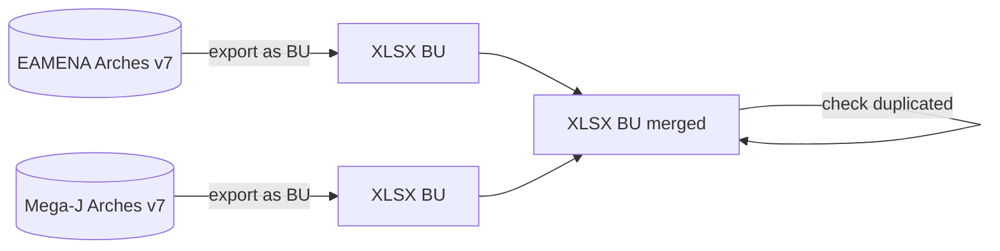
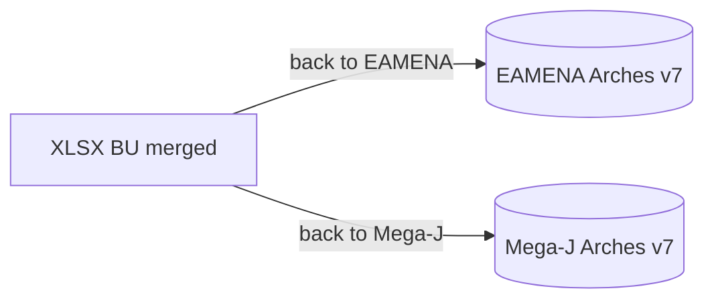

# Bulk Upload (BU)  

Bulk upload is a process for uploading **many XLSX** files containing heritage places (HPs) data into the database without going through the graphical user interface. It speeds up data entry.

  
   
    <em>The folder `2021-11-22-B-BIJAN` contains two XLSX files</em>

## BU template file

The last/updated version of the BU template file is hosted on:  
  

GitHub: https://github.com/eamena-oxford/eamena-arches-dev/blob/main/data/bulk/templates/E61N30-13-Revised.xlsx 
<s>EAMENA DB: https://database.eamena.org/en/bulk-upload/templates/34cfe98e-c2c0-11ea-9026-02e7594ce0a0.xlsx</s> 
<s>Google Drive: https://drive.google.com/file/d/1KtZlCB_mdTOPxh1DpFdfeXddjJLTvF1k/view?usp=sharing</s>

## BU mapping

To recast structured data to a BU format, see the [`eamenaR` R package](https://github.com/eamena-oxford/eamenaR#bu-mapping)

## BU exchange

The objective is to exchange data between EAMENA and national instances BDs (eg: Mega-J once this database has been ported to Arches v7)

## Workflow

The workflow will be to:

In this example, the merged XLSX dataset will be sorted and/or filtered by toponyms, coordinates, or any relevant fields to group rows refering to the same HPs. Then two cases can occur:

1. total matching/perfect duplicates: one of them is removed
2. partial matching: the *n* rows are merged in a single record (ie, with the same UNIQUEID), like this (see ID 5):

| UNIQUEID | Assessment.Investigator.-.Actor | Investigator.Role.Type   | Assessment.Activity.Type | Assessment.Activity.Date | GE.Assessment(Yes/No) | Resource.Name | Name.Type             |
|----------|---------------------------------|--------------------------|--------------------------|--------------------------|-----------------------|---------------|-----------------------|
| ...      | ...                             | ...                      | ...                      | ...                      | ...                   | ...           | ...                   |
| 4        | Mohamed Kenawi                  | EAMENA Project Staff     | Desk-based Assessment    | 2022-10-05               | Yes                   |               |                       |
| 5        | Martin Sterry                   | **MEGA-J Project Staff** |                          | 2028-09-12               |                       | AAA f.37.5    | Alternative Reference |
| 5        | Mohamed Kenawi                  | **EAMENA Project Staff** | Desk-based Assessment    | 2022-10-05               | Yes                   | Metkaouak     | Toponym               |
| ...      | ...                             | ...                      | ...                      | ...                      | ...                   | ...           | ...                   |

Example of a merged XLSX BU resulting from the merge of EAMENA (bolded) and Mega-J (bolded) 

Once done, the merged BU will be returned to the databases.

## ~~BU process~~
> ⚠️ This process is no longer in use ⚠️ ~~step-by-step BU procedure from the user-side~~

Start by creating a root `examples/` folder on **your OneDrive**, or equivalent, create and authorise the DB Manager to write only in this folder. See the 'ideal' file/folder naming/structure on the [examples/](https://github.com/eamena-oxford/eamena-arches-dev/tree/main/output/bulk/examples) folder. 

1. choose short and self-explanatory names for your **XLSX file(s)**, like the format *`GridSquare-GridSquareSubpart-YourName`* (ex: `E61N31-23-Bijan.xlsx`), avoiding dots and spaces in the filename (~~`E61 N31 23.Bijan.xlsx`~~) 

2. add the BUs worksheets in a **folder** named *`YYYY-MM-DD-YourName`* (ex: `2021-11-23-Bijan`). If you run various BUs processes during the same day, you will have to name your folders with different suffixes (ex: Bulk 1: `2021-11-22-Bijan`; Bulk 2: `2021-11-22a-Bijan`)

3. add your BU folders in the root root `examples/` folder. Send a **Slack message** (eamena.slack.com) to the DB Manager with the **link to the folder(s)** 

:-1: if **the BU doesn't work**, because of errors, the DB Manager will send you an **error report** in the form of an error JSON file named in the same way as your BU files (ex: [`E61N31-22-Bijan.json`](https://github.com/eamena-oxford/eamena-arches-dev/blob/main/output/bulk/examples/2021-11-21-Bijan/E61N31-21-Bijan.json))
  - follow the recommendations of the error JSON file, correcting the content of your file. Once done, change the name of your file to something explicit, e.g. adding the suffix `-rev` (for `revised`) at the end of the file name (ex: `E61N31-22-Bijan.xlsx` -> `E61N31-22-Bijan-rev.xlsx`)

:+1: if **the BU works**, the DB Manager will send you a **confirmation** that your BU has been uploaded, and the JSON output will be uploaded into the **same OneDrive folder** as your BUs worksheets 
  - if you ask to, the DB Manager will send you a [BU summary](https://github.com/eamena-oxford/eamena-arches-dev/blob/main/output/bulk/BU.md#bu-summary) in the form of a JSON file named in the same way as your BU files with the suffix `-sum` (for `summary`), ex: [`E61N31-22-Bijan-rev-sum.json`](https://github.com/eamena-oxford/eamena-arches-dev/blob/main/output/bulk/examples/2021-11-21-Bijan/E61N31-21-Bijan-rev-sum.json)

4. once you received the confirmation that your BU has been uploaded into the DB, **move your BU folder into an archive folder** 

## BU summary
> After a successfull BU, render a short summary for the user

Once the BU process has been completed, a resume can be displayed with a Python command[^1]. The result is copied/pasted in a JSON file. A Search &Replace allows to convert the UUID into an URL[^2]

  
   
    <em>screenshot of the JSON with URL</em>

The URL opens the Resource Report

  
   
    <em>screenshot of the Resource Report</em>

The Resource name can be search in the map database

  
   
    <em>screenshot of the Resource Report</em>

[^1]: `python /opt/arches/eamena/manage.py bu -o summary -s "filename.json" | json_pp`
[^2]: Search: `"uuid" : "`, Replace by `"uuid" : "https://database.eamena.org/en/report/`
