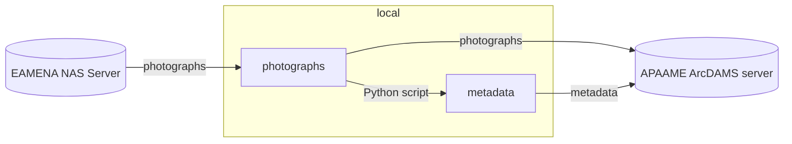

## BU exchange

The objective is to exchange data between EAMENA and national instances BDs (eg: Mega-J once this database has been ported to Arches v7)

```mermaid
flowchart LR
    A[(EAMENA NAS Server)] --photographs--> B[photographs];
    subgraph local
    B --Python script--> C[metadata];
    end
    B --photographs--> D[(APAAME ArcDAMS server)];
    C --metadata--> D[(APAAME ArcDAMS server)]; 
```