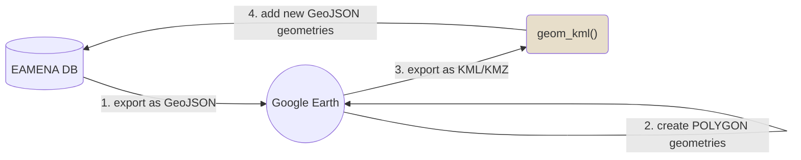

## Integrating Google Earth geometries

Most of the geometries in EAMENA are POINTS (Center Point). The objective is to acquire new geometries created in Google Earth and to add them to already existing records in EAMENA.

[#e7deca](https://via.placeholder.com/150/e7deca/000000?Text=geom_kml.png) geom_kml()

$\colorbox{#e7deca}{{\color{black}{eamenaR functions}}}$: [geom_kml()](https://eamena-oxford.github.io/eamenaR/doc/geojson_kml)

$\colorbox{brown}{{\color{black}{xxx}}}$

-  `#e7deca`  

