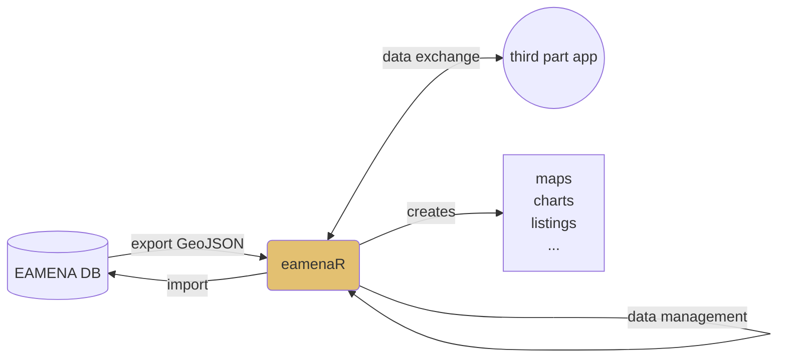

```mermaid
flowchart LR
    A[(EAMENA DB)] --export GeoJSON--> B("eamenaR"):::eamenaRpkg;
    B --data management--> B;
    B <--data exchange--> C((third part app));
    B --import--> A;
    B --creates--> D[maps<br>charts<br>listings<br>...]
    classDef eamenaRpkg fill:#e3c071;
```

