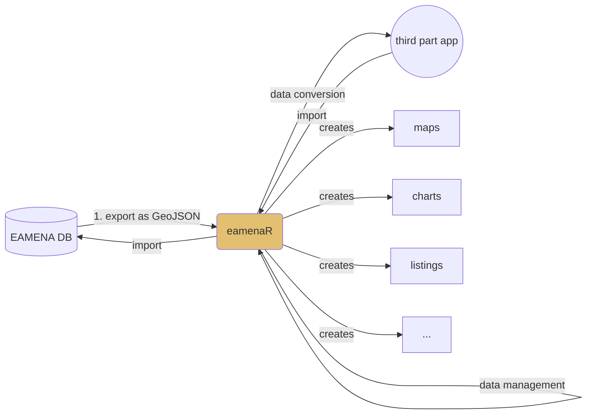

```mermaid
flowchart LR
    A[(EAMENA DB)] --1. export as GeoJSON--> B("eamenaR"):::eamenaRpkg;
    B --data management--> B;
    B --data conversion--> C((third part app));
    C --import--> B;
    B --import--> A;
    B --creates--> D[maps]
    B --creates--> E[charts]
    B --creates--> F[listings]
    B --creates--> G[...]
    classDef eamenaRpkg fill:#e3c071;
```

