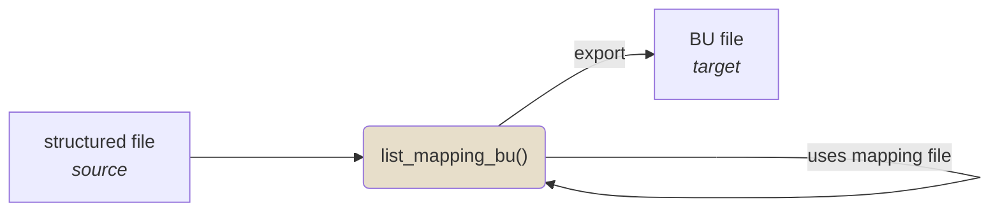

any structured file (source) ➡️ ***eamenaR*** mapping function + mapping file ➡️ bulk upload file (target)


```{mermaid}
flowchart LR
subgraph ide1 [Arches];
A[(EAMENA<br>DB)];
end;
A <--data<br>exchange--> B{{"eamenaR"}}:::eamenaRpkg;
B --data<br>analysis & management--> B;
B <--data<br>exchange--> C((3<sup>rd</sup> part<br>app));
B --"output"--> D[maps<br>charts<br>listings<br>...];
classDef eamenaRpkg fill:#e3c071;
```
