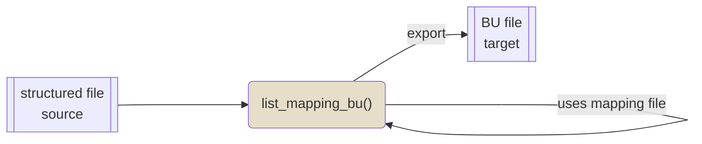

```mermaid
flowchart LR
    A[[structured file<br>source]] ----> B("list_mapping_bu()"):::eamenaRfunction;;
    B --uses mapping file--> B;
    B --export--> C[[BU file<br>target]];
    classDef eamenaRfunction fill:#e7deca;
```

any structured file (source) ➡️ ***eamenaR*** mapping function + mapping file ➡️ bulk upload file (target)
