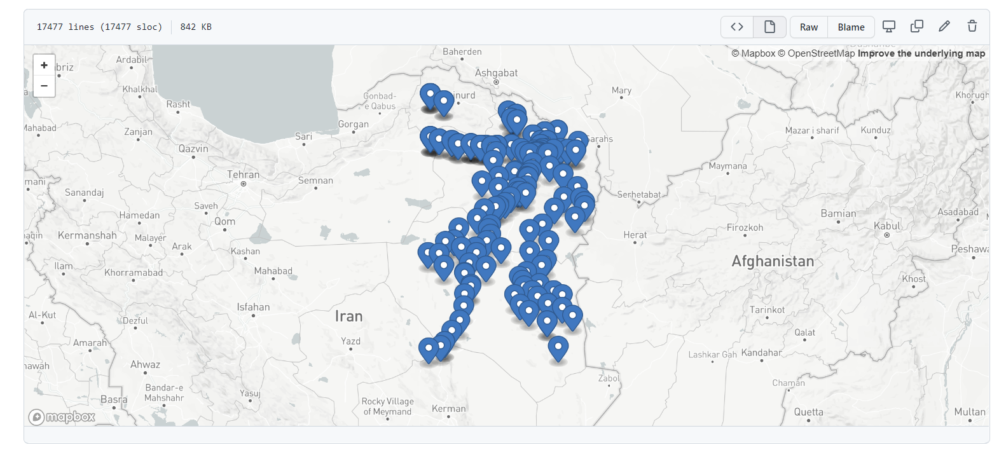

# Visualise the result of a EAMENA search on GitHub

Use [EAMENA](https://database.eamena.org/) to create new resource maps hosted on GitHub.
## Workflow

1. **EAMENA search**  
On EAMENA, search for the resources, select Download and copy the geojson url (in green) to the clipboard.

2. **Get the GeoJSON content**  
Paste the copied URL into the address bar, the result is something like :

3. **Create a new GeoJSON file**  
Copy the GeoJSON content and save it in a new GeoJSON file, for example `caravanserail.geojson`.

4. **Host on GitHub**  
Host this GeoJSON file on GitHub, for example in the `https://github.com/eamena-oxford/eamena-arches-dev/blob/main/data/geojson/` folder.

5. **Visualise the map**  
In your web browser, access the GeoJSON file directly by its URL, for example https://github.com/eamena-oxford/eamena-arches-dev/blob/main/data/geojson/caravanserail.geojson.
  

## Other

### Get GeoJSON geometries

Go to https://geojson.io/, use the geocoder, draw a POINT, LINE or a POLYGON, copy the JSON geometry (GeoJSON) (in green) and paste it into a new `.geosjon` file

