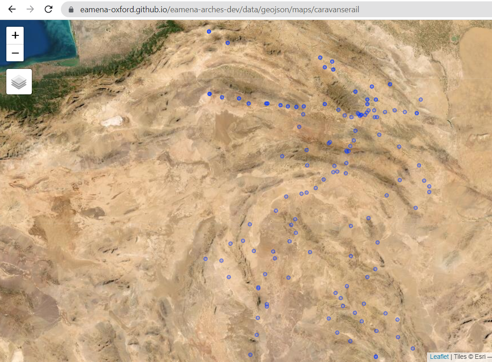

# Visualise an EAMENA search result on GitHub

Use [EAMENA](https://database.eamena.org/) to create new resource maps hosted on GitHub and [shine a light on your work](https://github.com/eamena-oxford/reveal.js#shine-a-light-on-your-work)
## Simple GeoJSON Workflow

1. **EAMENA search**  
On EAMENA, search for the resources, select Download and copy the geojson url (in green) to the clipboard.


2. Send this URL to @EMANEA or follow with 3.

3. Createa GeoJSON file

    3.1. **Get the GeoJSON content**  
Paste the copied URL into the address bar, the result is something like :


  

    3.2. **Create a new GeoJSON file**  
Copy the GeoJSON content and save it in a new GeoJSON file, for example `caravanserail.geojson`, `qasr.geojson`, etc.

    3.3. **Host on GitHub**  
Host this GeoJSON file on GitHub, for example in the `https://github.com/eamena-oxford/eamena-arches-dev/blob/main/data/geojson/` folder.

    3.4. **Visualise the map**  
In your web browser, access the GeoJSON file directly by its URL, for example https://github.com/eamena-oxford/eamena-arches-dev/blob/main/data/geojson/caravanserail.geojson.
  


## GeoJSON -> leaflet with R Workflow

After 1., 2., and 3. previous steps, run the R script https://github.com/eamena-oxford/eamena-arches-dev/blob/main/functions/map_geojson.R will create a HTML file, for example: https://eamena-oxford.github.io/eamena-arches-dev/data/geojson/maps/caravanserail



### Marker labels

Marker labels are calculated on these fields: https://github.com/eamena-oxford/eamena-arches-dev/blob/main/functions/list_HP_fields_for_R.tsv. For example

```
ea.search$lbl <- paste0("<b>", ea.search$EAMENA.ID," - ", ea.search$Administrative.Division., ", ", ea.search$Country.Type, "</b><br>",
                        ea.search$Site.Feature.Interpretation.Type, " (", ea.search$Cultural.Period.Type, ")")
```


## Other

### Get GeoJSON geometries

Go to https://geojson.io/, use the geocoder, draw a POINT, LINE or a POLYGON (in green), copy the JSON geometry (in red) and paste it into a new `.geosjon` file.  
  
The format of a rectangle selection is 4 different points[^1] with this order: xmin, 

```
[
    xmin,
    ymin
],
[
    xmax,
    ymin
],
[
    xmax,
    ymax
],
[
    xmin
    ymax
],
[
    xmin,
    ymin
]
```


[^1]: + 1 duplicate which is the need of first point to 'close' with the last point 