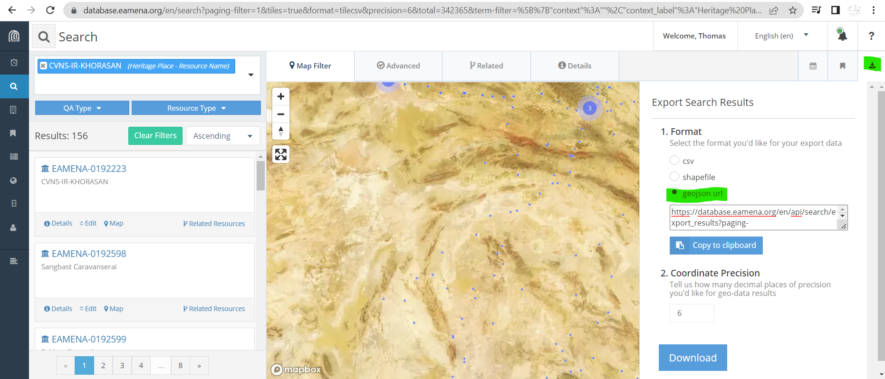
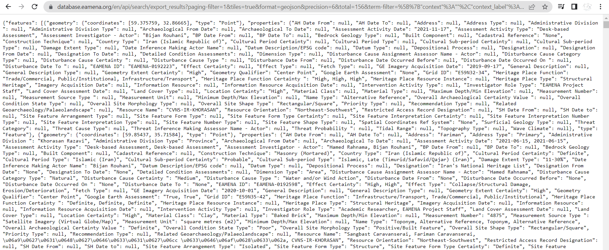
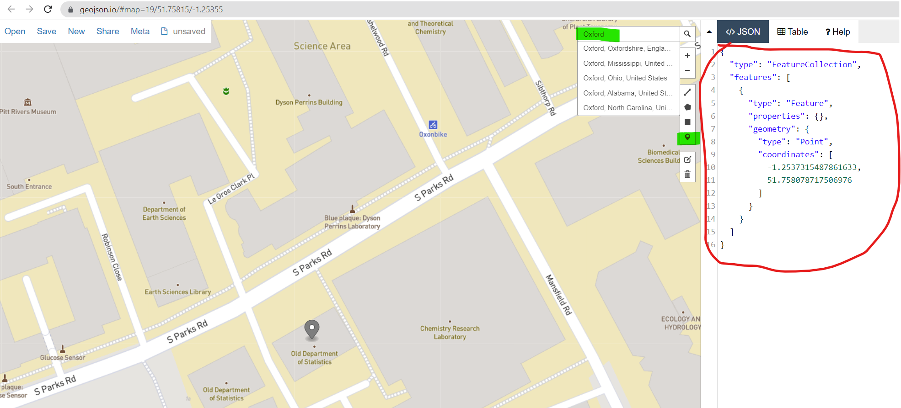

# Work with EAMENA and GeoJSON

JavaScript is THE interactive web language, and the most popular file types are JSON and GeoJSON

## Export an EAMENA search ot a GeoJSON file

Use [EAMENA](https://database.eamena.org/) to create a GeoJSON dataset. This dataset can then be used by the [eamenaR](https://github.com/eamena-oxford/eamenaR#readme) package and the [reveal.js](https://github.com/eamena-oxford/reveal.js#readme) framework

1. **EAMENA search**  

In EAMENA, search for the resources, select Download and copy the URL `geojson` (in green) to the clipboard.



2. **Get the GeoJSON content**  
  
  
Paste the copied URL into the address bar, the result is something like :


  

3. **Create a new GeoJSON file**  
  
Copy the text content and save it in a new GeoJSON file, for example `caravanserail.geojson` ([rendered](https://github.com/eamena-oxford/eamena-arches-dev/blob/main/data/geojson/caravanserail.geojson) | [raw](https://raw.githubusercontent.com/eamena-oxford/eamena-arches-dev/main/data/geojson/caravanserail.geojson))

## Share a GeoJSON geometry

Go to https://geojson.io/, use the geocoder to find a location, draw a POINT, LINE or a POLYGON (in green), copy the JSON geometry (in red) and paste it into a new `.geosjon` file.  




The format of a rectangle selection is 4 different points[^1], starting from the geographical origin (`xmin, ymin`), eg. `"POINT(0 0)"`):

```
[
    xmin,
    ymin
],
[
    xmax,
    ymin
],
[
    xmax,
    ymax
],
[
    xmin
    ymax
],
[
    xmin,
    ymin
]
```

[^1]: there is a duplicate which comes from the need to close the polygon, so the coordinates of the origin (`xmin`, `ymin`) are the same as those of the last point.

