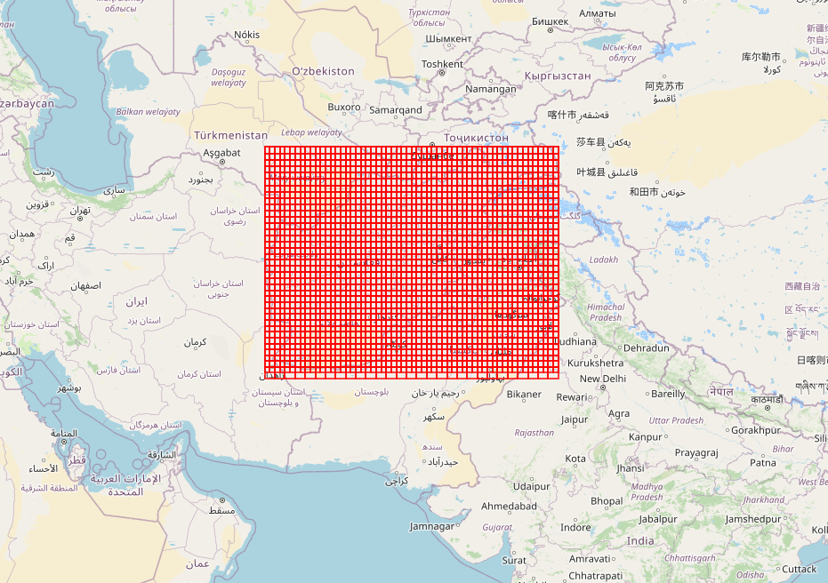

# Grids

[README](https://github.com/eamena-project/eamena-arches-dev/tree/main/data/grids/qdgc_#readme)

## Database

### Geometries

These grids come from the Grid Square Ressource Model

  
   
    <em>EAMENA v4 grids (in the database)</em>

### List of grids registered in HP

The CSV list of all the grids registered in the Heritage Places Resource Model is available here: https://github.com/eamena-project/eamena-arches-dev/blob/main/data/grids/data-1688403740400-1.csv
## File

Grids are strored as a GeoJSON file here: https://github.com/eamena-project/eamena-arches-dev/blob/main/data/grids/EAMENA_Grid.geojson

  
   
    <em>EAMENA v4 grids (GeoJSON)</em>

## GIS

### QGIS project

The QGIS project is here: https://github.com/eamena-project/eamena-arches-dev/blob/main/data/grids/grids_nb_hp.qgz. But you can also use the QGIS project associated with the GeoServer [projet_gesoserver.qgz](https://github.com/eamena-project/eamena-arches-dev/blob/main/gis/qgis/projet_gesoserver.qgz)

  
   
    <em>Number of Heritage Places by EAMENA v4 grids (QGIS)</em>

The SLD file, for the layer style, is here: https://github.com/eamena-project/eamena-arches-dev/blob/main/data/grids/grids_nb_hp_230704.sld

## Create new grids

see the [QDGC folder](https://github.com/eamena-project/eamena-arches-dev/tree/main/data/grids/qdgc_#readme) 

## Leaflet

Use the R script [eamena-grid.R](https://github.com/eamena-project/eamena-arches-dev/blob/main/data/grids/eamena-grid.R) to create an interactive web map like [this one](https://eamena-project.github.io/eamena-arches-dev/data/grids/grid_afghanistan)

  
   
    <em>New grids for Afghanisthan (here in HTML)</em>

