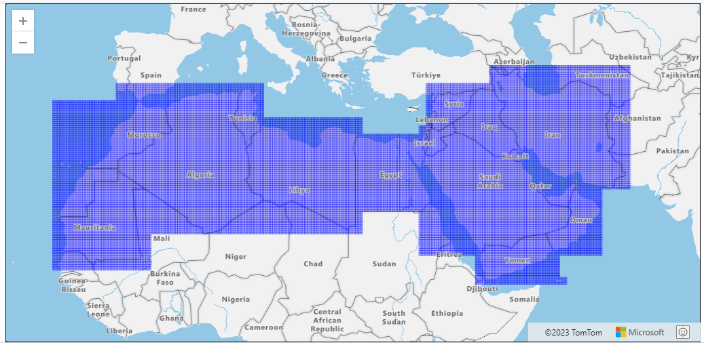

# Grids

Grids are strored as a GeoJSON file here: https://github.com/eamena-project/eamena-arches-dev/blob/main/data/grids/EAMENA_Grid.geojson

  
   
    <em>EAMENA v4 grids (in the database)</em>

