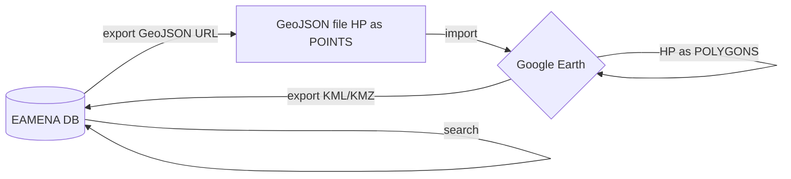

The workflow will be to:

```mermaid
flowchart LR
    A[(EAMENA DB)] --search--> A;
    A --export GeoJSON URL--> B[GeoJSON file HP as POINTS];
    B --import--> C{Google Earth};
    C --"HP as POLYGONS"--> C;
    C --export KML/KMZ--> A; 
```