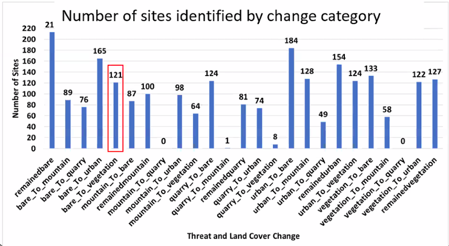
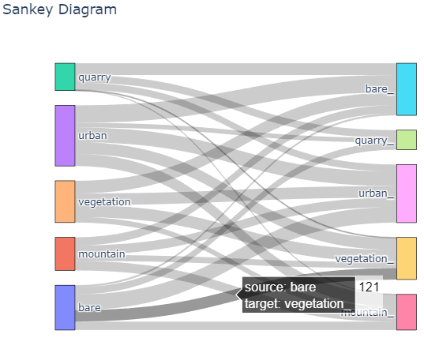

## Sankey diagrams

This plot shows before-and-after changes

I've copied to this dataframe: https://github.com/eamena-project/eamena-arches-dev/blob/main/data/time/sankey/acd_ex1.tsv. And run this script: https://github.com/eamena-project/eamena-arches-dev/blob/main/data/time/sankey/sankey.py. It gives:

See the HTML output: https://eamena-project.github.io/eamena-arches-dev/data/time/sankey.html
