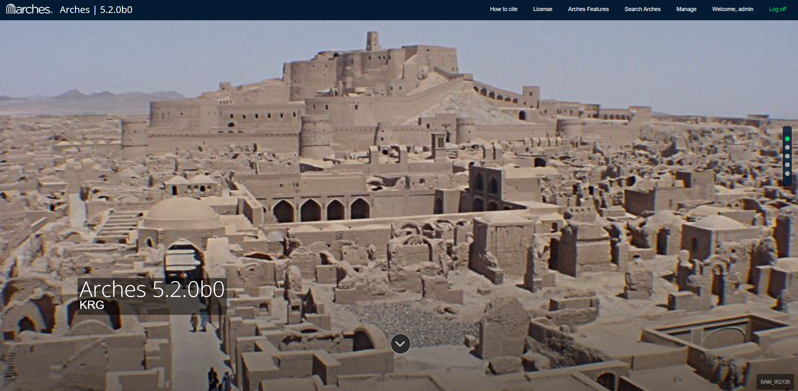
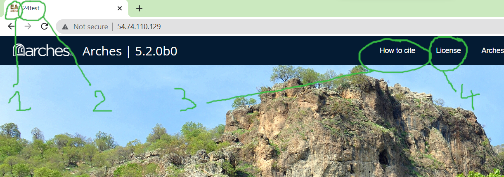

# 24test
> for KRG

## Customize the landing page

### Background image


<p align="center">
  
  <br>
    <em>Landing page</em>
</p>

image : https://github.com/eamena-project/eamena-arches-dev/blob/da9d4efc80119df549e8029de75b5ce47d1027df/dbs/24test/index.htm#L171
db name: https://github.com/eamena-project/eamena-arches-dev/blob/da9d4efc80119df549e8029de75b5ce47d1027df/dbs/24test/index.htm#L176
image caption: https://github.com/eamena-project/eamena-arches-dev/blob/da9d4efc80119df549e8029de75b5ce47d1027df/dbs/24test/index.htm#L184

### Links


<p align="center">
  
  <br>
    <em>Landing page</em>
</p>


Modify:

1. favicon
 - link: https://github.com/eamena-project/eamena-arches-dev/blob/cbde1edd0c28232f0ab65eb5796d3194822a0a54/dbs/24test/index.htm#L39
 - image: https://github.com/eamena-project/eamena-arches-dev/tree/main/dbs/24test/img logo.png

2. App title, example: https://github.com/eamena-project/eamena-arches-dev/blob/main/training/templates/settings.py#L192

3. How to cite link: https://github.com/eamena-project/eamena-arches-dev/blob/cbde1edd0c28232f0ab65eb5796d3194822a0a54/dbs/24test/index.htm#L79

4. License link: https://github.com/eamena-project/eamena-arches-dev/blob/cbde1edd0c28232f0ab65eb5796d3194822a0a54/dbs/24test/index.htm#L82


## Import missing Resource Models 
> Import missing Resource Models from EAMENA

* IR
```python manage.py packages -o import_graphs -s './packages/220607_pkg/graphs/resource_models/Information Resource.json'```

* GS
```python manage.py packages -o import_graphs -s './packages/220607_pkg/graphs/resource_models/Grid Square.json'```

* PS
```python manage.py packages -o import_graphs -s './packages/220607_pkg/graphs/resource_models/Person-Organization.json'```

* DCA
```python manage.py packages -o import_graphs -s './packages/220607_pkg/graphs/resource_models/Detailed Condition Assessment.json'```

## Exporting Business data
> Exporting from EAMENA

* GS
```python manage.py packages -o export_business_data -d '/opt/arches/data_temp' -f 'json' -g '77d18973-7428-11ea-b4d0-02e7594ce0a0'```

* IR
```python manage.py packages -o export_business_data -d '/opt/arches/data_temp' -f 'json' -g '35b99cb7-379a-11ea-9989-06f597a7d5ce'```

* PS
```python manage.py packages -o export_business_data -d '/opt/arches/data_temp' -f 'json' -g 'e98e1cee-c38b-11ea-9026-02e7594ce0a0'```

## Import Business data
> Import Business data from EAMENA

* GS
```python manage.py packages -o import_business_data -s "/home/archesadmin/data-temp/grid_krg.jsonl" -ow overwrite```

## Reindex

*GS

After importing the `grid_krg.jsonl` file. On:

```

Error:
```
  File "/home/archesadmin/arches/arches/app/datatypes/datatypes.py", line 113, in get_search_terms
    if settings.WORDS_PER_SEARCH_TERM is None or (len(nodevalue.split(" ")) < settings.WORDS_PER_SEARCH_TERM):
AttributeError: 'dict' object has no attribute 'split'
```

Error message;

```
...
'status': 400, 'error': {'type': 'mapper_parsing_exception', 'reason': "failed to parse field [strings.string] of type [text] in document with id '1cbb0bc6-6f6d-433b-9f0a-9700c3cdd0c9'. Preview of field's value: '{en={value=E44N34-43, direction=ltr}}'", 'caused_by': {'type': 'illegal_state_exception', 'reason': "Can't get text on a START_OBJECT at 1:1366"}}
...
```

The data:

```
{
  "7248e0d0-ca96-11ea-a292-02e7594ce0a0": {
    "type": "FeatureCollection",
    "features": [
      {
        "id": "b1b3f65c-24a3-4c15-a291-58b407cda52d",
        "type": "Feature",
        "geometry": {
          "type": "Polygon",
          "coordinates": [
            [
              [
                42.25,
                36.75
              ],
              [
                42.25,
                37
              ],
              [
                42.5,
                37
              ],
              [
                42.5,
                36.75
              ],
              [
                42.25,
                36.75
              ]
            ]
          ]
        },
        "properties": {}
      }
    ]
  }
}
```

```
{
  "b3628db0-742d-11ea-b4d0-02e7594ce0a0": {
    "en": {
      "value": "E42N36-41",
      "direction": "ltr"
    }
  }
}
```

```
{
  "b3628db0-742d-11ea-b4d0-02e7594ce0a0": {
    "en": {
      "value": "E42N36-34",
      "direction": "ltr"
    }
  }
}
```
