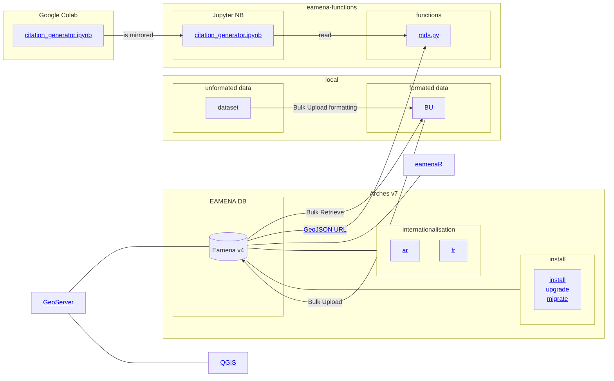
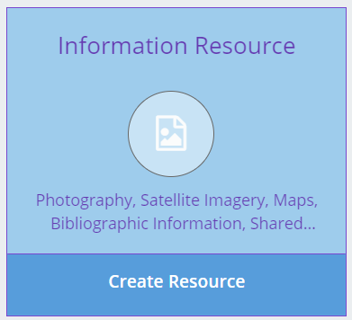

# EAMENA DB

[reference data](https://github.com/eamena-project/eamena-arches-dev/tree/main/dbs/database.eamena/data/reference_data)

## Diagram

## Contribute to the EAMENA database

There is two ways to add your data to the database:

1. Request a [*Contributor* user account](https://eamena.web.ox.ac.uk/open-access-policy#user-contributor) to add data directly into the database using the graphical user interface <https://database.eamena.org/>.
2. Submit an [unformated or formated dataset](#unformated-or-formated-dataset) in a form of a TSV, CSV or XLSX file, to the team

If you aim to submit your data to EAMENA as an [unformated or formated dataset](#unformated-or-formated-dataset), .

### Unformated or formated dataset

If you want to host a dataset on EAMENA, this dataset will have first to be formated for the EAMENA database: this is the [Bulk Upload procedure](https://github.com/eamena-project/eamena-arches-dev/tree/main/data/bulk#readme). The EAMENA team will evaluate the interest of your data for the research on endangered archaeology and, if your dataset need to be reformat into a EAMENA-compliant structure ("unformated dataset"), the effort needed to prepare your dataset.
Alongside with your data you will create an **Information Resource** referencing your dataset. 

  
   
    <em>Create a new resource in the Ressource Model <b>Information Resource</b>, see for example: <a href = "https://github.com/eamena-project/eamena-arches-dev/blob/main/www/arches-ea-v4-rm-ir-ex2.pdf">GlobalKites ANR project</a></em>

Before assigning a DOI to your dataset, and maybe publishing it as a *data paper*, we suggest two routes:

#### **Unformated dataset** route

An "unformated dataset" is our original dataset 'as-it-is', as you published it under its DOI ([Zenodo](https://zenodo.org/), [OSF](https://help.osf.io/article/220-create-dois), [Inist-CNRS](https://www.inist.fr/nos-actualites/datacite-accompagne-doi/), etc.), in *data paper* journal ([JOAD](https://openarchaeologydata.metajnl.com/), [IAJ](https://archaeologydataservice.ac.uk/about/the-internet-archaeology-journal/), etc.), etc., respecting only the FAIR guidelines. 

There is no need for you to align the columns names, map the values, etc. with the EAMENA format. You submit your dataset directly to the EAMENA team. 

#### **Formated dataset** route

A "formated dataset" is a Bulk Upload form, that is to say, a EAMENA databae-compliant dataset that can be uploaded directly into EAMENA via the Bulk Upload process. Following this route will improve the FAIRability[^1]. Indeed, making your compliant to a open-access and open-source database and long term repository using CIDOC-CRM onlogy[^2] can already be mentioned in your *data paper* (see, improve and reuse, this [JOAD template](https://github.com/eamena-project/eamena-arches-dev/blob/main/data/bibref/templates/template_joad.md)).

You will need to align the columns names, map the values, etc., with the EAMENA format. We can provide tools (see the [eamaneR](https://github.com/eamena-project/eamenaR#bu) pakage) and help to make this process as simple and easy as possible.

---

Our team is currently developping a computer routine allowing to automatise the generation of ready-made citation for the different data subset (see ["How-to-cite"](https://github.com/eamena-project/eamena-arches-dev/tree/main/data/bibref#readme)). For the moment, we suggest that you assign a DOI to your dataset (Zenodo, etc.) and publish it as a *data paper* in a specialised journal ([JOAD](https://openarchaeologydata.metajnl.com/), [IAJ](https://archaeologydataservice.ac.uk/about/the-internet-archaeology-journal/), etc.). See also the [License](https://eamena.org/database#data-use) and [Open Access policy](https://eamena.org/open-access-policy) on EAMENA website

[^1]: Findable, Accessible, Interoperable, Reusable. See <https://www.go-fair.org/>
[^2]: CIDOC Conceptual Reference Model is the ISO 21127:2014. See: <https://www.cidoc-crm.org/>

