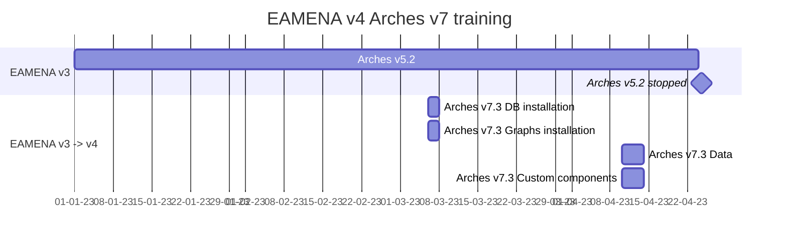

# EAMENA DB

## Timeline

DB migration process and trainings

```mermaid
gantt
    title EAMENA v4 Arches v7 training
    dateFormat  YYYY-MM-DD
    axisFormat  %d-%m-%y
    tickInterval 7day
    section EAMENA v3
    Arches v5.2              : a0, 2023-01-01, 2023-04-24
    Arches v5.2 stopped      : milestone, m3, 2023-04-24, 1d
    section EAMENA v3 -> v4
    Arches v7.3 DB installation        : a1, 2023-03-06, 2d
    Arches v7.3 Graphs installation    : a1, 2023-03-06, 2d
    Arches v7.3 Data                   : a1, 2023-04-10, 4d
    Arches v7.3 Custom components      : a1, 2023-04-10, 4d
    
```
