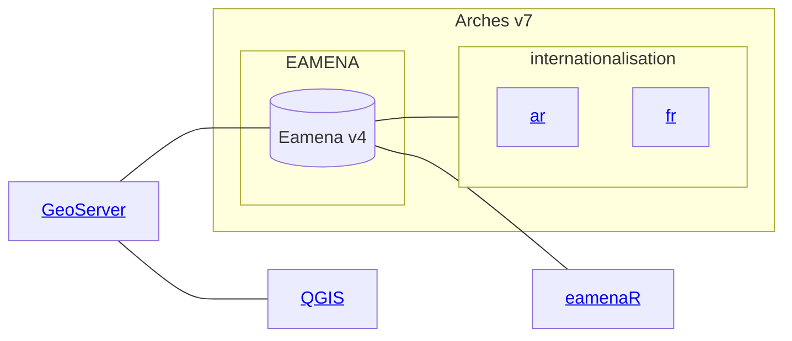
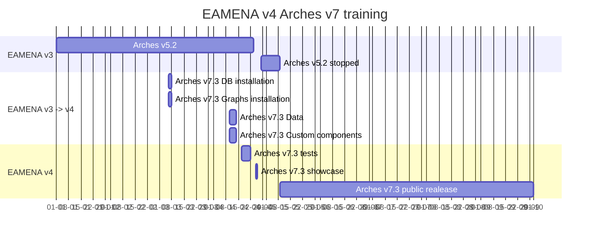

# EAMENA DB

by theme:

* [related computer applications](https://github.com/eamena-project/eamena-arches-dev/tree/main/dbs/database.eamena#related-computer-applications)

---

## Related Computer Applications

## DB migration process timeline

## Customization

### Landing page

To give a new "skin" to the landing page of EAv4, we can change the background images and captions of the slides. 

  
   
    <em>Landing page of EAMENA v4</em> <https://database.eamena.org/>

## Update the `index.htm` file

Change directly the file: https://github.com/eamena-project/eamena-arches-dev/blob/main/dbs/database.eamena/varia/index.htm (paths and captions). And add the images in this folder: https://github.com/eamena-project/eamena-arches-dev/tree/main/dbs/database.eamena/img

* example for [Slide 1](https://github.com/eamena-project/eamena-arches-dev/blob/11df37b9c528e4e3b423ae00464190432bd69c0c/dbs/database.eamena/varia/index.htm#L255-L275)

1. Change the [image](https://github.com/eamena-project/eamena-arches-dev/blob/11df37b9c528e4e3b423ae00464190432bd69c0c/dbs/database.eamena/varia/index.htm#L258) [^1]
2. Change the [caption](https://github.com/eamena-project/eamena-arches-dev/blob/11df37b9c528e4e3b423ae00464190432bd69c0c/dbs/database.eamena/varia/index.htm#L273) [^2]

## Example

index.htm modified, a new slide has been created;
 - https://github.com/eamena-project/eamena-arches-dev/commit/1a434b49e6c21618c30d9f0e199d07dcddc3c7cf?diff=split

## Import the image to the EA instance

1. Connect the EA instance throug SSH as with the `arches` account
2. move to the landing images folder: 
  - `/opt/arches/media/img/landing/eamena`
3. import the image:
  - `wget https://github.com/eamena-project/eamena-arches-dev/blob/main/dbs/database.eamena/img/APAAME_20221123_FAB-0154_reduced.jpg`

## Import the updated `index.htm` to the EA instance

1. Connect the EA instance throug SSH as with the `arches` account
2. move to the `index.htm` folder: 
  - `cd /opt/arches/eamena/eamena/templates`
3. rename the former `index.htm` to `index_old.htm`: 
  - `mv index.htm intex_old.htm`
4. import the updated `index.htm`: 
  - `wget https://raw.githubusercontent.com/eamena-project/eamena-arches-dev/main/dbs/database.eamena/varia/index.htm`
5. refresh EA landing page in your browser

---

⚠️ if there's an error:
1. delete the updated `index.htm`
2. rename reverse: rename `index_old.htm` to `index.htm`  

[^1]: `index.htm` -> `/opt/arches/eamena/eamena/templates`
[^2]: images -> `/opt/arches/eamena/eamena/media/img/landing/eamena`
