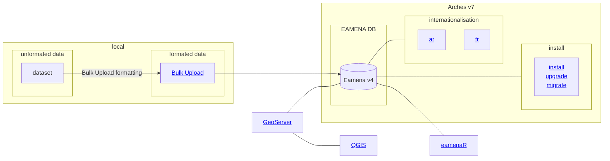

# EAMENA DB

## Diagram

## Contribute to the EAMENA database

There is two ways to add data to the database:

1. Request a Contributor user account to add data directly into the database using the graphical user interface <https://database.eamena.org/>. See the [EAMENA website](https://eamena.web.ox.ac.uk/open-access-policy#user-contributor).
2. Submit an [unformated or formated dataset](#unformated-or-formated-dataset) in a form of a TSV, CSV or XLSX file, to the team

If you aim to submit your data to EAMENA as an [unformated or formated dataset](#unformated-or-formated-dataset), the EAMENA team will balance the effort needed to format your dataset into a EAMENA-compliant structure and its interest for the research on endangered archaeology.

### Unformated or formated dataset

If you want to host and expose an already prepared dataset, the latter will have to be formated for the EAMENA database: this is the [Bulk Upload procedure](https://github.com/eamena-project/eamena-arches-dev/tree/main/data/bulk#readme). Before assigning a DOI to your dataset, and publishing it as a *data paper*, we suggest two routes:

#### **Unformated dataset** route

An "unformated dataset" is our original dataset 'as-it-is', as you published it under its DOI, in data paper journal, etc., respecting only the FAIR guidelines. So, there is no need for you to reformat the columns, values, etc. You submit your dataset directly to the EAMENA team. 

#### **Formated dataset** route

A "formated dataset" is a Bulk Upload form, that is to say, a EAMENA databae-compliant dataset that can be uploaded directly into EAMENA via the Bulk Upload process. Following this route will improve the FAIRability[^1]. Indeed, the process of making your compliant to a open-access and open-source database using CIDOC-CRM onlogy can already be mentioned in your *data paper* (see, improve and reuse, this [JOAD template](https://github.com/eamena-project/eamena-arches-dev/blob/main/data/bibref/templates/template_joad.md)).

---

The EAMENA team is currently developping a computer routine allowing to automatise the generation of ready-made citation for the different data subset (see ["How-to-cite"](https://github.com/eamena-project/eamena-arches-dev/tree/main/data/bibref#readme)). For the moment, we suggest that you assign a DOI to your dataset (Zenodo, etc.) and publish it as a *data paper* in a specialised journal ([JOAD](https://openarchaeologydata.metajnl.com/), [IAJ](https://archaeologydataservice.ac.uk/about/the-internet-archaeology-journal/), etc.). See also the [License](https://eamena.org/database#data-use) and [Open Access policy](https://eamena.org/open-access-policy) on EAMENA website

[^1]: Findable, Accessible, Interoperable, Reusable. See <https://www.go-fair.org/>
[^2]: CIDOC Conceptual Reference Model is the ISO 21127:2014. See: <https://www.cidoc-crm.org/>

