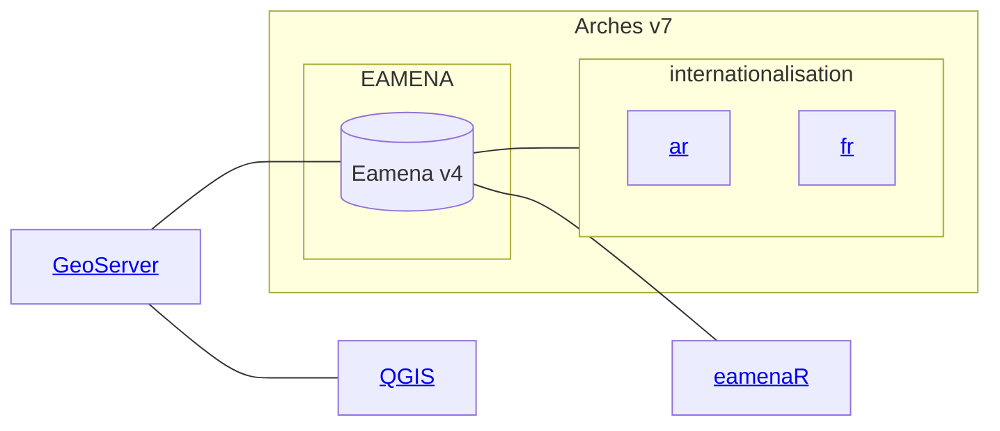
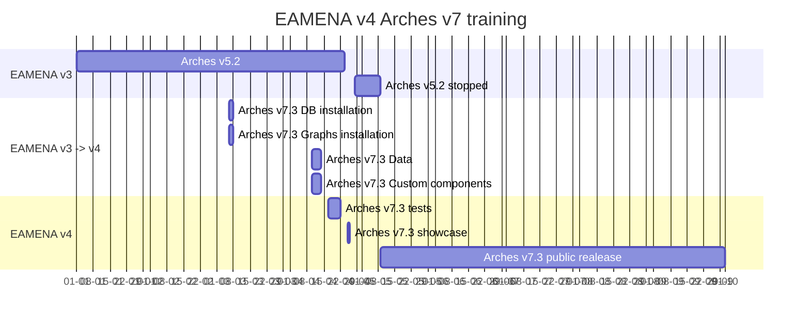

# EAMENA DB

by theme:

* [related computer applications](https://github.com/eamena-project/eamena-arches-dev/tree/main/dbs/database.eamena#related-computer-applications)

---

## Related Computer Applications

## DB migration process timeline

