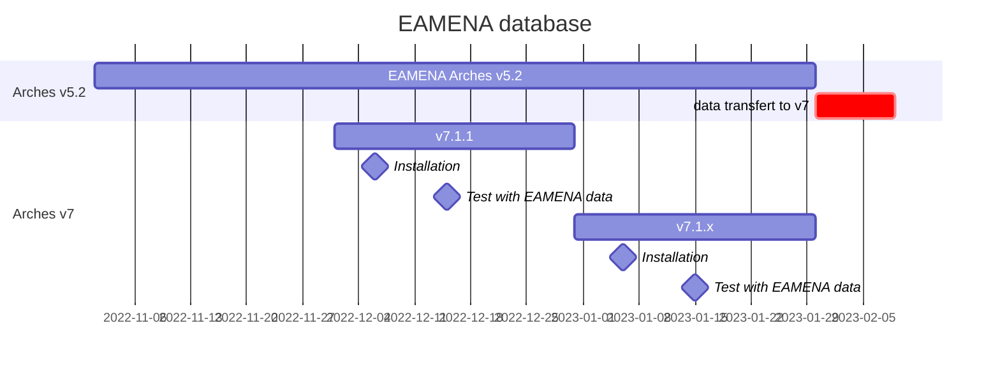
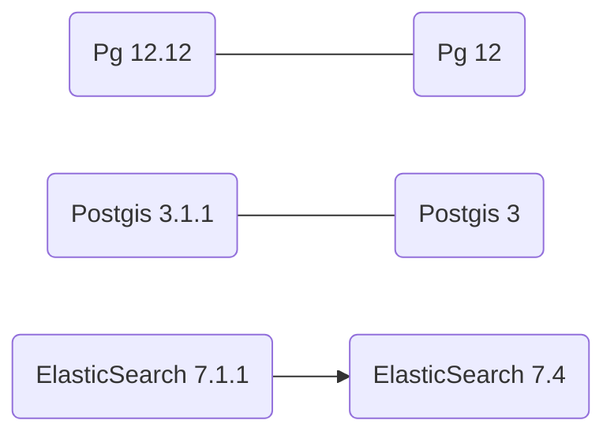

# EAMENA DB

## Timeline

```mermaid
gantt
    title EAMENA database
    dateFormat  YYYY-MM-DD
    section Arches v5.2
    EAMENA Arches v5.2       : a0, 2022-11-01, 90d
    data transfert to v7     : crit, after a0, 10d
    section Arches v7
    v7.1.1                   : a1, 2022-12-01, 30d
    Installation             : milestone, m0, 2022-12-01, 10d
    Test with EAMENA data    : milestone, m1, 2022-12-10, 10d
    v7.1.x                   : after a1, 30d
    Installation             : milestone, m2, 2023-01-01, 10d
    Test with EAMENA data    : milestone, m3, 2023-01-10, 10d
```

## Upgrade Arches v5.2 to v7

Needed updates

```mermaid
flowchart LR
    A(Pg 12.12) --- B(Pg 12);
    C(Postgis 3.1.1) --- D(Postgis 3);
    E(ElasticSearch 7.1.1) --> F(ElasticSearch 7.4);
```
legend:
`---` no upgrade  
`-->` upgrade