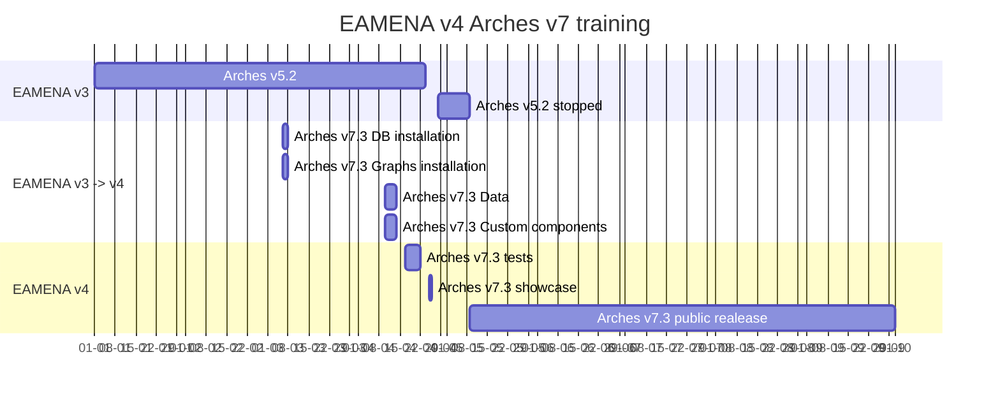

# EAMENA DB

## Timeline

DB migration process

## Customization

### Landing page

To give a new "skin" to the landing page of EAv4, we can change the background images and captions of the slides. 

  
   
    <em>Current landing page of EAMENA v4 <https://database.eamena.org/> </em>

Change directly the file: https://github.com/eamena-project/eamena-arches-dev/blob/main/dbs/database.eamena/varia/index.htm (paths and captions). And add the images in this folder: https://github.com/eamena-project/eamena-arches-dev/tree/main/dbs/database.eamena/img

* example for [Slide 1](https://github.com/eamena-project/eamena-arches-dev/blob/11df37b9c528e4e3b423ae00464190432bd69c0c/dbs/database.eamena/varia/index.htm#L255-L275)

1. Change the [image](https://github.com/eamena-project/eamena-arches-dev/blob/11df37b9c528e4e3b423ae00464190432bd69c0c/dbs/database.eamena/varia/index.htm#L258) [^1]
2. Change the [caption](https://github.com/eamena-project/eamena-arches-dev/blob/11df37b9c528e4e3b423ae00464190432bd69c0c/dbs/database.eamena/varia/index.htm#L273) [^2]

[^1]: `index.htm` -> `/opt/arches/eamena/eamena/templates`
[^2]: images -> `/opt/arches/eamena/eamena/media/img/landing/eamena`
