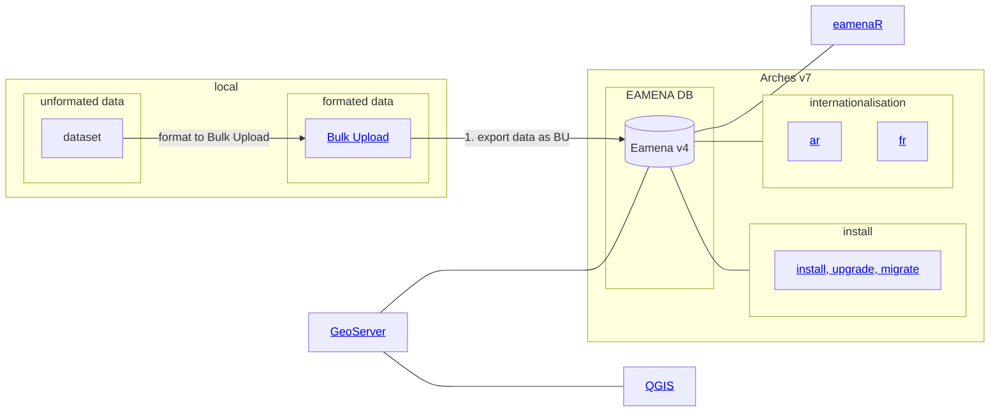

# EAMENA DB

## Diagram

```mermaid
flowchart LR
  subgraph Arches v7
    subgraph EAMENA DB
    ea[(Eamena v4)]
    end
    subgraph internationalisation
      id6[<a href='https://github.com/eamena-project/eamena-arches-dev/tree/main/dbs/database.eamena/internationalisation'>ar</a>];
      id7[<a href='https://github.com/eamena-project/eamena-arches-dev/tree/main/dbs/database.eamena/internationalisation'>fr</a>];
    end 
    subgraph install
      id8[<a href='https://github.com/eamena-project/eamena-arches-dev/tree/main/dbs/database.eamena/install'>install, upgrade, migrate</a>];
    end 
  end
  id3[<a href='https://github.com/eamena-project/eamena-arches-dev/tree/main/geoserver'>GeoServer</a>] --- ea;
  id3 --- id4[<a href='https://github.com/eamena-project/eamena-arches-dev/tree/main/gis/qgis'>QGIS</a>];
  subgraph local
    direction TB
    subgraph unformated data
      id9A[dataset]
    end
    subgraph formated data
      id9A -- format to Bulk Upload --> id9B[<a href='https://github.com/eamena-project/eamena-arches-dev/tree/main/data/bulk#readme'>Bulk Upload</a>]
      id9B --1. export data as BU--> ea;
    end
  end
  ea --- id5[<a href='https://github.com/eamena-project/eamenaR'>eamenaR</a>];
  ea --- internationalisation
  ea --- install
```
