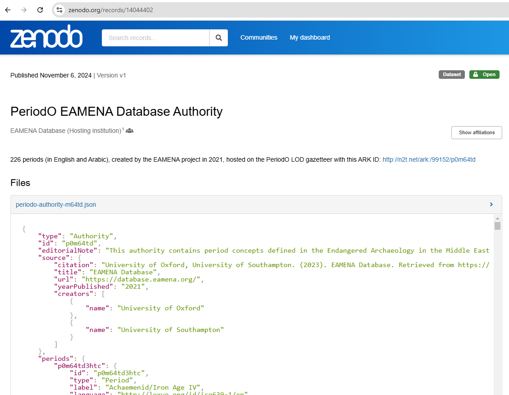
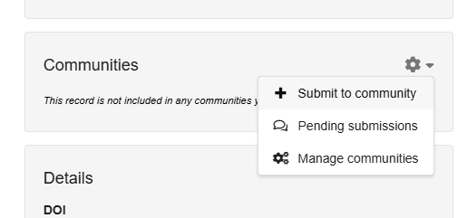
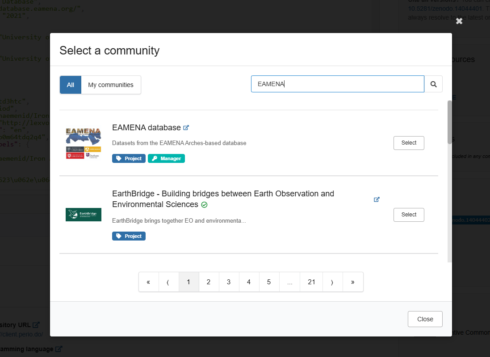
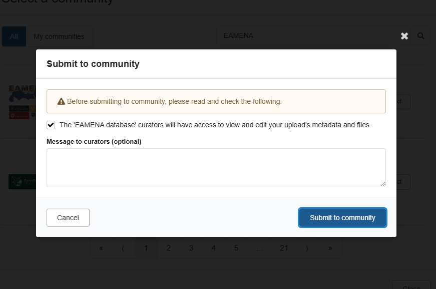
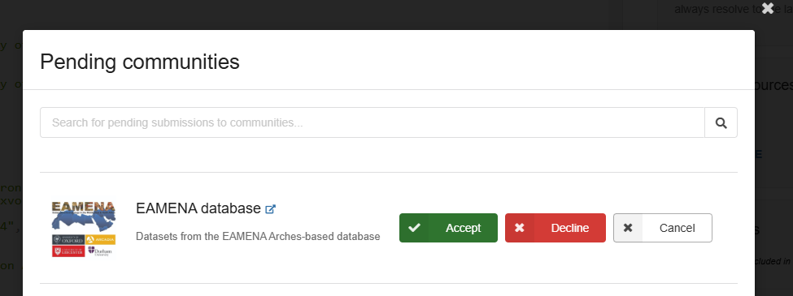
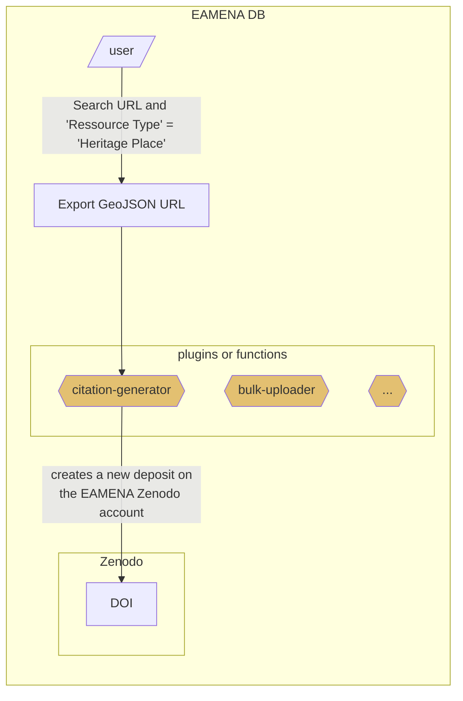
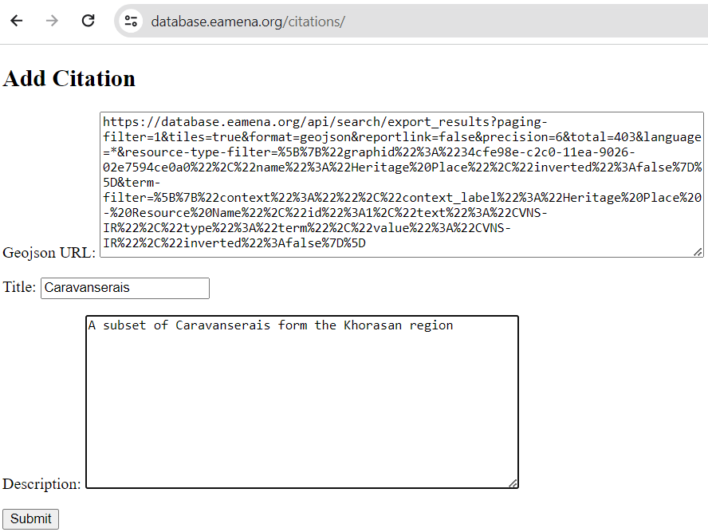

# citation-generator
> "How-to-cite" EAMENA database and datasets, Automate the generation of DOI and bibliographic references for the EAMENA sub-datasets, Zenodo, etc.

## Zenodo

Upload your data to your Zenodo account, and then submit your upload to the EAMENA Zenodo community

### Submit to the EAMENA community

* From the Contributor side

1. Upload your data under your Zenodo account

<p align="center">
  <br>
</p>

2. On the right hand panel, choose: `+ Submit to community`

<p align="center">
  <br>
</p>

3. Select the `EAMENA` community

<p align="center">
  <br>
</p>

4. Allow the 'EAMENA database' curators to view and edit your data and metada 

<p align="center">
  <br>
</p>

* From the EAMENA Community side

1. Accept the request

<p align="center">
  <br>
</p>

## Contributions

The aim is to allow EAMENA contributors (see [Contributor profile](https://github.com/eamena-project/eamena-arches-dev/tree/main/dbs/database.eamena/users)) to easily publish EAMENA data subsets working with a GeoJSON URL only to create GeoJSON data, the user provide a GeoJSON URL ([search and GeoJSON URL examples](https://github.com/eamena-project/eamena-arches-dev/tree/main/projects/sistan#dataset), [how to export as GeoJSON](https://raw.githubusercontent.com/eamena-project/eamena-arches-dev/main/www/arches-v7-search-resource-type.png)).



The core of the Python `citation-generator` function is currently hosted on [**Google Colab**](https://colab.research.google.com/github/eamena-project/eamena-arches-dev/blob/main/dbs/database.eamena/citation/citation_generator.ipynb). During this workflow:

1. the GeoJSON URL is converted into a GeoJSON file and zipped;
2. the file is uploaded to Zenodo 'eamena' community with its metadata, see [Zenodo](#zenodo) 

The GitHub issue thread is [#39](https://github.com/eamena-project/eamena-arches-dev/issues/39)

## Plugin
> citation plugin, citation-generator plugin

Plugin for EAMENA v4/Arches v7.3 with the creation of a new form to publish data to Zenodo. The plugin code is hosted in the folder [citation_form_code/](https://github.com/eamena-project/eamena-arches-dev/tree/main/dbs/database.eamena/citation/citation_form_code)

- Added a new page at `/citations/`
- It allows a user to input a:
  -  GeoJSON URL export
  -  Title
  -  Description


<p align="center">
  <br>
  <em>Screenshot of the Arches citation plugin for Heritage Places developed by EAMENA and MaREA, showing the GeoJSON URL field and two free-text fields. The other metadata (authors, contributors, keywords, etc.) are calculated on the fly. Once the user clicks 'Submit,' a GeoJSON file is created and uploaded to Zenodo along with its metadata.</em>
</p>

The code uses a Django form to accept values from the user. It takes the GeoJSON url and writes the output to a json file on the server. The title and description are used to populate the `METADATA` object in `zenodo_publish.py`, which is used to the data publish to Zenodo. The code then deletes the json file from the server to save space. 

A presentation of the plugin is available here: [presentation_citation_generator.ipynb](https://colab.research.google.com/github/eamena-project/eamena-arches-dev/blob/main/talks/2024-citation-generator/presentation_citation_generator.ipynb)

### Paths

* Zenodo location (currently the sandbox): /opt/arches/eamena/citations/zenodo_publish.py

Other paths:

```sh
./eamena/citations
./eamena/citations/zenodo_publish.py
./eamena/citations/forms.py
./eamena/citations/views.py
./eamena/citations/templates
./eamena/citations/templates/citation_form.html
./eamena/citations/zenodo_calculate.py
./eamena/citations/zip_file.py
```

### TO DO 
We could further integrate the code with Arches by adding an option here to prepopulate the GeoJSON Url option based upon the search results.


## Zenodo

Zenodo ['eamena' community](https://zenodo.org/communities/eamena) host the data (the GeoJSON file itself) and its [metadata](https://github.com/eamena-project/eamena-arches-dev/blob/main/data/bibref/README.md#metadata). 

ℹ️ see for example the GitHub release of Ressource Models and collections ([here](https://zenodo.org/records/10142707))

### Location

There are two different Zenodo deposit: [Zenodo](https://zenodo.org/api/deposit/depositions) and [Zenodo Sanbox](https://sandbox.zenodo.org/api/deposit/depositions) for tests


### Metadata
> proposed metadata schema/layout

Metadata of published dataset could be: [free text](https://github.com/eamena-project/eamena-arches-dev/blob/main/data/bibref/README.md#free-text), [constant values](https://github.com/eamena-project/eamena-arches-dev/blob/main/data/bibref/README.md#constant-values), [calculated values](https://github.com/eamena-project/eamena-arches-dev/blob/main/data/bibref/README.md#calculated-values)

ℹ️ see the [list of Zenodo metadata](https://developers.zenodo.org/#depositions) 

#### Free text
> These metadata values have to be entered manually (ie, can not be deduced from the GeoJSON data)

* `title`: *free text*. Name for the dataset (mandatory).
* `description`: *free text*. Dataset description (mandatory).

#### Constant values
> These metadata values are always the same (constant):

* `'communities'`: `[{'identifier': 'eamena'}]`,
* `upload_type`: `'dataset'`
* `creators`:
 ```
'creators': [{'name': "EAMENA database",
			  'affiliation': "University of Oxford, University of Southampton"}]
```
* `license`: `'cc-by'`
* `grants`: this is the ID of 'Arcadia fund, num 4178'
```
'grants': [{'id': '051z6e826::4178'}]
```
* `subjects`:
```
[{"term": "Cultural property", "identifier": "https://id.loc.gov/authorities/subjects/sh97000183.html", "scheme": "url"}]
```
* `method`: `'EAMENA data entry methodology'`


##### implicit
> By default on a Zenodo upload

* `access_right`: `open`


#### Calculated values
> Calculated from the GeoJSON data

These metadata values:

1. are calculated (variable) from the GeoJSON data using [zenodo.py](https://github.com/eamena-project/eamena-functions/blob/main/zenodo/zenodo.py), OR 
2. change, based of previous published dataset (calculated), OR
3. are mixed (mixed): partly constant (constant), partly calculated (calculated) 

* `contributors` (mixed, example)[^6]:
 ```
'contributors': [{'name': "Thomas, Huet",
				  "type": "DataCollector"},
				  {'name': "Ash, Smith",
			  	  "type": "DataCollector"}]
```
* `dates`: creation dates (mixed), a list
with this constant keys/values:
```
'dates': {'type': 'Collected', 'description': 'Data creation and curation'}
```
with this calculated keys/values (example)[^2]:
```
'dates': {'start': '2021-08-01', 'end': '2022-05-01'}
```
result (example):
'dates': [{'start': '2021-08-01', 'end': '2022-05-01', 'type': 'Collected', 'description': 'Data creation and curation'}]

* `related_identifiers`:  (mixed) 

with this constant (constant)[^3]:
```
[{'relation': 'isDescribedBy', 'identifier':'https://zenodo.org/doi/10.5281/zenodo.10142706'}] 
```
and this calculated value (calculated, example)[^5]:
```
[{'relation': 'isContinuedBy', 'identifier':'a_previously_published_dataset'}] 
```
result (example):
```
[
	{'relation': 'isDescribedBy', 'identifier':'https://zenodo.org/doi/10.5281/zenodo.10142706'}, 
	{'relation': 'isContinuedBy', 'identifier':'a_previously_published_dataset'}
] 
```
* `keywords`: (mixed)
`'EAMENA', MaREA` + locations ("Country Type"[^1]) + periods ("Cultural Period Type[^1]")


## TODO
> Optional?

| Zenodo field | Description |
|------|-------------|
| `description` and `title` | accept Markdown syntax |
| `contributors` | add keys `affiliation`, `orcid` |
| `references` | add list of references, for ex: `["Doe J (2014). Title. Publisher. DOI", "Smith J (2014). Title. Publisher. DOI"]` |
| `communities` | maybe Arches-based projects |
| `locations` | problem, only accept point positions (not MBR)|

Push on the Zenodo sandbox for the first tests.


> Draft for the EAMENA website

<h5 class="rtejustify" id="open-data">How to use our datasets and images</h5>

<p>Images and datasets from the EAMENA Database are under the Creative Commons Attribution 4.0 International License <a href="http://creativecommons.org/licenses/by/4.0/" rel="license"></a></p>

<h5 class="rtejustify" id="cite-data">How to cite an EAMENA dataset</h5>

<p>To cite our database please use the following (examples):</p>

<h6 class="rtejustify" id="cite-data-APA">APA</h6>
EAMENA database. (2023). Sistan: part 1. Heritage Places [Data set]. Zenodo. https://doi.org/10.5072/zenodo.5847

<h6 class="rtejustify" id="cite-data-Harvard">Harvard</h6>
EAMENA database (2023) “Sistan: part 1. Heritage Places”. Zenodo. doi: 10.5072/zenodo.5847.

<h6 class="rtejustify" id="open-data-BibTex">BibTex</h6>
<pre><code data-trim id="awesomecpp">
@dataset{eamena_database_2023_5847,
  author       = {EAMENA database},
  title        = {Sistan: part 1. Heritage Places},
  month        = dec,
  year         = 2023,
  publisher    = {Zenodo},
  doi          = {10.5072/zenodo.5847},
  url          = {https://doi.org/10.5072/zenodo.5847}
}
</code></pre>

<h5 class="rtejustify" id="publish-data">How to publish EAMENA data</h5>

<p>A ‘citation-generator’ feature is being developed by EAMENA to create an option allowing the export of a dataset to Zenodo. By doing this, EAMENA contributors will be given a citable unique reference identifier (DOI) that can be referenced in a data or research paper. This workflow has currently been implemented in a Jupyter Notebook hosted on <a href="https://github.com/eamena-project/eamena-arches-dev/blob/main/dev/citations/citation_generator.ipynb">GitHub</a> and <a href="https://colab.research.google.com/github/eamena-project/eamena-arches-dev/blob/main/dev/citations/citation_generator.ipynb">Google Colab</a>.</p>

<p style="text-align: center;">
<br>
<em>Future export mode in the EAMENA main window</em>
</p>

<p>The workflow will follow these steps:
<ol>
	<li>Create a Search URL in the database, selecting one resource model (Heritage Place, Grid Square, etc.) from the Resource Type menu under the search bar. This URL will comprise the exported dataset. Currently, only Heritage Places and Grid Squares are supported.</li>
	<li>Select the 'citation' button.</li>
	<li>Populate some dataset metadata fields:</li>
	<ul>
		<li>TITLE: Provide a name for the dataset (e.g. "Sistan Region Heritage Places Part 1")</li>
		<li>DESCRIPTION: Enter a description of the dataset contents (e.g. "Heritage Places from the Sistan region maintained within the EAMENA database”).</li>
		<li>FILENAME: Specify the file name to assign (e.g. "sistan_part1_hps").</li>
	</ul>
</ol>
<p>The remaining metadata is extracted from the data itself.</p> 

<p>An example exported dataset available on Zenodo can be seen here: <a href="https://sandbox.zenodo.org/records/5847">https://sandbox.zenodo.org/records/5847</a>.
</p>

<p style="text-align:center;">
<a href="https://zenodo.org/communities/eamena" rel="license"></a><br>
<em>EAMENA datasets, GeoJSON files, will be hosted under Zenodo's `eamena` community (https://zenodo.org/communities/eamena) and referenced by DOI.</em>
</p>


---

[^2]: the min and max of the EAMENA field "Assessment Activity Date"
[^1]: All unique values from this EAMENA field. For example in a given GeoJSON export, the EAMENA field "Country Type" gathers these values: "Iran (Islamic Republic of)", "Afghanistan", "Islamic (Iran)"
[^3]: constant: `isDescribedBy`: `https://zenodo.org/doi/10.5281/zenodo.10142706` refers to the Zenodo GitHub release of the refrence data (resource models, etc.), see: https://zenodo.org/doi/10.5281/zenodo.10142706
[^5]: calculated: `isContinuedBy` : the DOI of already published datasets. Assuming that all dataset will be stored on Zenodo, we can use the Zenodo API to collect DOI of already published datasets, see: https://developers.zenodo.org/#oai-pmh
[^6]: `name` is calculated, `type` is constant (`DataCollector`)