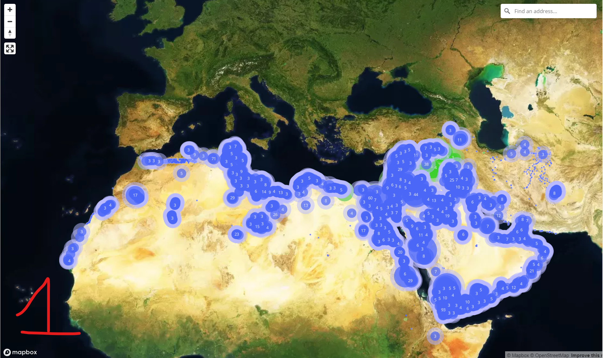
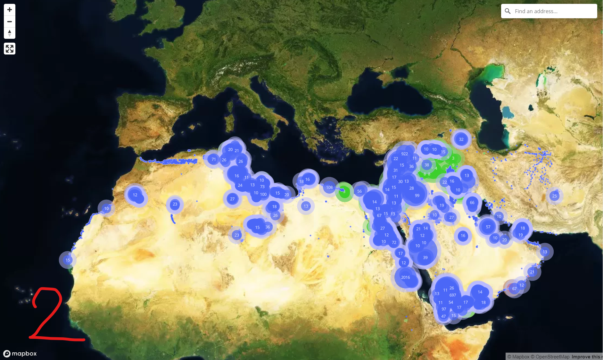
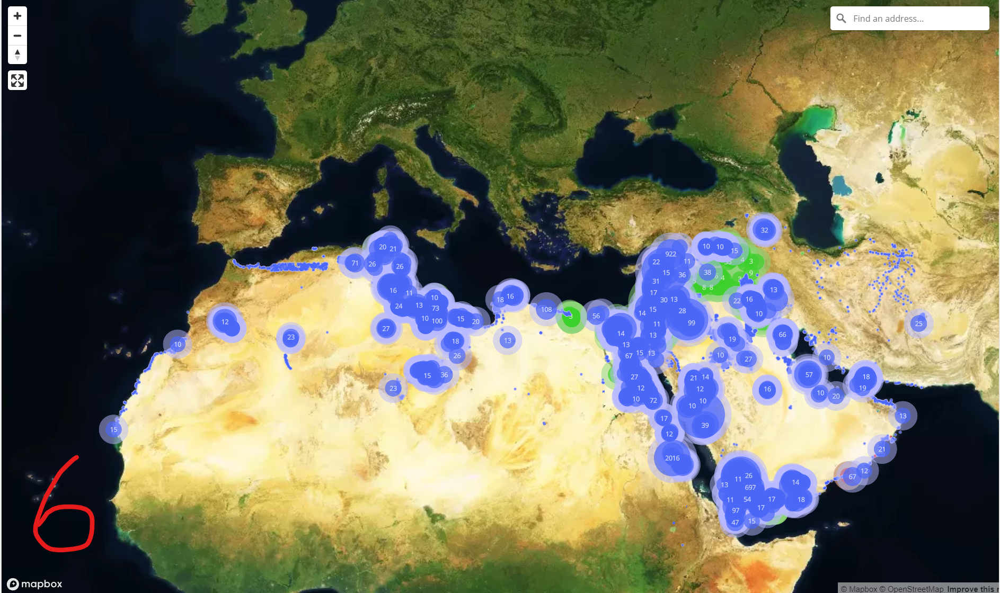

# Customization

## Landing page

To give a new "skin" to the landing page of EAv4, we can change the background images and captions of the slides. 

  
   
    <em>Landing page of EAMENA v4</em> <https://database.eamena.org/>

## `index.htm` file

### Update the file

Change the `index.htm` file directly: https://github.com/eamena-project/eamena-arches-dev/blob/main/dbs/database.eamena/customisation/index.htm (paths and captions). 

* example for [Slide 1](https://github.com/eamena-project/eamena-arches-dev/blob/11df37b9c528e4e3b423ae00464190432bd69c0c/dbs/database.eamena/customisation/index.htm#L255-L275)

1. Change the [image name](https://github.com/eamena-project/eamena-arches-dev/blob/11df37b9c528e4e3b423ae00464190432bd69c0c/dbs/database.eamena/customisation/index.htm#L258) [^1]
2. Change the [caption name](https://github.com/eamena-project/eamena-arches-dev/blob/11df37b9c528e4e3b423ae00464190432bd69c0c/dbs/database.eamena/customisation/index.htm#L273) [^2]

## Import the updated file to the EA instance

* Connect the EA instance throug SSH as with the `arches` account

* move to the `index.htm` folder: 

  - `cd /opt/arches/eamena/eamena/templates`

* rename the former `index.htm` to the `archives/` folder by running this

  - `./archive-index.sh`

It will add the 'yesterday' date to the begining of the file, and move this renammed file into `archives/`

* import the updated `index.htm` from GitHub to EAMENA: 

  - `wget https://raw.githubusercontent.com/eamena-project/eamena-arches-dev/main/dbs/database.eamena/custom/index.htm`

* refresh EA landing page in your internet browser

## Image

You can add the images in this folder: https://github.com/eamena-project/eamena-arches-dev/tree/main/dbs/database.eamena/img and import it to the EA instance:

1. Connect the EA instance throug SSH as with the `arches` account
2. move to the landing images folder: 
  - `/opt/arches/media/img/landing/eamena`
3. import the image:
  - `wget https://github.com/eamena-project/eamena-arches-dev/blob/main/dbs/database.eamena/img/APAAME_20221123_FAB-0154_reduced.jpg`

## Map Layer Management

### Clustering
> Clustering of Heritage Places

  
   
    <em>1. Cluster Distance = .75 ; Cluster Min Points = 3; Results: few clusters with a small number of HP</em>

  
   
    <em>2. Cluster Distance = 10 ; Cluster Min Points = 10; Results: few clusters with a very large number of HP</em>

  
   
    <em>6. Cluster Distance = 5, Cluster points = 10</em>

---

⚠️ if there's an error:
1. delete the updated `index.htm`
2. rename reverse: rename `index_old.htm` to `index.htm`  

[^1]: `index.htm` -> `/opt/arches/eamena/eamena/templates`
[^2]: images -> `/opt/arches/eamena/eamena/media/img/landing/eamena`