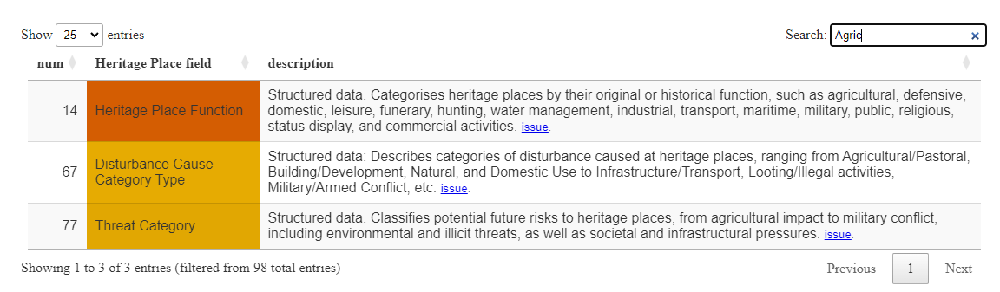

# EAMANA DB's Data

[Reference Data](#reference-data), [Business data](#business-data)

---

# Reference Data

**Reference data** includes Resource Models, Concepts, Grids, etc. This is all data provided a priori (≠ Business data)

## Resource Models
> RM

* [Heritage Places](https://github.com/eamena-project/eamena-arches-dev/tree/main/dbs/database.eamena/data/reference_data#heritage-places)
* [Information Resources](https://github.com/eamena-project/eamena-arches-dev/tree/main/dbs/database.eamena/data/reference_data#information-resources)

### Heritage Places
> HP, HP Resource Model, HP RM

* HP reference data is located here: https://github.com/eamena-project/eamena-arches-dev/tree/main/dbs/database.eamena/data/reference_data/rm/hp

* The latest BU template serves as the reference for:
  - [field values descriptions](#fields)

* The template `mds-template-*` is the reference table for:
  - groups of fields and fields descriptions
  - [MDS](#mds)
  - eamenaR mapping file `ids.csv` (see [eamenaR documentation](https://github.com/eamena-project/eamenaR#correspondances-between-concept-labels-and-uuids))

* [mds-template.xlsx](rm/hp/mds/mds-template.xlsx):
  - an editable XLSX file with the list of HP fields with their UUID and a "Yes" mark if these fields belong to the mds. This file is considered the authoritative document for MDS.

* [mds-template-readonly.tsv](rm/hp/mds/mds-template-readonly.tsv):
  - a read-only TSV file with the list of HP fields with their UUID and a "Yes" mark if these fields belong to the mds. This files results from the automatic export of [mds-template.xlsx](rm/hp/mds/mds-template.xlsx), it will be overwrite each time 'mds-template.xlsx' is updated)

**Level of aggregation**

This indicates that fields, including field values (`level3`, the most detailed level), can be aggregated into broader categories (`level2` and `level1`, the most general levels). 

#### Fields

##### Field descriptions
> on the [EAMENA website](https://eamena.org/advanced-use#rm-hp-fields)

Thinner categories (`level3`) colored by groups: [[fields-description.html](https://eamena-project.github.io/eamena-arches-dev/dbs/database.eamena/data/reference_data/rm/hp/mds/fields-description.html)]

<p align="center">
  
  <br>
    <em>Screenshot of the HTML dynamic/interactive table 'fields-description.html', with a search on 'Agricul' with field colored by groups and field descriptions</em>
</p>

##### Groups of fields descriptions

Fields (`level3`) are grouped in broader categories, or groups (`level1`). These groups are colored according to the MDS reference file, and HTML links are added to value descriptions ([Individual reference sheets](https://github.com/eamena-project/eamena-arches-dev/tree/main/data/bulk#individual-reference-sheets)): [[field-to-tsv.html](https://eamena-project.github.io/eamena-arches-dev/dbs/database.eamena/data/reference_data/rm/hp/mds/field-to-tsv.html)]

<p align="center">
  
  <br>
    <em>Screenshot of the HTML dynamic/interactive table 'field-to-tsv.html', with colored groups and hyperlinks to the indiviudal reference sheets</em>
</p>

##### MDS
> Minimum Data Standards. Completness of data, on the [EAMENA website](https://eamena.org/advanced-use#rm-hp-mds)

Minimum Data Standards (MDS) of Heritage Places. MDS fields in this HTML circular plot [[mds-reference.html](https://eamena-project.github.io/eamena-arches-dev/dbs/database.eamena/data/reference_data/rm/hp/mds/mds-reference.html)]

<p align="center">
  
  <br>
    <em>A screenshot of the `mds_level.html` file showing the 98 fields of the Heritage Places with the MDS fields (highlighted, thumbs up) using the `mds-reference.ipynb` script</em>
</p>

##### ERD
> Entity-relationships diagram, on the [EAMENA website](https://eamena.org/advanced-use#rm-hp-erd)


ERD of HP with fieldnames and CIDOC-CRM entities and relationships [[EAMENA-erd.html](https://eamena-project.github.io/eamena-arches-dev/dbs/database.eamena/data/reference_data/rm/hp/erd/EAMENA-erd.html)]

<p align="center">
  
  <br>
    <em>A screenshot of the Python `pyvis` ERD HTML file (detail) showing the 98 fields of the Heritage Places with the MDS fields (colored) using the coding from `EAMENA-erd.ipynb` or `EAMENA_spa.ipynb` scripts</em>
</p>

---

* [mds-reference.ipynb](https://github.com/eamena-project/eamena-arches-dev/blob/main/dbs/database.eamena/data/reference_data/mds/mds-reference.ipynb)
  - a Jupyter/Python document to run mds reference
* [mds-assessment.ipynb](https://github.com/eamena-project/eamena-functions/blob/main/mds/mds.ipynb):
  - a Jupyter/Python document to run mds assessment on heritage places
* [convert_xlsx_to_tsv.py](https://github.com/eamena-project/eamena-arches-dev/blob/main/dbs/database.eamena/data/reference_data/mds/convert_xlsx_to_tsv.py):
  - a Python simple script to convert 'mds-template.xlsx' into 'mds-template-readonly.tsv'. This script is run automatically, in a GitHub Action with [mds-to-tsv.yml](https://github.com/eamena-project/eamena-arches-dev/blob/main/.github/workflows/mds-to-tsv.yml), each time 'mds-template.xlsx' is updated.


<p align="center">
  
  <br>
    <em>A screenshot of the editable 'mds-template.xlsx'</em>
</p>

##### Values
> Field values

Photographs give a visual documentation of field values [[concepts_images_graph.ipynb]](https://colab.research.google.com/github/eamena-project/eamena-data/blob/main/reference-data/concepts/heritage_places/concepts_images_graph.ipynb)

<p align="center">
  
  <br>
    <em>A screenshot of the Python `pyvis` ERD HTML file (detail) using the coding from `concepts_images_graph.ipynb` script (in progress)</em>
</p>

Field value descriptions pertain to `level3` fields. They are listed in this file: [[README.md](https://github.com/eamena-project/eamena-arches-dev/tree/main/dbs/database.eamena/data/reference_data/rm/hp/values#readme)]. The latter is generated through the [split_bu_template.py]() script

```sh
py C:/Rprojects/eamena-arches-dev/dbs/database.eamena/data/bulk_data/functions/split_bu_template.py "../templates/Bulk_Upload_template_240228.xlsx" "C:/Rprojects/eamena-arches-dev/dbs/database.eamena/data/reference_data/rm/hp/values"
```

This script reads a BU template (ex: `Bulk_Upload_template_240228.xlsx`). 

<p align="center">
  
  <br>
    <em>Screenshot of the BU template worksheet 'Condition Assessment'. The script which uses '#' and empty row markers to delineate field descriptions</em>
</p>


### Information Resources
> IR, IR Resource Model, IR RM

field names' UUIDs are listed here: [ir-uuids-readonly.tsv](ir-uuids-readonly.tsv). The Python script that generate this file is [nodes_id.ipynb](nodes_id.ipynb)

## Grids


[EAMENA_Grid_contour.geojson](https://github.com/eamena-project/eamena-arches-dev/blob/main/dbs/database.eamena/data/reference_data/grids/EAMENA_Grid_contour.geojson) (screenshot, countour only) and [EAMENA_Grid.geojson]((https://github.com/eamena-project/eamena-arches-dev/blob/main/dbs/database.eamena/data/reference_data/grids/EAMENA_Grid.geojson)) (with grid cells)

# Business data

Add new HP from a BU ([BU Upload](https://github.com/eamena-project/eamena-arches-dev/tree/main/dbs/database.eamena/data#bulk-upload)), append new values ([BU append](https://github.com/eamena-project/eamena-arches-dev/tree/main/dbs/database.eamena/data#bu-append)) and related resources ([r2r append](https://github.com/eamena-project/eamena-arches-dev/tree/main/dbs/database.eamena/data#r2r-append)) in an existing HP, using templates and [functions](https://github.com/eamena-project/eamena-arches-dev/tree/main/dbs/database.eamena/data#function). 

* Abrevv.

| Abrevv.  | Full name              |
|----------|------------------------|
| HP       | Heritage Place         |
| IR       | Information Resources  |
| PO       | Person/Organisation    |
| GS       | Grid Squares           |


## Bulk Upload
> BU

Bulk upload is a process for uploading **many HPs** data in one single XLSX file, and possibly **many XLSX** files, into the EAMENA database without going through the graphical user interface (see [DB diagram, "local" subgraph](https://github.com/eamena-project/eamena-arches-dev/tree/main/dbs/database.eamena#diagram)): it speeds up data entry. The BU process is handle by the Bulk-Uploader plugin in the EAMENA DB.

### Template files

The last/updated version of the BU template appears on the upper part of this table (first row of the table, not strikethrough):  
  
<p align="center">

| Name 	| Host 	| URL 	|
|------|------	|-----	|
| Bulk_Upload_template_240911.xlsx | GitHub  | https://github.com/eamena-project/eamena-arches-dev/blob/main/dbs/database.eamena/data/bulk_data/templates/Bulk_Upload_template_240911.xlsx |
| ~~Bulk_Upload_template_240701.xlsx~~ | GitHub  | https://github.com/eamena-project/eamena-arches-dev/blob/main/dbs/database.eamena/data/bulk_data/templates/Bulk_Upload_template_240701.xlsx |
| ~~Bulk_Upload_template_231017.xlsx~~ | GitHub  | https://github.com/eamena-project/eamena-arches-dev/blob/main/dbs/database.eamena/data/bulk_data/templates/Bulk_Upload_template_231017.xlsx |
| ~~Bulk_Upload_template_221025.xlsx~~ | GitHub | https://github.com/eamena-project/eamena-arches-dev/blob/main/dbs/database.eamena/data/bulk_data/templates/Bulk_Upload_template_221025.xlsx	|
| ~~E61N30-13-Revised.xls~~ | GitHub | https://github.com/eamena-project/eamena-arches-dev/blob/main/dbs/database.eamena/data/bulk_data/templates/E61N30-13-Revised.xlsx    	|
| ~~34cfe98e-c2c0-11ea-9026-02e7594ce0a0.xlsx~~ | EAMENA DB | https://database.eamena.org/en/bulk-upload/templates/34cfe98e-c2c0-11ea-9026-02e7594ce0a0.xlsx    	|
| ~~BUS_TemplateUpdate20072021.xlsx~~   	 | Google Drive	| https://drive.google.com/file/d/1KtZlCB_mdTOPxh1DpFdfeXddjJLTvF1k/view?usp=sharing    	|

</p>

#### How to fill an Heritage Place BU

Explanations of the BU fields (ex: `Name Type`) are [**here**](https://eamena.org/advanced-use#rm-hp-fields) while explanation on possible values are within the different sheets (ex: `Alternative Reference`)

<p align="center">
  
  <br>
	<em>The BU template. In yellow, the different sheets where the dropdown values (ie. controled vocabularies) are coming from alongside value definitions</em>
</p>


#### Individual reference sheets

To make it easier to reference and share controlled vocabularies, the numerous BU template sheets (XLSX) can be converted into TSV files that can be read on GitHub using the [split_bu_template.py](https://github.com/eamena-project/eamena-arches-dev/blob/main/dbs/database.eamena/data/bulk_data/functions/split_bu_template.py) function. For example:

```bash
py split_bu_template.py "Bulk_Upload_template_231017.xlsx" "C:/Rprojects/eamena-arches-dev/data/bulk/templates/doc"
```

<p align="center">
  
  <br>
	<em>The BU template is a set of different templates. In yellow, example of the BU template sheets that will be exported as TSV file</em>
</p>


Will create the many TSV located into the folder https://github.com/eamena-project/eamena-arches-dev/tree/main/dbs/database.eamena/data/bulk_data/templates/doc: 
* [bu_Archaeological Assessment](https://github.com/eamena-project/eamena-arches-dev/blob/main/dbs/database.eamena/data/bulk_data/templates/doc/bu_Archaeological%20Assessment.tsv)
* [bu_Assessment Summary](https://github.com/eamena-project/eamena-arches-dev/blob/main/dbs/database.eamena/data/bulk_data/templates/doc/bu_Assessment%20Summary.tsv)
* [bu_Built Component](https://github.com/eamena-project/eamena-arches-dev/blob/main/dbs/database.eamena/data/bulk_data/templates/doc/bu_Built%20Component.tsv)
* ...

<p align="center">
  
  <br>
	<em>A search on 'Rol' in the <a href="https://github.com/eamena-project/eamena-arches-dev/blob/main/data/bulk/templates/doc/bu_Person-Organization.tsv">bu_Person-Organization</a> file</em>
</p>


## Data append

Data append entails (i) the append of usual data ([BU append](https://github.com/eamena-project/eamena-arches-dev/tree/main/dbs/database.eamena/data#bu-append)), such as Alternative names, coordinates, etc., and (ii) the append of related resources ([r2r append](https://github.com/eamena-project/eamena-arches-dev/tree/main/dbs/database.eamena/data#r2r-append)) in a HP. It is different from [Bulk Upload](https://github.com/eamena-project/eamena-arches-dev/tree/main/dbs/database.eamena/data#bulk-upload).


* r2r: `python manage.py packages -o import_business_data_relations -s ...`
* BU append: `python manage.py packages -o import_business_data -s ...`

#### limits

see: [#57](https://github.com/eamena-project/eamena-arches-dev/issues/57#issuecomment-2334212067) and following

#### templates

[bulk_data_hp_template.csv](https://github.com/eamena-project/eamena-arches-dev/blob/main/dbs/database.eamena/data/bulk_data/templates/bulk_data_hp_template.csv) or [bulk_data_hp_template_empty.csv](https://github.com/eamena-project/eamena-arches-dev/blob/main/dbs/database.eamena/data/bulk_data/templates/bulk_data_hp_template_empty.csv)


### BU append
> BU append, Append data to an already existing record

A BU append is necessarly a CSV file. A mapping file (`.mapping`) is also necessary, cf: https://github.com/eamena-project/eamena-arches-dev/tree/main/dbs/database.eamena/data/mapping_files, do not include Related Resources (see: [#57](https://github.com/eamena-project/eamena-arches-dev/issues/57)). **ResourceID** is the only required field.

The process is `import_business_data -s 'path\to\bu_append_file' -ow append`

---

To create a BU from a structured file, or to recast structured data (source) to a BU format (target), see the [eamenaR](https://github.com/eamena-project/eamenaR#bu-mapping) package

---

#### Template files
> BU append templates

The last/updated version of the BU template appears on the upper part of this table (first row of the table, not strikethrough):  
  
<p align="center">

| Name 	| Host 	| URL 	| Description |
|------|------	|-----	|------       |
| Bulk_Append_template_240911.csv | GitHub  | https://github.com/eamena-project/eamena-arches-dev/blob/main/dbs/database.eamena/data/bulk_data/templates/Bulk_Append_template_240911.csv | |
| ~~caravanserail_outCSV2.csv~~ | GitHub  | https://github.com/eamena-project/eamena-arches-dev/blob/main/dbs/database.eamena/data/bulk_data/append/caravanserail_outCSV2.csv | Adding new geometries (Polygons) to HP (caravanserails). These geometries will be added to already existing geometries (Points) |
| ~~bu_append_hp_grid_20240116.csv~~ | GitHub  | https://github.com/eamena-project/eamena-arches-dev/blob/main/dbs/database.eamena/data/bulk_data/append/bu_append_gs.csv | Append missing GS to HP |


#### Fields

There are slight changes between the fieldnames in the BU template and the field names in the BU append template. The latter is closer to what exists in the database, with many remaining extra trailing spaces and some longer field names

<p align="center">
  
  
  <br>
	<em>Be careful about the trailing spaces in the DB (in blue). These extra spaces have to be added to some fieldnames in the BU file</em>
</p>


| BU template                                      | BU append template                                       | changes                                                    |
|--------------------------------------------------|----------------------------------------------------------|------------------------------------------------------------|
| Assessment Investigator - Actor                  | Assessment Investigator - Actor                          |                                                            |
| Investigator Role Type                            | Investigator Role Type                                   |                                                            |
| Assessment Activity Type                          | Assessment Activity Type                                 |                                                            |
| Assessment Activity Date                          | Assessment Activity Date                                 |                                                            |
| GE Assessment(Yes/No)                             | GE Assessment(Yes/No)                                    |                                                            |
| Resource Name                                     | Resource Name                                            |                                                            |
| Name Type                                         | Name Type                                                |                                                            |
| Heritage Place Type                               | Heritage Place Type                                      |                                                            |
| Heritage Place Function                           | Heritage Place Function                                  |                                                            |
| Heritage Place Function Certainty                 | Heritage Place Function Certainty                        | extra trailing space                                      |
| Site Overall Shape Type                           | Overall Site Shape Type                                  | different fieldname                                      |
| Overall Archaeological Certainty Value            | Overall Archaeological Certainty Value                   | extra trailing space                                      |
| Overall Site Morphology Type                      | Overall Site Morphology Type                             |                                                            |
| Cultural Period Type                              | Cultural Period Type                                     |                                                            |
| Cultural Period Certainty                         | Cultural Period Certainty                                |                                                            |
| Cultural Subperiod Type                           | Cultural Sub-period Type                                 | different field name                                      |
| Cultural Subperiod Certainty                      | Cultural Sub-period Certainty                            | different field name                                      |
| Date Inference Making Actor                       | Date Inference Making Actor Name                         | different field name                                      |
| Site Feature Form Type                            | Site Feature Form Type                                   |                                                            |
| Site Feature Form Type Certainty                  | Site Feature Form Type Certainty                         |                                                            |
| Site Feature Shape Type                           | Site Feature Shape Type                                  |                                                            |
| Site Feature Arrangement Type                     | Site Feature Arrangement Type                            |                                                            |
| Site Feature Number Type                          | Site Feature Number Type                                 |                                                            |
| Site Feature Interpretation Type                  | Site Feature Interpretation Type                         |                                                            |
| Site Feature Interpretation Number                | Site Feature Interpretation Number Type                  | different field name                                      |
| Site Feature Interpretation Certainty             | Site Feature Interpretation Certainty                     |                                                            |
| Overall Condition State                           | Overall Condition State Type                             |                                                            |
| Damage Extent Type                                | Damage Extent Type                                       |                                                            |
| Disturbance Cause Category Type                   |      Disturbance Cause Category Type                        |                                                            |
| Disturbance Cause Type                            |                                                          |                                                            |
| Disturbance Cause Certainty                       | Disturbance Cause Certainty                              | extra trailing space                                      |
| Disturbance Date From                             |                                                          |                                                            |
| Disturbance Date To                               | Disturbance Date To                                      | extra trailing space                                      |
| Disturbance Date Occurred Before                  |                                                          |                                                            |
| Disturbance Cause Assignment Assessor Name        | Disturbance Cause Assignment Assessor Name - Actor       | different field name                                      |
| Effect Type                                       |                                                          |                                                            |
| Effect Certainty                                  |                                                          |                                                            |
| Threat Category                                   |                                                          |                                                            |
| Threat Type                                       | Threat Cause Type                                        | different field name                                      |
| Threat Probability                                | Threat Probability                                       | extra trailing space                                      |
| Threat Inference Making Assessor Name             | Threat Inference Making Assessor Name - Actor            | different field name                                      |
| Topography Type                                   |                                                          |                                                            |

Correct fieldnames are listed here (CSV layout). Those can be copied and placed as header in the [Data to append](https://github.com/eamena-project/eamena-arches-dev/blob/main/dbs/database.eamena/data/bulk_data/append/bu_append_to_be_mapped.csv) file (remember to keep the trailing spaces, etc.)

```
ResourceID, Assessment Investigator - Actor,Investigator Role Type,Assessment Activity Type,Assessment Activity Date,GE Assessment(Yes/No),Information Resource Used, Resource Name,Name Type,Heritage Place Type,Heritage Place Function,Heritage Place Function Certainty ,Overall Site Shape Type,Overall Archaeological Certainty Value ,Overall Site Morphology Type,Cultural Period Type,Cultural Period Certainty,Cultural Subperiod Type,Cultural Subperiod Certainty,Date Inference Making Actor Name,Site Feature Form Type,Site Feature Form Type Certainty,Site Feature Shape Type,Site Feature Arrangement Type,Site Feature Number Type,Site Feature Interpretation Type,Site Feature Interpretation Number,Site Feature Interpretation Certainty,Overall Condition State,Damage Extent Type,Disturbance Cause Category Type,Disturbance Cause Type,Disturbance Cause Certainty,Disturbance Date From,Disturbance Date To,Disturbance Date Occurred Before,Disturbance Cause Assignment Assessor Name,Effect Type,Effect Certainty,Threat Category,Threat Type,Threat Probability,Threat Inference Making Assessor Name,Topography Type
```

The reference is [hp-uuids.csv](https://raw.githubusercontent.com/eamena-project/eamena-arches-dev/main/dbs/database.eamena/data/reference_data/rm/hp/hp-uuids.csv) (raw format), directly created from the RM. You can also check the name of the fields in the reference data [mds-template-readonly.tsv](https://github.com/eamena-project/eamena-arches-dev/blob/main/dbs/database.eamena/data/reference_data/mds/mds-template-readonly.tsv) file  

#### validated fields

| RM | field | format and description |
|----|--------------|----------|
| HP | **ResourceID**   | the UUID of the ressource  |
| HP | Assessment Activity Date   | Date format `YYYY-MM-DD`   |
| HP | Disturbance Cause Category Type |   |
| HP | Disturbance Cause Type |   |
| HP | Disturbance Cause Certainty |   |
| HP | Disturbance Date From | Date format `YYYY-MM-DD` |
| HP | Disturbance Date To | Date format `YYYY-MM-DD`  |
| HP | Disturbance Date Occurred Before | Date format `YYYY-MM-DD`  |
| HP | Disturbance Date Occurred On |  Date format `YYYY-MM-DD` |
| HP | Disturbance Cause Assignment Assessor Name | Free text  |
| HP | Grid ID | |

#### invalid fields

Do not BU append these fields but choose [Resource-to-Resource](#resource-to-resource-relationship) import

| RM | field | format and description |
|----|--------------|----------|
| HP | Assessment Investigator - Actor   | this is a *related resource*, will create an error  |


### r2r append
> res2res, r2r, resource-to-Resource relationship append

To update a r2r relationships, for example between an HP and a PO (field 'Assessment Investigator - Actor' in HP), or between an HP and a IR (field 'Information Resource Used' in IR).

#### Import

the process is `import_business_data_relations -s 'path\to\relations_file'` will add a new r2r relationship.

##### Examples

* the [res2res_hp_ir.relations](https://github.com/eamena-project/eamena-arches-dev/blob/main/dbs/database.eamena/data/business_data_relations/res2res_hp_ir.relations) file

| resourceinstanceidfrom              | resourceinstanceidto                | relationshiptype                                         | datestarted | dateended | notes |
|-------------------------------------|-------------------------------------|----------------------------------------------------------|-------------|-----------|-------|
| a882affc-60cb-4dcb-a26c-c2721fd0797c | ecdc771c-ff31-42c7-9ec9-522e6302e6f0 | http://www.cidoc-crm.org/cidoc-crm/P129i_is_subject_of   |             |           |       |

Where `a882affc-60cb-4dcb-a26c-c2721fd0797c` is an HP and `ecdc771c-ff31-42c7-9ec9-522e6302e6f0` is INFORMATION-0000052.

* the [res2res_hp_po.relations](https://github.com/eamena-project/eamena-arches-dev/blob/main/dbs/database.eamena/data/business_data_relations/res2res_hp_po.relations) file

| resourceinstanceidfrom              | resourceinstanceidto                | relationshiptype                                   | datestarted | dateended | notes |
|-------------------------------------|-------------------------------------|----------------------------------------------------|-------------|-----------|-------|
| 1062dbf4-70a2-4b87-b0f1-0f459b6c3016 | 5bc25761-cf35-4350-b0cd-002b8c813d64 | http://www.ics.forth.gr/isl/CRMdig/L33_has_maker   |             |           |       |


Where `1062dbf4-70a2-4b87-b0f1-0f459b6c3016` is EAMENA-0264152 and `5bc25761-cf35-4350-b0cd-002b8c813d64` is Martin Sterry.

## Functions

Python functions. The generic function to manage Business data is [business_data.py](https://github.com/eamena-project/eamena-functions/blob/main/business_data.py) in the [eamena-functions](https://github.com/eamena-project/eamena-functions/) repo.

### filter_business_data()

Filter data that have to be uploaded by BU append function and data that to be append by r2r functions, see [filter_business_data()](https://github.com/eamena-project/eamena-functions/blob/main/business_data.py#L5).

# Reference data

* [MDS](reference_data/README.md)

# Resource models

---

# Others

* [GeoJSON URL to GeoJSON file](https://colab.research.google.com/github/eamena-project/eamena-arches-dev/blob/main/dbs/database.eamena/data/business_data/geojsonUrl_to_geojsonFile.ipynb)
* SQL 

## ~~BU process~~
> ⚠️ This process is no longer in use ⚠️ ~~step-by-step BU procedure from the user-side~~

<p align="center">
  
  <br>
	<em>The folder `2021-11-22-B-BIJAN` contains two XLSX files</em>
</p>


Start by creating a root `examples/` folder on **your OneDrive**, or equivalent, create and authorise the DB Manager to write only in this folder. See the 'ideal' file/folder naming/structure on the [examples/](https://github.com/eamena-project/eamena-arches-dev/tree/main/output/bulk/examples) folder. 

1. choose short and self-explanatory names for your **XLSX file(s)**, like the format *`GridSquare-GridSquareSubpart-YourName`* (ex: `E61N31-23-Bijan.xlsx`), avoiding dots and spaces in the filename (~~`E61 N31 23.Bijan.xlsx`~~) 

2. add the BUs worksheets in a **folder** named *`YYYY-MM-DD-YourName`* (ex: `2021-11-23-Bijan`). If you run various BUs processes during the same day, you will have to name your folders with different suffixes (ex: Bulk 1: `2021-11-22-Bijan`; Bulk 2: `2021-11-22a-Bijan`)

3. add your BU folders in the root root `examples/` folder. Send a **Slack message** (eamena.slack.com) to the DB Manager with the **link to the folder(s)** 

:-1: if **the BU doesn't work**, because of errors, the DB Manager will send you an **error report** in the form of an error JSON file named in the same way as your BU files (ex: [`E61N31-22-Bijan.json`](https://github.com/eamena-project/eamena-arches-dev/blob/main/output/bulk/examples/2021-11-21-Bijan/E61N31-21-Bijan.json))
  - follow the recommendations of the error JSON file, correcting the content of your file. Once done, change the name of your file to something explicit, e.g. adding the suffix `-rev` (for `revised`) at the end of the file name (ex: `E61N31-22-Bijan.xlsx` -> `E61N31-22-Bijan-rev.xlsx`)

:+1: if **the BU works**, the DB Manager will send you a **confirmation** that your BU has been uploaded, and the JSON output will be uploaded into the **same OneDrive folder** as your BUs worksheets 
  - if you ask to, the DB Manager will send you a [BU summary](https://github.com/eamena-project/eamena-arches-dev/blob/main/output/bulk/BU.md#bu-summary) in the form of a JSON file named in the same way as your BU files with the suffix `-sum` (for `summary`), ex: [`E61N31-22-Bijan-rev-sum.json`](https://github.com/eamena-project/eamena-arches-dev/blob/main/output/bulk/examples/2021-11-21-Bijan/E61N31-21-Bijan-rev-sum.json)

4. once you received the confirmation that your BU has been uploaded into the DB, **move your BU folder into an archive folder** 


## BU summary
> After a successfull BU, render a short summary for the user

Once the BU process has been completed, a resume can be displayed with a Python command[^1]. The result is copied/pasted in a JSON file. A Search &Replace allows to convert the UUID into an URL[^2]


<p align="center">
  
  <br>
	<em>screenshot of the JSON with URL</em>
</p>

The URL opens the Resource Report

<p align="center">
  
  <br>
	<em>screenshot of the Resource Report</em>
</p>

The Resource name can be search in the map database

<p align="center">
  
  <br>
	<em>screenshot of the Resource Report</em>
</p>


[^1]: `python /opt/arches/eamena/manage.py bu -o summary -s "filename.json" | json_pp`
[^2]: Search: `"uuid" : "`, Replace by `"uuid" : "https://database.eamena.org/en/report/`