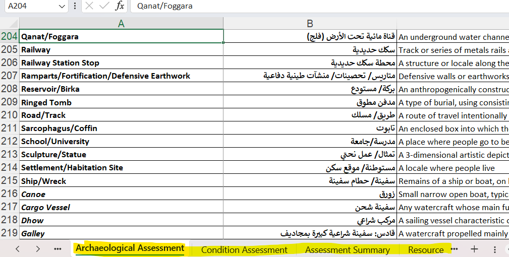

# Business data

Add new HP from a BU, or append new values in an existing HP, using the procedure BU append. The generic function to manage Business data using management functions.

## Management functions

### append_filter_data()

Filter data that have to be uploaded by BU append function and data that to be append by r2r functions, see [append_filter_data()](https://github.com/eamena-project/eamena-functions/blob/ed4b489277b1d4045650c9cb0920ec99c7f5bd57/business_data.py#L5) in the [eamena-functions](https://github.com/eamena-project/eamena-functions/) repo.


## Bulk Upload
> BU

Bulk upload is a process for uploading **many HPs** data in one single XLSX file, and possibly **many XLSX** files, into the EAMENA database without going through the graphical user interface (see [DB diagram, "local" subgraph](https://github.com/eamena-project/eamena-arches-dev/tree/main/dbs/database.eamena#diagram)): it speeds up data entry. 

### Template files

The last/updated version of the BU template appears on the upper part of this table (first row of the table, not strikethrough):  
  
<p align="center">

| Name 	| Host 	| URL 	|
|------|------	|-----	|
| Bulk_Upload_template_240701.xlsx | GitHub  | https://github.com/eamena-project/eamena-arches-dev/blob/main/dbs/database.eamena/data/bulk_data/templates/Bulk_Upload_template_240701.xlsx |
| ~~Bulk_Upload_template_231017.xlsx~~ | GitHub  | https://github.com/eamena-project/eamena-arches-dev/blob/main/dbs/database.eamena/data/bulk_data/templates/Bulk_Upload_template_231017.xlsx |
| ~~Bulk_Upload_template_221025.xlsx~~ | GitHub | https://github.com/eamena-project/eamena-arches-dev/blob/main/dbs/database.eamena/data/bulk_data/templates/Bulk_Upload_template_221025.xlsx	|
| ~~E61N30-13-Revised.xls~~ | GitHub | https://github.com/eamena-project/eamena-arches-dev/blob/main/dbs/database.eamena/data/bulk_data/templates/E61N30-13-Revised.xlsx    	|
| ~~34cfe98e-c2c0-11ea-9026-02e7594ce0a0.xlsx~~ | EAMENA DB | https://database.eamena.org/en/bulk-upload/templates/34cfe98e-c2c0-11ea-9026-02e7594ce0a0.xlsx    	|
| ~~BUS_TemplateUpdate20072021.xlsx~~   	 | Google Drive	| https://drive.google.com/file/d/1KtZlCB_mdTOPxh1DpFdfeXddjJLTvF1k/view?usp=sharing    	|

</p>

#### How to fill an Heritage Place BU

Explanations of the BU fields (ex: `Name Type`) are [**here**](https://eamena.org/advanced-use#rm-hp-fields) while explanation on possible values are within the different sheets (ex: `Alternative Reference`)

<p align="center">
  
  <br>
	<em>The BU template. In yellow, the different sheets where the dropdown values (ie. controled vocabularies) are coming from alongside value definitions</em>
</p>


#### Individual reference sheets

To make it easier to reference and share controlled vocabularies, the numerous BU template sheets (XLSX) can be converted into TSV files that can be read on GitHub using the [split_bu_template.py](https://github.com/eamena-project/eamena-arches-dev/blob/main/dbs/database.eamena/data/bulk_data/functions/split_bu_template.py) function. For example:

```bash
py split_bu_template.py "Bulk_Upload_template_231017.xlsx" "C:/Rprojects/eamena-arches-dev/data/bulk/templates/doc"
```

<p align="center">
  
  <br>
	<em>The BU template is a set of different templates. In yellow, example of the BU template sheets that will be exported as TSV file</em>
</p>


Will create the many TSV located into the folder https://github.com/eamena-project/eamena-arches-dev/tree/main/dbs/database.eamena/data/bulk_data/templates/doc: 
* [bu_Archaeological Assessment](https://github.com/eamena-project/eamena-arches-dev/blob/main/dbs/database.eamena/data/bulk_data/templates/doc/bu_Archaeological%20Assessment.tsv)
* [bu_Assessment Summary](https://github.com/eamena-project/eamena-arches-dev/blob/main/dbs/database.eamena/data/bulk_data/templates/doc/bu_Assessment%20Summary.tsv)
* [bu_Built Component](https://github.com/eamena-project/eamena-arches-dev/blob/main/dbs/database.eamena/data/bulk_data/templates/doc/bu_Built%20Component.tsv)
* ...

<p align="center">
  
  <br>
	<em>A search on 'Rol' in the <a href="https://github.com/eamena-project/eamena-arches-dev/blob/main/data/bulk/templates/doc/bu_Person-Organization.tsv">bu_Person-Organization</a> file</em>
</p>


### Mapping
> Create a BU from a structured file

To recast structured data (source) to a BU format (target), see the [eamenaR](https://github.com/eamena-project/eamenaR#bu-mapping) package

### BU append
> Append data to an already existing record

A BU append is necessarly a CSV file. A mapping file (`.mapping`) is also necessary, cf: https://github.com/eamena-project/eamena-arches-dev/tree/main/dbs/database.eamena/data/mapping_files, do not include Related Resources (see: [#57](https://github.com/eamena-project/eamena-arches-dev/issues/57)). **ResourceID** is the only required field.

The process is `import_business_data -s 'path\to\bu_append_file' -ow append`

#### validated fields

| RM | field | format and description |
|----|--------------|----------|
| HP | **ResourceID**   | the UUID of the ressource  |
| HP | Assessment Activity Date   | Date format `YYYY-MM-DD`   |
| HP | Disturbance Cause Category Type |   |
| HP | Disturbance Cause Type |   |
| HP | Disturbance Cause Certainty |   |
| HP | Disturbance Date From | Date format `YYYY-MM-DD` |
| HP | Disturbance Date To | Date format `YYYY-MM-DD`  |
| HP | Disturbance Date Occurred Before | Date format `YYYY-MM-DD`  |
| HP | Disturbance Date Occurred On |  Date format `YYYY-MM-DD` |
| HP | Disturbance Cause Assignment Assessor Name | Free text  |
| HP | Grid ID | |

#### invalid fields

Do not BU append these fields but choose [Resource-to-Resource](#resource-to-resource-relationship) import

| RM | field | format and description |
|----|--------------|----------|
| HP | Assessment Investigator - Actor   | this is a *related resource*, will create an error  |


#### templates
> BU append templates

* Check one of these templates:
  - [caravanserail_outCSV2.csv](https://github.com/eamena-project/eamena-arches-dev/blob/main/dbs/database.eamena/data/bulk_data/append/caravanserail_outCSV2.csv): Adding new geometries (Polygons) to HP (caravanserails). These geometries will be added to already existing geometries (Points).
  - [bu_append_hp_grid_20240116.csv](https://github.com/eamena-project/eamena-arches-dev/blob/main/dbs/database.eamena/data/bulk_data/append/bu_append_gs.csv). Append missing GS to HP 
* Check the name of the fields in the reference data [mds-template-readonly.tsv](https://github.com/eamena-project/eamena-arches-dev/blob/main/dbs/database.eamena/data/reference_data/mds/mds-template-readonly.tsv) file  

### BU summary
> After a successfull BU, render a short summary for the user

Once the BU process has been completed, a resume can be displayed with a Python command[^1]. The result is copied/pasted in a JSON file. A Search &Replace allows to convert the UUID into an URL[^2]


<p align="center">
  
  <br>
	<em>screenshot of the JSON with URL</em>
</p>

The URL opens the Resource Report

<p align="center">
  
  <br>
	<em>screenshot of the Resource Report</em>
</p>

The Resource name can be search in the map database

<p align="center">
  
  <br>
	<em>screenshot of the Resource Report</em>
</p>


[^1]: `python /opt/arches/eamena/manage.py bu -o summary -s "filename.json" | json_pp`
[^2]: Search: `"uuid" : "`, Replace by `"uuid" : "https://database.eamena.org/en/report/`

## Resource-to-Resource relationship
> res2res, r2r

To update a r2r relationships, for example between an HP and a PO (field 'Assessment Investigator - Actor' in HP), or between an HP and a IR (field 'Information Resource Used' in IR).

### Import

the process is `import_business_data_relations -s 'path\to\relations_file'` will add a new r2r relationship.

#### examples


* the [res2res_hp_ir.relations](https://github.com/eamena-project/eamena-arches-dev/blob/main/dbs/database.eamena/data/business_data_relations/res2res_hp_ir.relations) file

| resourceinstanceidfrom              | resourceinstanceidto                | relationshiptype                                         | datestarted | dateended | notes |
|-------------------------------------|-------------------------------------|----------------------------------------------------------|-------------|-----------|-------|
| a882affc-60cb-4dcb-a26c-c2721fd0797c | ecdc771c-ff31-42c7-9ec9-522e6302e6f0 | http://www.cidoc-crm.org/cidoc-crm/P129i_is_subject_of   |             |           |       |

Where `a882affc-60cb-4dcb-a26c-c2721fd0797c` is an HP and `ecdc771c-ff31-42c7-9ec9-522e6302e6f0` is INFORMATION-0000052.

* the [res2res_hp_po.relations](https://github.com/eamena-project/eamena-arches-dev/blob/main/dbs/database.eamena/data/business_data_relations/res2res_hp_po.relations) file

| resourceinstanceidfrom              | resourceinstanceidto                | relationshiptype                                   | datestarted | dateended | notes |
|-------------------------------------|-------------------------------------|----------------------------------------------------|-------------|-----------|-------|
| 1062dbf4-70a2-4b87-b0f1-0f459b6c3016 | 5bc25761-cf35-4350-b0cd-002b8c813d64 | http://www.ics.forth.gr/isl/CRMdig/L33_has_maker   |             |           |       |


Where `1062dbf4-70a2-4b87-b0f1-0f459b6c3016` is EAMENA-0264152 and `5bc25761-cf35-4350-b0cd-002b8c813d64` is Martin Sterry.

# Reference data

* [MDS](reference_data/README.md)

# Resource models

---

# Others

* [GeoJSON URL to GeoJSON file](https://colab.research.google.com/github/eamena-project/eamena-arches-dev/blob/main/dbs/database.eamena/data/business_data/geojsonUrl_to_geojsonFile.ipynb)
* SQL 

## ~~BU process~~
> ⚠️ This process is no longer in use ⚠️ ~~step-by-step BU procedure from the user-side~~

<p align="center">
  
  <br>
	<em>The folder `2021-11-22-B-BIJAN` contains two XLSX files</em>
</p>


Start by creating a root `examples/` folder on **your OneDrive**, or equivalent, create and authorise the DB Manager to write only in this folder. See the 'ideal' file/folder naming/structure on the [examples/](https://github.com/eamena-project/eamena-arches-dev/tree/main/output/bulk/examples) folder. 

1. choose short and self-explanatory names for your **XLSX file(s)**, like the format *`GridSquare-GridSquareSubpart-YourName`* (ex: `E61N31-23-Bijan.xlsx`), avoiding dots and spaces in the filename (~~`E61 N31 23.Bijan.xlsx`~~) 

2. add the BUs worksheets in a **folder** named *`YYYY-MM-DD-YourName`* (ex: `2021-11-23-Bijan`). If you run various BUs processes during the same day, you will have to name your folders with different suffixes (ex: Bulk 1: `2021-11-22-Bijan`; Bulk 2: `2021-11-22a-Bijan`)

3. add your BU folders in the root root `examples/` folder. Send a **Slack message** (eamena.slack.com) to the DB Manager with the **link to the folder(s)** 

:-1: if **the BU doesn't work**, because of errors, the DB Manager will send you an **error report** in the form of an error JSON file named in the same way as your BU files (ex: [`E61N31-22-Bijan.json`](https://github.com/eamena-project/eamena-arches-dev/blob/main/output/bulk/examples/2021-11-21-Bijan/E61N31-21-Bijan.json))
  - follow the recommendations of the error JSON file, correcting the content of your file. Once done, change the name of your file to something explicit, e.g. adding the suffix `-rev` (for `revised`) at the end of the file name (ex: `E61N31-22-Bijan.xlsx` -> `E61N31-22-Bijan-rev.xlsx`)

:+1: if **the BU works**, the DB Manager will send you a **confirmation** that your BU has been uploaded, and the JSON output will be uploaded into the **same OneDrive folder** as your BUs worksheets 
  - if you ask to, the DB Manager will send you a [BU summary](https://github.com/eamena-project/eamena-arches-dev/blob/main/output/bulk/BU.md#bu-summary) in the form of a JSON file named in the same way as your BU files with the suffix `-sum` (for `summary`), ex: [`E61N31-22-Bijan-rev-sum.json`](https://github.com/eamena-project/eamena-arches-dev/blob/main/output/bulk/examples/2021-11-21-Bijan/E61N31-21-Bijan-rev-sum.json)

4. once you received the confirmation that your BU has been uploaded into the DB, **move your BU folder into an archive folder** 