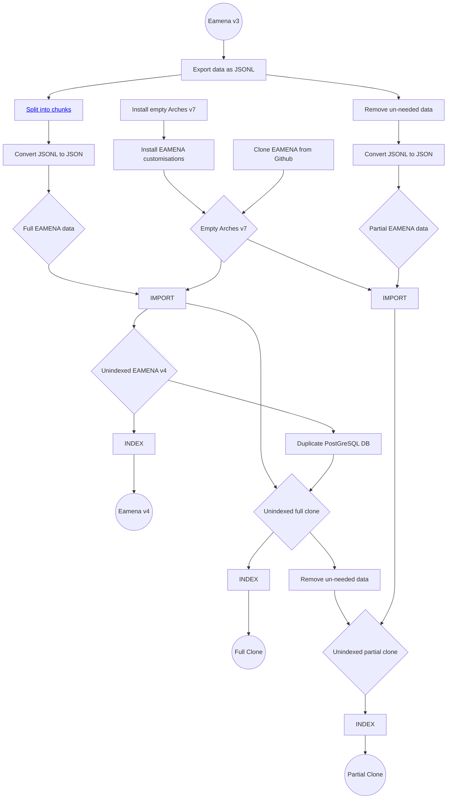

# EAMENA 4 Install Docs

In progress. For now, see [Arches 7 Upgrade](notes/Arches%207%20Upgrade.md). 

These docs describe the process of (a) installing an empty EAMENA-customised version of Arches 7.3, and (b) copying the data from an old EAMENA v3 instance to the new database.

## Prerequisites

Arches 7.3 requires Elasticsearch [8.3.3](https://artifacts.elastic.co/downloads/elasticsearch/elasticsearch-8.3.3-amd64.deb) and PostgreSQL 14 to be installed. Additionally, Arches 7 requires NPM 8.19.3 or 9.6.0 (tested and works with both), Yarn 1.22.19 and Node.JS 14.17.6. The instructions for installing and configuring all of these are linked from below.

* [Install PostgreSQL 14](prerequisites/PostgreSQL.md)
* [Install Elasticsearch 8.3.3](prerequisites/Elasticsearch.md)
* [Install NodeJS / NPM / Yarn](prerequisites/Yarn.md)

## Install Paths

Once the VM is configured correctly, follow the flow chart below in order to 

Paths to/from the various Arches/EAMENA incarnations.

* [Cloning EAMENA from Github](install/Clone.md)

