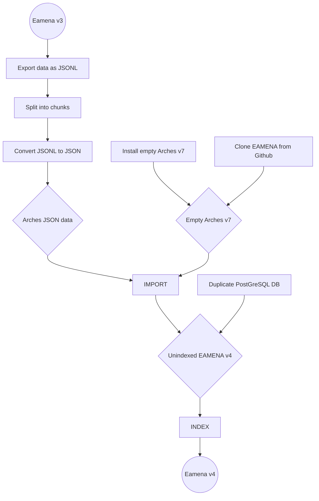

Paths to/from the various Arches/EAMENA incarnations.

```mermaid
flowchart TD
	id1((Eamena v3))-->id2[Export data as JSONL]
	id2-->id3[Split into chunks]
	id3-->id4[Convert JSONL to JSON]
	id4-->id5{Arches JSON data}
	id5-->id6[IMPORT]
	id7[Install empty Arches v7]-->id8{Empty Arches v7}
	id9[Clone EAMENA from Github]-->id8
	id8-->id6
	id6-->id10{Unindexed EAMENA v4}
	id11[Duplicate PostGreSQL DB]-->id10
	id10-->id12[INDEX]
	id12-->id13((Eamena v4))
```
