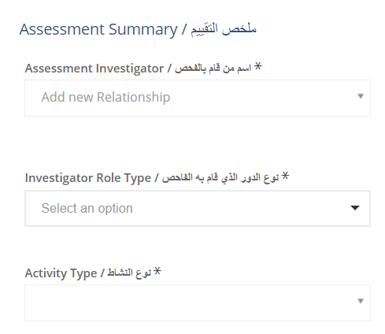
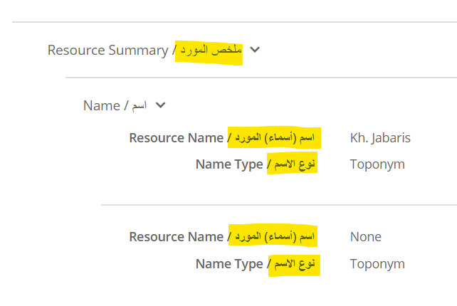
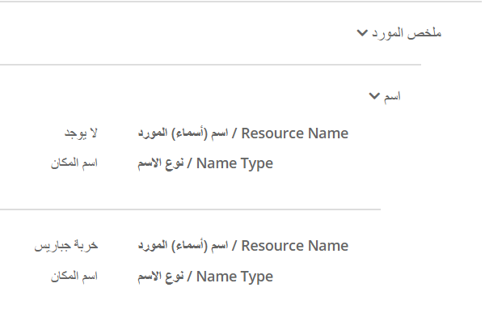
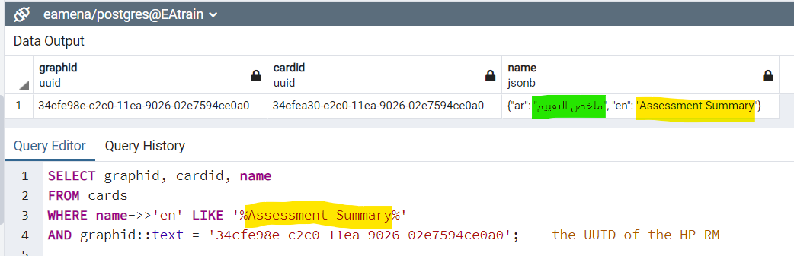
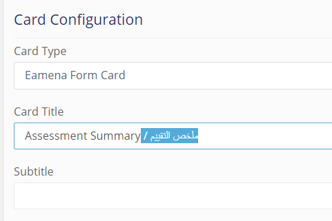
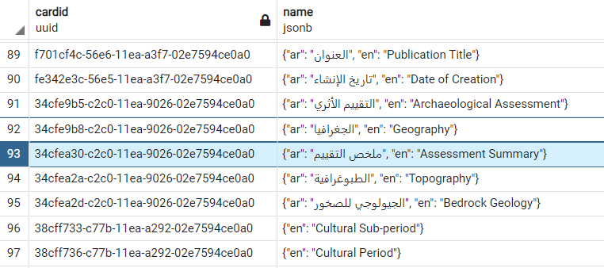
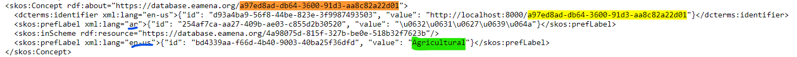

# Internationalisation
>  Internationalisation (i18n) and localisation (l10n)


## Messages, thesauri and resource models

Example of translation from English (`en`) to a target language (`ar`, `fr`, etc.), using the [skos2excel](https://github.com/zoometh/skos2excel) and [po2excel](https://github.com/zoometh/po2excel) tools

| description | script                                                                  | base          |           |
|-------------|-------------------------------------------------------------------------|---------------|-----------|
| messages    | texts displayed on the screen describing tabs, menus, etc., for navigation purposes | [po2excel.py](https://github.com/zoometh/po2excel)     | [arches-70_djangopo_en.po](https://github.com/eamena-project/eamena-arches-dev/blob/main/dbs/database.eamena/i18n/data/bases/arches-70_djangopo_en.po) |
| thesauri    | controlled vocabularies describing the ressources                       | [skos2excel.py](https://github.com/zoometh/skos2excel) | [EAMENA.xml](https://github.com/eamena-project/eamena-arches-dev/blob/main/dbs/database.eamena/i18n/data/bases/EAMENA.xml) |
| rm          | ...                                                                     | [Heritage Place_without_hard_written_arabic.json](https://github.com/eamena-project/eamena-arches-dev/blob/main/dbs/database.eamena/i18n/data/bases/Heritage%20Place_without_hard_written_arabic.json) |           |


### Messages


### Thesauri


### Resource Models
> RM



## Bases

The templates (so-called `base`) of these files are in the folder [bases/](https://github.com/eamena-project/eamena-arches-dev/tree/main/dbs/database.eamena/i18n/data/bases)

* `EAMENA.xml` (snippet) listing `en-us` and `ar` languages (`en` is for internal purposes)

```XML
...
<skos:Concept rdf:about="https://database.eamena.org/89fab53f-ce9d-4c0b-8ef9-d01d2899ef97">
<skos:prefLabel xml:lang="ar">{"id": "5264b031-4580-4a9c-91f2-be5d0b184da5", "value": "\u062e\u0648\u0631 \u0623\u0648 \u0645\u0635\u0628 \u0627\u0644\u0646\u0647\u0631"}</skos:prefLabel>
<skos:inScheme rdf:resource="https://database.eamena.org/4a98075d-815f-327b-be0e-518b32f7623b"/>
<skos:prefLabel xml:lang="en-us">{"id": "78fd12f7-000e-4f26-8861-360018aa40ee", "value": "Estuary"}</skos:prefLabel>
<dcterms:identifier xml:lang="en">{"id": "046d03a4-e76e-4713-aaf9-546a9f344458", "value": "https://database.eamena.org/concepts/89fab53f-ce9d-4c0b-8ef9-d01d2899ef97"}</dcterms:identifier>
</skos:Concept>
</skos:narrower>
...
```

* [arches-70_djangopo_en.po](https://github.com/eamena-project/eamena-arches-dev/blob/main/dbs/database.eamena/i18n/data/bases/arches-70_djangopo_en.po) directly downloaded from [Arches/Transifex](https://app.transifex.com/archesproject/arches-70/djangopo/) has 11,617 words and 1,553 strings to translate from `en` to a traget language (`fr`, `ar`, etc.). Here a snippet:

```Python
...
#: app/datatypes/datatypes.py:564
#, python-brace-format
msgid "{value} is an invalid date format"
msgstr ""
...
```

## Translation errors

There could have translations errors:

<p align="center">
  
  
  <br>
    <em>The English `Close` [windows] has been incorrectly translated to `Proche` in French when the correct translation should be `Fermer`</em>
</p>

If you find any errors in the **translations messages**, please update these files:

- Arabic `ar`: <a href='https://github.com/eamena-project/arches/blob/master/arches/locale/ar/LC_MESSAGES/django.po'>ar</a>
- French `fr`: <a href='https://github.com/eamena-project/arches/blob/master/arches/locale/fr/LC_MESSAGES/django.po'>fr</a>
- Central Kurdish (Sorani) `ckb`: <a href='https://github.com/eamena-project/arches/blob/master/arches/locale/ckb/LC_MESSAGES/django.po'>ckb</a>[^2]

These changes will be then proposed to Arches' source code via a Pull request

<p align="center">
  
  <br>
    <em>Pull request to change <a href='https://github.com/archesproject/arches/blob/master/arches/locale/fr/LC_MESSAGES/django.po'>Arches French PO file content</a></em>
</p>

## Localisation
> l10n

### en -> ckb

Example of translation to Central Kurdish (Sorani) (`ckb`)

#### Thesauri
> ⚠️ possible typo issues with `EAMENA.xml` see [here](https://github.com/eamena-project/eamena/issues/1#issue-2225163630)

Example for the EAMENA.xml file, and translation of the DB thesauri to Central Kurdish (Sorani) (`ckb`), using the [skos2excel.py](https://github.com/zoometh/skos2excel) script

1. Convert [EAMENA.xml](https://github.com/eamena-project/eamena-arches-dev/blob/main/dbs/database.eamena/data/reference_data/concepts/EAMENA.xml) to [xxx_ckb.xlsx]() using the `skos2excel.py` script:

```sh
py skos2excel.py ./data/EAMENA.xml ./data/xxx_ckb.xlsx -lang ckb -f xlsx 
```

2. Proofreading of the XLSX automatic translation. 

3. Convert (back) the [kurdish_thesaurus.xlsx]() concepts to [EAMENA.xml]() using the `excel2skos.py` script:

```sh
py C:/Rprojects/skos2excel/excel2skos.py C:/Rprojects/eamena-arches-dev/dbs/database.eamena/i18n/data/ckb/kurdish_thesaurus.xlsx C:/Rprojects/eamena-arches-dev/dbs/database.eamena/i18n/data/EAMENA.xml --base C:/Rprojects/eamena-arches-dev/dbs/database.eamena/i18n/data/bases/EAMENA.xml
```

4. Import in the DB (see: [Import thesauri](https://github.com/eamena-project/eamena-arches-dev/tree/main/dbs/database.eamena/i18n#import-thesauri))

#### Messages

Example for the `EAMENA.xml` file, and translation of the DB messages to Central Kurdish (Sorani) (`ckb`), using the [po2excel.py](https://github.com/zoometh/po2excel) script

1. Convert [django.po](https://github.com/eamena-project/eamena-arches-dev/blob/main/dbs/database.eamena/i18n/data/django.po) to [django_ckb.xlsx]() using the `skos2excel.py` script:

```sh
py po2excel.py django.po django_ckb.xlsx --format xlsx
```

2. Proofreading of the XLSX automatic translation. 

3. Convert (back) the [kurdish_database_menu_terms.xlsx]() concepts to [django.po]() using the `excel2po.py` script:

```sh
py C:/Rprojects/po2excel/excel2po.py C:/Rprojects/eamena-arches-dev/dbs/database.eamena/i18n/data/ckb/kurdish_database_menu_terms.xlsx C:/Rprojects/eamena-arches-dev/dbs/database.eamena/i18n/data/ckb/django.po -lang ckb --base C:/Rprojects/eamena-arches-dev/dbs/database.eamena/i18n/data/bases/django.po
```

4. Import in the DB and update the DB (see: [Import messages](https://github.com/eamena-project/eamena-arches-dev/tree/main/dbs/database.eamena/i18n#import-messages))


### en -> fr

Example for the `EAMENA.xml` file, and translation to French (`fr`), using the [skos2excel](https://github.com/ads04r/skos2excel) tools

1. Convert [EAMENA.xml](https://github.com/eamena-project/eamena-arches-dev/blob/main/dbs/database.eamena/data/reference_data/concepts/EAMENA.xml) to [EAMENA_fr.xlsx](https://github.com/eamena-project/eamena-arches-dev/blob/main/dbs/database.eamena/i18n/EAMENA_fr.xlsx) (See the corresponding [TSV file](https://github.com/eamena-project/eamena-arches-dev/blob/main/dbs/database.eamena/i18n/EAMENA_fr.tsv)) using the `skos2excel.py` script:

```sh
py skos2excel.py ./data/EAMENA.xml ./data/EAMENA_fr.xlsx -lang fr -f xlsx 
```

Proofreading of the automatic translation. 

2. Convert (back) the [EAMENA_fr.xlsx](https://github.com/eamena-project/eamena-arches-dev/blob/main/dbs/database.eamena/i18n/EAMENA_fr.xlsx) concepts to [EAMENA_fr.xml](https://github.com/eamena-project/eamena-arches-dev/blob/main/dbs/database.eamena/data/reference_data/concepts/EAMENA_fr.xml) using the `excel2skos.py` script:

```sh
py excel2skos.py ./data/EAMENA_fr.xlsx ./data/EAMENA_fr.xml -b ./data/EAMENA.xml
```

see also[^1]

3. On the DB 

* SSH, backend:

Change directory

```sh
cd /opt/arches/eamena/eamena/pkg/reference_data/concepts
```

Import from GitHub

```sh
wget https://raw.githubusercontent.com/eamena-project/eamena-arches-dev/main/dbs/database.eamena/data/reference_data/concepts/EAMENA_fr.xml
```

Rename the old file and new file

```sh
sudo mv EAMENA.xml EAMENA_old.xml
sudo mv EAMENA_fr.xml EAMENA.xml
```

activate ENV, and run `import_reference_data` ...

```sh
python manage.py packages -o import_reference_data -s '/opt/arches/eamena/eamena/pkg/reference_data/concepts/EAMENA.xml'
```

Restart Apache

```sh
(ENV) root@ip-172-31-32-122:/opt/arches/eamena# sudo service apache2 restart
```

* frontend:

RDM > Tools > Import Thesauri

## Import in the DB

### Import thesauri

On the DB:

RDM > Tools > Import Thesauri > *select* `EAMENA.xml`

<p align="center">
  
  <br>
    <em>RDM import thesauri</em>
</p>


### Import messages


```sh
sudo su
cd /opt/arches/
source ENV/bin/activate
```

Create the new language folders, here `ckb`, and move in: 

```sh
mkdir /opt/arches/ENV/lib/python3.10/site-packages/arches/locale/ckb
mkdir /opt/arches/ENV/lib/python3.10/site-packages/arches/locale/ckb/LC_MESSAGES
cd /opt/arches/ENV/lib/python3.10/site-packages/arches/locale/ckb/LC_MESSAGES
```

Import the `django.po` in it `LC_MESSAGES/`:

```sh
wget https://raw.githubusercontent.com/eamena-project/eamena-arches-dev/main/dbs/database.eamena/i18n/data/ckb/django.po
```

Convert the PO file (Portable Object) to a MO file (Machine Object)

```sh
msgfmt -o django.mo django.po
```

Change files ownerships and permissions

```sh
# files ownership
chown arches:arches django.po
chown arches:arches django.mo
# files permissions
chmod 755 djang*
```

Now to update the language switcher;

1. Make sure the `settings.py` new language is registered (here, `ckb`):

```py
...
LANGUAGES = [
    ('en', _('English')),
    ('ar', _('Arabic')),
    ('ckb', _('Central Kurdish (Sorani)')),
]
...
```

For some languages, including ku-ckb, and additional line may need to be added the `settings.py` to make sure it is formatted as RTL instead of LTR.
```
LANGUAGES_BIDI = ["ku","ar"] # this forces rtl alignment

```


2. Run `build_development`

```sh
cd /opt/arches/eamena/eamena/
yarn build_development &
```

3. Run `collectstatic`

```sh
cd /opt/arches/eamena
python manage.py collectstatic
```

4. Restart Apache2

```sh
service apache2 restart
```

5. Update or create the Django Admin / Languages


<p align="center">
  
  <br>
</p>


## Hard written nodes
> Hard written values in the Card resource model *vs* Dynamic strings

Context: the HP RM 

So far in the EAMENA DB, Arabic translation of English are hard written in the Resource Models (RM). Here for the node 'Resource Summary' (`ar`: ملخص التقييم) 

| English | Arabic |
|----------|----------|
|     |    |
| English (`en`) mode, EAMENA training instance    | Arabic (`ar`) mode, EAMENA training instance   |

See for example [Resource Summary](https://github.com/eamena-project/eamena-arches-dev/blob/main/dbs/database.eamena/data/reference_data/rm/hp/Heritage%20Place_with_hard_written_arabic.json#L86-L87)

### Removing hard written values

In  the l10n in Arabic (`ar`) has been done, we can remove this Arabic hard written values

#### in the Card designer
> http://52.50.27.140/graph_designer/34cfe98e-c2c0-11ea-9026-02e7594ce0a0

1. Check, in the Postgres DB, if the `ar` translation exists:

<p align="center">
  
  <br>
</p>

```SQL
SELECT graphid, cardid, name
FROM cards
WHERE name->>'en' LIKE '%Assessment Summary%'
AND graphid::text = '34cfe98e-c2c0-11ea-9026-02e7594ce0a0'; -- the UUID of the HP RM
```

2. If the `ar` exists: remove the hard written Arabic after the `/` (in blue)

<p align="center">
  
  <br>
</p>

3. iterate over each node

#### in the PostgreSQL DB

Remove the hard written values in the `cards` table, for the HP only, using this SQL statement:

```SQL
UPDATE cards
SET name = jsonb_set(
    name,
    '{en}',
    ('"' || split_part(name->>'en', ' /', 1) || '"')::jsonb
)
WHERE name ? 'en' 
AND graphid::text = '34cfe98e-c2c0-11ea-9026-02e7594ce0a0'; -- the UUID of the HP RM
```

<p align="center">
  
  <br>
</p>


❌ However, the Arabic values continue to appear (!) after (not ordered):
  - `apache restart`
  - ElasticSearch reindexing, 
  - `collectstatic`
  - `build_development`

#### in the RM

see this [Python script](https://github.com/eamena-project/eamena-arches-dev/blob/main/dbs/database.eamena/data/reference_data/rm/hp/read_rm.py#L17-L35)

❌ However, because there are already data linked with the HP RM, the former RM (with hard written node) can not be overwrite by the new one (without hard written values)


## Other

Agricultural:

* Collections: https://github.com/eamena-project/eamena/blob/master/eamena/pkg/reference_data/collections/collections.xml#L2432
* Concepts:

<p align="center">
  
  <br>
</p>

- ? Import `django_ckb.po` into the DB (`/opt/arches/ENV/lib/python3.8/site-packages/arches/locale`), see: `makemessages`
- ? Import to transifex

## Documentation

- Arches documentation - [localizing-arches](https://arches.readthedocs.io/en/stable/developing/advanced/localizing-arches/#localizing-arches)


## Errors

### Import errors

On:

```sh
python manage.py packages -o import_reference_data -s '/opt/arches/eamena/eamena/pkg/reference_data/concepts/EAMENA.xml'
```

... gives this message (ORPHANS)

```
operation: import_reference_data
2024-02-21 03:21:17,255 arches.app.utils.skos WARNING  
The SKOS file "EAMENA.xml" appears to have orphaned concepts.
```

Probable source of the issue: https://github.com/eamena-project/eamena/issues/1

Imported, with errors (ORPHANS)

<p align="center">
  
  <br>
    <em>French, Arabic and English... but with orphans</em>
</p>

### Delete errors

RDM > Tools > Delete Thesauri doesn't work

## Documentation

### Reporting data in different languages
> fall back languages

[Arches forum](https://community.archesproject.org/t/arches-v7-x-internationalisation-reporting-data-in-different-languages/2100/3)


---

[^1]: ```py C:/Rprojects/skos2excel/skos2excel.py C:/Rprojects/eamena-arches-dev/dbs/database.eamena/data/reference_data/concepts/EAMENA.xml C:/Rprojects/eamena-arches-dev/dbs/database.eamena/data/reference_data/concepts/EAMENA_fr_2.xlsx -lang fr -f xlsx``` and  ```py C:/Rprojects/skos2excel/excel2skos.py C:/Rprojects/eamena-arches-dev/dbs/database.eamena/data/reference_data/concepts/EAMENA_fr_2.xlsx C:/Rprojects/eamena-arches-dev/dbs/database.eamena/data/reference_data/concepts/EAMENA_fr_2.xml -b C:/Rprojects/eamena-arches-dev/dbs/database.eamena/data/reference_data/concepts/EAMENA.xml```
[^2]: Submitted to Arches, see this [the Pull request](https://github.com/archesproject/arches/pull/10755)


