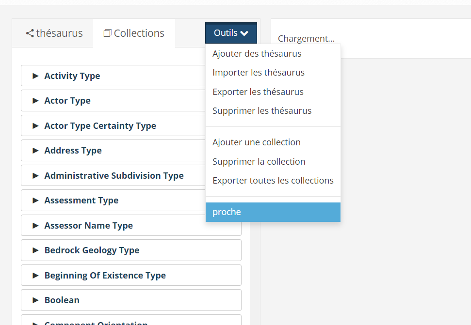
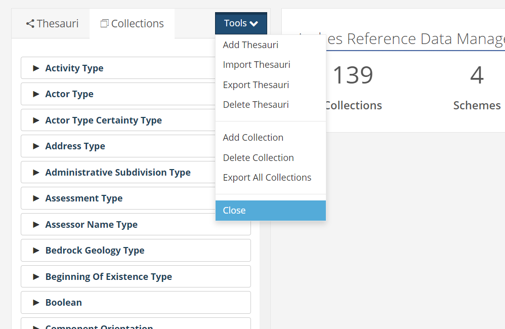
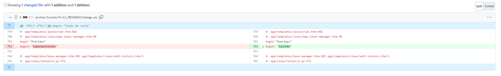

# Internationalisation

## Spotted errors

There could have errors in the translations:

  
  
   
    <em>The English `Close` [the windows] has been wrongly translated to `Proche` in French</em>

If you find any errors in the translations, please update these files:

- Arabic: <a href='https://github.com/eamena-project/arches/blob/master/arches/locale/ar/LC_MESSAGES/django.po'>ar</a>
- French: <a href='https://github.com/eamena-project/arches/blob/master/arches/locale/fr/LC_MESSAGES/django.po'>fr</a>

These changes will be then proposed (Pull request) to Arches' source code

  
   
    <em>Pull request to change <a href='https://github.com/archesproject/arches/blob/master/arches/locale/fr/LC_MESSAGES/django.po'>Arches French PO file content</a></em>

## Concepts

