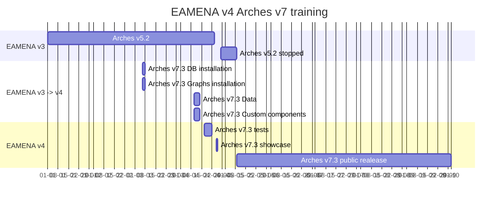

# Installation
> Installation, upgrade and migration

* Arches v7: [README](https://github.com/eamena-project/eamena-arches-dev/tree/main/dbs/database.eamena/docs)

## DB migration process timeline

EAMENA v5.2 to v7.3 migration process timeline

