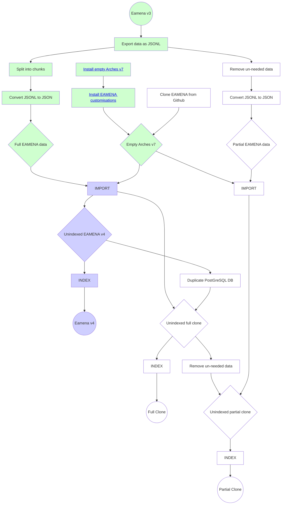
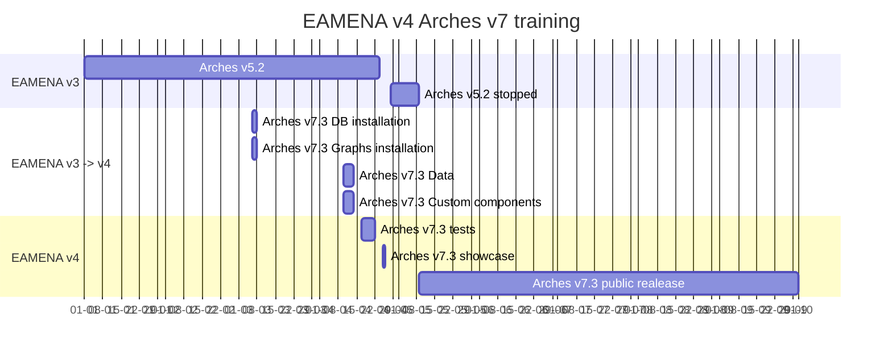

# Installation
> Installation, upgrade and migration

## EAMENA 4 Install Docs

In progress. For now, see [Arches 7 Upgrade](notes/Arches%207%20Upgrade.md). 

These docs describe the process of (a) installing an empty EAMENA-customised version of Arches 7.3, and (b) copying the data from an old EAMENA v3 (Arches v5.2) instance to the new database.

### Prerequisites

Arches 7.3 requires Elasticsearch [8.3.3](https://artifacts.elastic.co/downloads/elasticsearch/elasticsearch-8.3.3-amd64.deb) and PostgreSQL 14 to be installed. Additionally, Arches 7 requires NPM 8.19.3 or 9.6.0 (tested and works with both), Yarn 1.22.19 and Node.JS 14.17.6. The instructions for installing and configuring all of these are linked from below.

Install:

* [PostgreSQL 14](prerequisites/PostgreSQL.md)
* [Elasticsearch 8.3.3](prerequisites/Elasticsearch.md)
* [NodeJS / NPM / Yarn](prerequisites/Yarn.md)
* [Celery](prerequisites/Celery.md)
* [Apache](prerequisites/Apache.md)

### Install Paths

Once the VM is configured correctly, follow the flow chart below in order to 

Paths to/from the various Arches/EAMENA incarnations.



## Install empty Arches v7

```Bash
sudo apt-get install python3-psycopg2
sudo apt-get install libpq-dev
```

Install the Arches Python package:

```Bash
python -m pip install "arches==7.3"
```

## Install EAMENA customisations

From the `arches/` folder, run:

```Bash
git clone https://github.com/eamena-project/eamena.git
```

## Others

* [Cloning EAMENA from Github](install/Clone.md)

| Task | 3->5 | 5->7 |
|------|-------|-------|
| Export data structures from old database  | Up | Up |
| Install new version of Arches on a test box  | Up | Up |
| Develop/convert data structures in new database  | Up | Up |
| Develop/convert EAMENA customisations  | Up | Up |
| Export a subset of data from old database  | Down | Up |
| Determine changes to be made to data  | Down | Up |
| Write automated scripts to convert data  | Down | Up |
| Convert a subset of data using test script  | Down | Up |
| Install correct version of Python, Django, PostgreSQL, etc | Down | Up |
| Install new database on AWS   | Down | Up |
| Install new data structures into new database  | Down | Up |
| Apply EAMENA customisations to the database  | Down | Up |
| Export complete data from old database (test run) | Down | Up |
| Import complete data into new database (test run) | Down | Up |
| Export complete data from old database   | Down | Down |
| Import complete data into new database   | Down | Down |
| Perform the 'switch' (eg server certificates, domain name, etc)   | Down | Down |


### Still to do (2023-05-09)

#### If time isn't tight
* Upgrade to 7.4 (currently 7.3)
* A few more partial export/imports using the AWS server.
* Some heavy stress testing


## DB migration process timeline

EAMENA v5.2 to v7.3 migration process timeline

