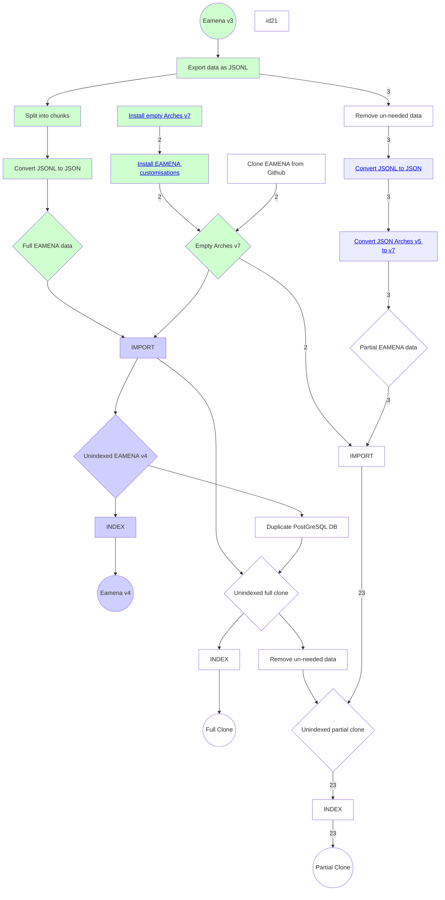
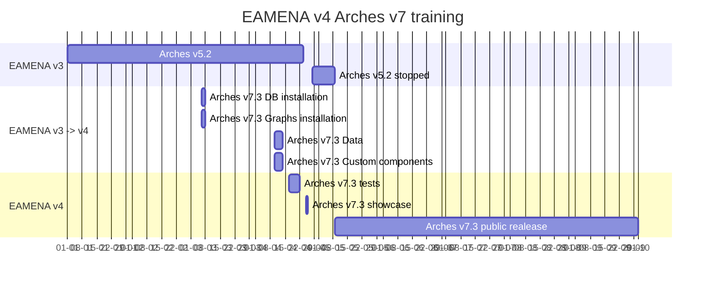

# Installation
> Installation, upgrade and migration

This workflow has been test on two AWS instances:

1- installation of the [EA training instance](https://github.com/eamena-project/eamena-arches-dev/tree/main/dev#instance-ea) (spec: Ubuntu 20.04.2, AWS r6g.large, <http://54.247.46.210>)

2- migration of the [EAMENA database](#db-migration-process-timeline) (spec: Ubuntu 22.04.2, AWS m6g.4xlarge, <https://database.eamena.org/>)


See also: [troubleshooting](#troubleshooting)

## EAMENA 4 Install Docs

In progress. For now, see [Arches 7 Upgrade](notes/Arches%207%20Upgrade.md). 

These docs describe the process of (a) installing an empty EAMENA-customised version of Arches 7.3, and (b) copying the data from an old EAMENA v3 (Arches v5.2) instance to the new database.

## File Hierarchical Structure

Once the VM is configured correctly, create:

* an `arches` user: 

```Bash
sudo adduser arches
```

* an `arches/` folder

```Bash
mkdir /opt/arches/
```

### Prerequisites

Arches 7.3 requires [Python](prerequisites/Python.md), [Elasticsearch](prerequisites/Elasticsearch.md) and [PostgreSQL](prerequisites/PostgreSQL.md) to be installed. Additionally, Arches 7 requires NPM 8.19.3 or 9.6.0 (tested and works with both), Yarn 1.22.19 and Node.JS 14.17.6. The instructions for installing and configuring all of these are linked from below.

Install:

1 [Python](prerequisites/Python.md)
2 [Elasticsearch](prerequisites/Elasticsearch.md)
3 [PostgreSQL](prerequisites/PostgreSQL.md) 
4 [NodeJS / NPM / Yarn](prerequisites/Yarn.md)
5 [Apache](prerequisites/Apache.md)
6 [Celery](prerequisites/Celery.md)


### Install Paths

Follow the flow chart below in order to install/upgraded to Arches v.7. Paths to/from the various Arches/EAMENA incarnations are identified by numbers on edges: `1`; `2`; `3`, etc. When two or more routes join, the new route is named after the concatenation of the converging routes: `1` and `2` = `12`; `2` and `3` = `23`; etc.



## Install empty Arches v7

```Bash
sudo apt-get install python3-psycopg2
sudo apt-get install libpq-dev
```

Install the Arches Python package:

```Bash
python -m pip install "arches==7.3"
```

## Install EAMENA customisations

From the `arches/` folder, run:

```Bash
git clone https://github.com/eamena-project/eamena.git
```

## Convert JSONL to JSON

Use the [jsonl2json.py](https://github.com/eamena-project/eamena-arches-dev/blob/main/dbs/database.eamena/install/scripts/jsonl2json.py) script to convert business data from JSONL to JSON.

## Convert JSON Arches v5 to v7

Use the [convert_json_57.py](https://github.com/eamena-project/eamena-arches-dev/blob/main/dbs/database.eamena/install/scripts/convert_json_57.py) script to convert business data from JSON data for Arches v5 to Arches v7. This script will mostly convert strings to dictionnaries for the internationalisation in Arches v7.

## Import

Following this order

* Grids

```
python manage.py packages -o import_business_data -s path/to/grids.csv -ow OVERWRITE -c pat/to/mapping/file/'Grid Square.mapping'
```

## Troubleshooting

|  error key 	|  error description 	|   solution	|  
|---	|---	|---	|
|  KeyError at /add-resource/ 	|   a default value is expected	|  [fix_default_values.py](https://github.com/eamena-project/eamena-arches-dev/blob/main/dbs/database.eamena/install/scripts/jsonl2json.py) assign default values when missing	|

## Others

* [Cloning EAMENA from Github](install/Clone.md)

| Task | 3->5 | 5->7 |
|------|-------|-------|
| Export data structures from old database  | Up | Up |
| Install new version of Arches on a test box  | Up | Up |
| Develop/convert data structures in new database  | Up | Up |
| Develop/convert EAMENA customisations  | Up | Up |
| Export a subset of data from old database  | Down | Up |
| Determine changes to be made to data  | Down | Up |
| Write automated scripts to convert data  | Down | Up |
| Convert a subset of data using test script  | Down | Up |
| Install correct version of Python, Django, PostgreSQL, etc | Down | Up |
| Install new database on AWS   | Down | Up |
| Install new data structures into new database  | Down | Up |
| Apply EAMENA customisations to the database  | Down | Up |
| Export complete data from old database (test run) | Down | Up |
| Import complete data into new database (test run) | Down | Up |
| Export complete data from old database   | Down | Down |
| Import complete data into new database   | Down | Down |
| Perform the 'switch' (eg server certificates, domain name, etc)   | Down | Down |


### Still to do (2023-05-09)

#### If time isn't tight
* Upgrade to 7.4 (currently 7.3)
* A few more partial export/imports using the AWS server.
* Some heavy stress testing


## DB migration process timeline

EAMENA v5.2 to v7.3 migration process timeline

