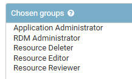

# Users

## Permissions
> User Permissions, Bulk-application of instance-level permissions, Built-in permissions, ...


### Groups

#### Arches native groups

* Application Administrator
* Crowdsource Editor
* Graph Editor
* Guest
* Mobile Project Administrator
* RDM Administrator

###### Resource Deleter

Chosen permissions:

	```
	-models | resource | Can add resource
	-models | resource | Can change resource
	-models | resource | Can delete resource
	-models | resource | Can view resource
	-models | resource instance | Create resource
	-models | resource instance | Update resource
	-models | resource instance | Delete resource
	-models | resource instance | Read resource
	```

###### Resource Editor

Chosen permissions:

	```
	-models | card | Can add tile
	-models | card | Can change tile
	-models | card | Can view tile
	-models | card component | Can add card component
	-models | card component | Can change card component
	-models | card component | Can view card component
	-models | card x node x widget | Can add card x node x widget
	-models | card x node x widget | Can change card x node x widget
	-models | card x node x widget | Can view card x node x widget
	-models | plugin | Can view plugin
	-models | resource | Can add resource
	-models | resource | Can change resource
	-models | resource | Can view resource
	-models | resource instance | Create resource
	-models | resource instance | Update resource
	-models | resource instance | Read resource
	```

###### Resource Reviewer

Chosen permissions:

	```
	-models | node group | Delete
	-models | node group | Create/Update
	```
###### System Administrator


#### EAMENA former groups

native groups +

* Academic Research Condition Assessment Users
* Academic Research Users

### EAMENA new groups

Unless otherwise specified, these groups are set up in Django Admin/Groups (https://database.eamena.org/admin/auth/group/)

| permission level | EA group name | Arches groups combination  | description  |
|---|---|---|---|
| 1 | Guest | Guest | same as Arches 'Guest', max zoom = 10 (~town scale)[^3], cannot see: condition assessment[^1], ~~coordinates[^1]~~ |
| 2 | Researcher | Researcher | same as Arches 'Guest', no edit, no add  |
| 3 | Contributor | Resource Editor + Resource Reviewer  |  can create/edit but can't delete |
| 4 | Staff | Resource Editor + Resource Reviewer + Resource Deleted + RDM Adinistrator + Application Administrator [^2] | cannot change Resource Models and System settings |
| 5 | Sys Admin | * | = superuser |

### EAMENA current groups


### Dev

Aims: 

1. Hide HP coordinates for Guest users
2. Don't allow Guest users to be able to Export Search Results 
2. For a specific country, Syria, 3 different groups (NE Kurdish, Itlib, Baghdad regime) should be able to input data, but the other two groups should be not able to see the data of the third one (particularly: Person names and Condition Assessment)

#### IT solution

##### QGIS/PostGRES
> see W. Deadman

A PostGRES DB having 3 different schemas is hosted online (AlwaysData) and accessed through QGIS. It allows 3 different groups to work on the same DB but in a siloed manner.


##### Built-in

Natively, Arches allows:

Arches Designer > Resource Model > Heritage Place > Permissions >   
	- [EAMENA](https://database.eamena.org/graph_designer/34cfe98e-c2c0-11ea-9026-02e7594ce0a0)

<p align="center">
  
  <br>
</p>

##### Custom

Duplicate EAMENA card, change the configuration of the duplicated card permissions in a way it can be seen by people in a particular group (user [permission level](https://github.com/eamena-project/eamena-arches-dev/tree/main/dbs/database.eamena/users#eamena-new-groups))

- duplicate the `eamena-default-card`  
- rename the duplicate `eamena-permission-card`  

* see
	- the Card: https://github.com/search?q=repo%3Aeamena-project%2Feamena%20eamena-default-card&type=code
	- Arches forum: https://community.archesproject.org/t/card-permission/1675?u=zoometh

#### Documentation

* Issue thread: [#11](https://github.com/achp-project/cultural-heritage/issues/11)
* Arches forum:
  - https://community.archesproject.org/t/hiding-spatial-locations-in-the-report-template/1020
  - https://community.archesproject.org/t/hide-places-coordinates-from-an-user-group-in-a-report-without-hiding-them-on-the-map/2042
  - https://community.archesproject.org/t/guest-group-and-anonymous-user-permissions/2301/4

* Phil Carlisle (HE) is developping a new paradigm to handle Arches permissions at very different levels
* [ring-fencing plugin](https://github.com/eamena-project/eamena-arches-dev/tree/main/functions/permissions)
* [IT draft](doc/SyrianDB_KH_WD.pdf)

## Create a read-only user 
> Create a read-only user in Postgres, *by* Reuben Osborne

1. Connect to your PostgreSQL database as a superuser or a user with appropriate privileges. `
```
psql -U postgres
```

2. Create the read-only user using the `CREATE USER` command. Replace `<username>` with the desired username and `<password>` with the user's password:

```sql
CREATE USER <username> WITH PASSWORD '<password>';
```

3. Grant read-only privileges to the user on the desired database. You can do this by using the `GRANT` command. For example, to grant read-only access to a database named `<database_name>`:

```sql
GRANT CONNECT ON DATABASE <database_name> TO <username>;
```

4. Grant SELECT privileges on the specific tables or schemas to restrict access to read-only. For example, to grant read-only access to all tables in a schema named `<schema_name>`:

```sql
GRANT SELECT ON ALL TABLES IN SCHEMA <schema_name> TO <username>;
```

Or, if you want to grant read-only access to a specific table:

```sql
GRANT SELECT ON <table_name> TO <username>;
```

5. Finally, you should revoke any unnecessary privileges to ensure that the user remains read-only. For example, you might want to revoke the ability to create tables:

```sql
REVOKE CREATE ON SCHEMA public FROM <username>;
```

###  Notes

- The main database should be called `eamena`.
- You can access this using the default `postgres` user.
- The `eamena` database is in the `public` schema.
- Depending on your requirements you might want to only grant acccess to specific tables. E.g `tiles`. 

---


[^1]: node level
[^2]: see Bijan R. user profile
[^3]: Django Admin/Group map settings: https://database.eamena.org/admin/models/groupmapsettings