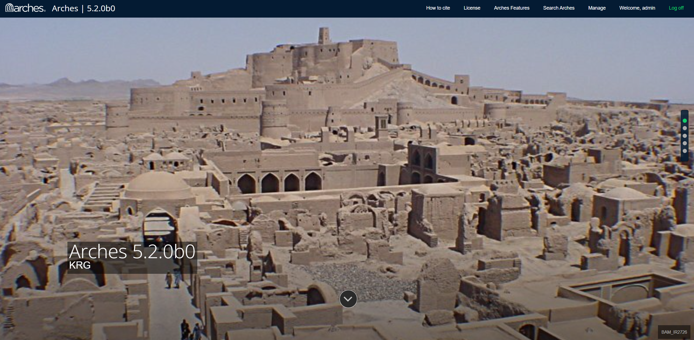
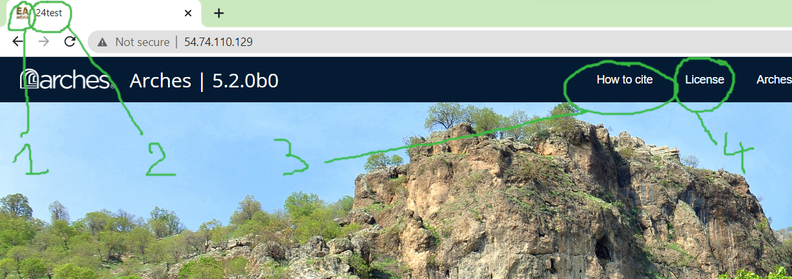

# EAtrain
> 24test, ea.train, ...

## Customize the landing page

### Background image


<p align="center">
  
  <br>
    <em>Landing page</em>
</p>

image : https://github.com/eamena-project/eamena-arches-dev/blob/da9d4efc80119df549e8029de75b5ce47d1027df/dbs/24test/index.htm#L171
db name: https://github.com/eamena-project/eamena-arches-dev/blob/da9d4efc80119df549e8029de75b5ce47d1027df/dbs/24test/index.htm#L176
image caption: https://github.com/eamena-project/eamena-arches-dev/blob/da9d4efc80119df549e8029de75b5ce47d1027df/dbs/24test/index.htm#L184

### Links


<p align="center">
  
  <br>
    <em>Landing page</em>
</p>


1. favicon
 - link: https://github.com/eamena-project/eamena-arches-dev/blob/cbde1edd0c28232f0ab65eb5796d3194822a0a54/dbs/24test/index.htm#L39
 - image (***example***) 'logo.png': https://github.com/eamena-project/eamena-arches-dev/tree/main/dbs/24test/img 

2. App title (***example***): https://github.com/eamena-project/eamena-arches-dev/blob/main/training/templates/settings.py#L192

3. How to cite link: https://github.com/eamena-project/eamena-arches-dev/blob/cbde1edd0c28232f0ab65eb5796d3194822a0a54/dbs/24test/index.htm#L79

4. License link: https://github.com/eamena-project/eamena-arches-dev/blob/cbde1edd0c28232f0ab65eb5796d3194822a0a54/dbs/24test/index.htm#L82


## Import missing Resource Models 
> Import missing Resource Models from EAMENA

* IR
```python manage.py packages -o import_graphs -s './packages/220607_pkg/graphs/resource_models/Information Resource.json'```

* GS
```python manage.py packages -o import_graphs -s './packages/220607_pkg/graphs/resource_models/Grid Square.json'```

* PS
```python manage.py packages -o import_graphs -s './packages/220607_pkg/graphs/resource_models/Person-Organization.json'```

* DCA
```python manage.py packages -o import_graphs -s './packages/220607_pkg/graphs/resource_models/Detailed Condition Assessment.json'```

## Exporting Business data
> Exporting from EAMENA

* GS
```python manage.py packages -o export_business_data -d '/opt/arches/data_temp' -f 'json' -g '77d18973-7428-11ea-b4d0-02e7594ce0a0'```

* IR
```python manage.py packages -o export_business_data -d '/opt/arches/data_temp' -f 'json' -g '35b99cb7-379a-11ea-9989-06f597a7d5ce'```

* PS
```python manage.py packages -o export_business_data -d '/opt/arches/data_temp' -f 'json' -g 'e98e1cee-c38b-11ea-9026-02e7594ce0a0'```

## Import Business data
> Import Business data from EAMENA

* GS
```python manage.py packages -o import_business_data -s "/home/archesadmin/data-temp/grid_krg.jsonl" -ow overwrite```

> Import GS works but not its re-index

## Reindex Business data from EAMENA

* GS

After importing the `grid_krg.jsonl` file (⚠️ it is not a JSON). On:

```

Error:
```
  File "/home/archesadmin/arches/arches/app/datatypes/datatypes.py", line 113, in get_search_terms
    if settings.WORDS_PER_SEARCH_TERM is None or (len(nodevalue.split(" ")) < settings.WORDS_PER_SEARCH_TERM):
AttributeError: 'dict' object has no attribute 'split'
```

Error message;

```
...
'status': 400, 'error': {'type': 'mapper_parsing_exception', 'reason': "failed to parse field [strings.string] of type [text] in document with id '1cbb0bc6-6f6d-433b-9f0a-9700c3cdd0c9'. Preview of field's value: '{en={value=E44N34-43, direction=ltr}}'", 'caused_by': {'type': 'illegal_state_exception', 'reason': "Can't get text on a START_OBJECT at 1:1366"}}
...
```

The data:

`tiledada`
```
{
  "7248e0d0-ca96-11ea-a292-02e7594ce0a0": {
    "type": "FeatureCollection",
    "features": [
      {
        "id": "b1b3f65c-24a3-4c15-a291-58b407cda52d",
        "type": "Feature",
        "geometry": {
          "type": "Polygon",
          "coordinates": [
            [
              [
                42.25,
                36.75
              ],
              [
                42.25,
                37
              ],
              [
                42.5,
                37
              ],
              [
                42.5,
                36.75
              ],
              [
                42.25,
                36.75
              ]
            ]
          ]
        },
        "properties": {}
      }
    ]
  }
}
```

`tiledata`
```
{
  "b3628db0-742d-11ea-b4d0-02e7594ce0a0": {
    "en": {
      "value": "E42N36-41",
      "direction": "ltr"
    }
  }
}
```

`tiledata`
```
{
  "b3628db0-742d-11ea-b4d0-02e7594ce0a0": {
    "en": {
      "value": "E42N36-34",
      "direction": "ltr"
    }
  }
}
```

nodegroupid1: `b3628db0-742d-11ea-b4d0-02e7594ce0a0`
nodegroupid2: `7248e0d0-ca96-11ea-a292-02e7594ce0a0`
nodegroupid3: `7248e0d0-ca96-11ea-a292-02e7594ce0a0`
nodegroupid3: `b3628db0-742d-11ea-b4d0-02e7594ce0a0`

## Import Business data from 

After creating the GS by hand (`E42N36-34`), using: https://geojson.io/#map=7.07/36.231/42.863 with this coordinates:

```
{
  "type": "FeatureCollection",
  "features": [
    {
      "type": "Feature",
      "properties": {},
      "geometry": {
        "coordinates": [
          [
[42.25, 36.75], [42.25, 37.0], [42.5, 37.0], [42.5, 36.75], [42.25, 36.75]
          ]
        ],
        "type": "Polygon"
      }
    }
  ]
}
```

I'll export it

```
python manage.py packages -o export_business_data -d '/home/archesadmin/data-temp' -f 'json' -g '77d
18973-7428-11ea-b4d0-02e7594ce0a0'
```

Which gives this JSON file `Grid_Square_2023-05-05_10-41-17.json` (⚠️ it is not a JSONL):

```
{"business_data": {"resources": [{"resourceinstance": {"graph_id": "77d18973-7428-11ea-b4d0-02e7594ce0a0", "legacyid": null, "resourceinstanceid": "14fee91e-c6a1-418f-8f4b-0d089e220001"}, "tiles": [{"data": {"b3628db0-742d-11ea-b4d0-02e7594ce0a0": "E42N36-34"}, "nodegroup_id": "b3628db0-742d-11ea-b4d0-02e7594ce0a0", "parenttile_id": null, "provisionaledits": null, "resourceinstance_id": "14fee91e-c6a1-418f-8f4b-0d089e220001", "sortorder": 0, "tileid": "a1dfc3a8-968c-4bc0-8e80-dd216d79aab5"}, {"data": {"7248e0d0-ca96-11ea-a292-02e7594ce0a0": {"features": [{"geometry": {"coordinates": [[[42.25, 36.75], [42.25, 37], [42.5, 37], [42.5, 36.75], [42.25, 36.75]]], "type": "Polygon"}, "id": "d42675a5-9fe2-4835-8da6-bb2ddfcf3bd2", "properties": {"nodeId": "7248e0d0-ca96-11ea-a292-02e7594ce0a0"}, "type": "Feature"}], "type": "FeatureCollection"}}, "nodegroup_id": "7248e0d0-ca96-11ea-a292-02e7594ce0a0", "parenttile_id": null, "provisionaledits": null, "resourceinstance_id": "14fee91e-c6a1-418f-8f4b-0d089e220001", "sortorder": 0, "tileid": "9518bc38-f4dc-430a-b51f-1ffd417e99e4"}]}]}}
```

Delete it from the KAHD Arches DB and reimport it:

```
python manage.py packages -o import_business_data -s "/home/archesadmin/data-temp/Grid_Square_2023-05-05_10-41-17.json" -ow overwrite
```

Imports works, reindex works

{"business_data": {"resources": [{"resourceinstance": {"graph_id": "77d18973-7428-11ea-b4d0-02e7594ce0a0", "legacyid": "f02a8487-e3af-4da1-951f-1dee6234e0e0", "resourceinstanceid": "f02a8487-e3af-4da1-951f-1dee6234e0e0"}, "tiles": [{"data": {"7248e0d0-ca96-11ea-a292-02e7594ce0a0": {"features": [{"geometry": {"coordinates": [[[42.25, 36.75], [42.25, 37.0], [42.5, 37.0], [42.5, 36.75], [42.25, 36.75]]], "type": "Polygon"}, "id": "b1b3f65c-24a3-4c15-a291-58b407cda52d", "properties": {}, "type": "Feature"}], "type": "FeatureCollection"}}, "nodegroup_id": "7248e0d0-ca96-11ea-a292-02e7594ce0a0", "parenttile_id": null, "provisionaledits": null, "resourceinstance_id": "f02a8487-e3af-4da1-951f-1dee6234e0e0", "sortorder": 0, "tileid": "cac4a7fb-47fc-44cf-9616-5c0f326df189"}, {"data": {"b3628db0-742d-11ea-b4d0-02e7594ce0a0": {"en": {"value": "E42N36-34", "direction": "ltr"}}}, "nodegroup_id": "b3628db0-742d-11ea-b4d0-02e7594ce0a0", "parenttile_id": null, "provisionaledits": null, "resourceinstance_id": "f02a8487-e3af-4da1-951f-1dee6234e0e0", "sortorder": 0, "tileid": "9fee37df-6093-4d3d-b19c-ae898c6c76ae"}]}]}}
