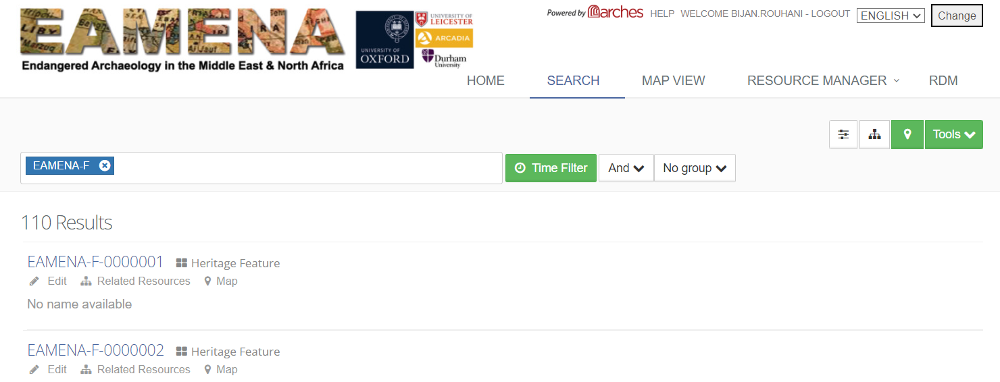

# levant.eamena.training
> http://levant.eamena.training/index.htm

## dataset_1

Stored in the [dataset_1](https://github.com/eamena-oxford/eamena-arches-dev/tree/main/dbs/levant.eamena.training/dataset_1) folder:

- The 20/10/22, this search: http://levant.eamena.training/search?page=1&termFilter=%5B%5B%7B%22inverted%22%3Afalse%2C%22type%22%3A%22string%22%2C%22context%22%3A%22%22%2C%22context_label%22%3A%22%22%2C%22id%22%3A%22EAMENA-F%22%2C%22text%22%3A%22EAMENA-F%22%2C%22value%22%3A%22EAMENA-F%22%7D%5D%5D&temporalFilter=%5B%7B%22year_min_max%22%3A%5B%5D%2C%22filters%22%3A%5B%5D%2C%22inverted%22%3Afalse%7D%5D&spatialFilter=%7B%22geometry%22%3A%7B%22type%22%3A%22%22%2C%22coordinates%22%3A%5B%5D%7D%2C%22buffer%22%3A%7B%22width%22%3A%220%22%2C%22unit%22%3A%22m%22%7D%2C%22inverted%22%3Afalse%7D&mapExpanded=false&timeExpanded=false&booleanSearch=and&searchRelatedResources=false&termFilterAndOr=%5B%22and%22%5D&termFilterCombineWithPrev=%5B%5Bfalse%5D%5D&termFilterGroup=%5B%22No%20group%22%5D&advancedSearch=false&include_ids=true, 110 HPs tagged `EAMENA-F`

