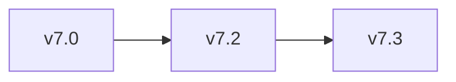
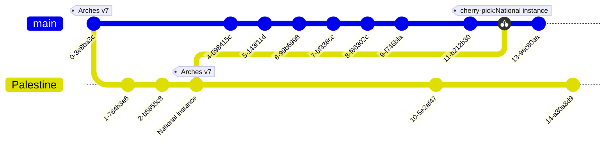
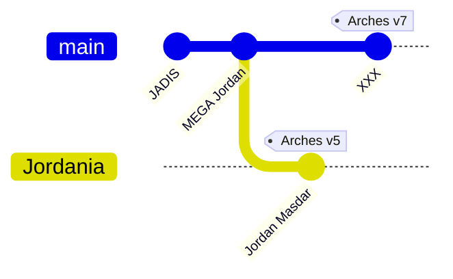
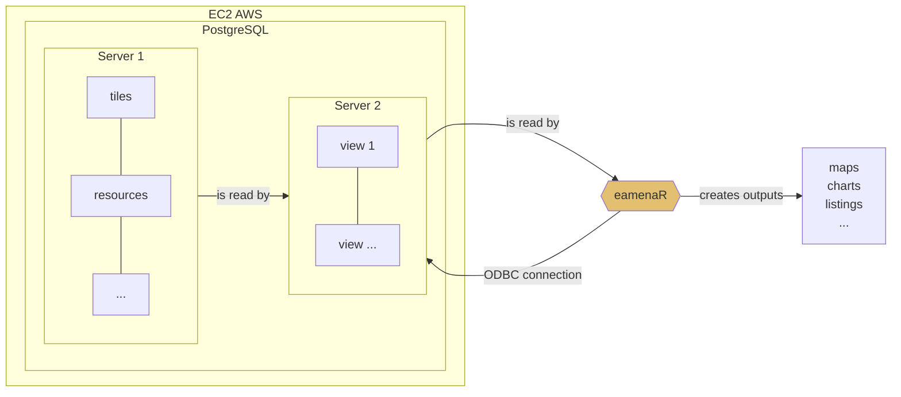

# Dev

## Arches v5.2 to v7.3 upgrade

### Proposed workflow
> cf. https://github.com/archesproject/arches/blob/dev/7.3.x/releases/7.3.0.md#upgrading-arches

## National instances
> [Git Mermaid diagram](https://mermaid.js.org/syntax/gitgraph.html) 

Example of a Palestinian national instance with EAMENA data

## From JADIS to a new Jordanian national instance
> [Git Mermaid diagram](https://mermaid.js.org/syntax/gitgraph.html) 

## PostgreSQL Views

Planning of Arches v7 (EAMENA v4) installation, test and release.

