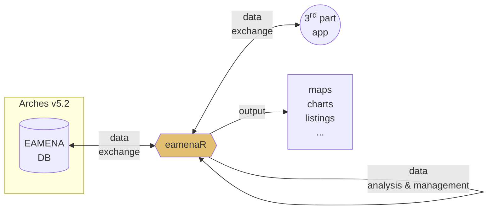

# Dev

## PostgreSQL Views

```mermaid
flowchart LR
    subgraph ide1 [Arches v5.2];
    A[(EAMENA<br>DB)];
    end;
    A <--data<br>exchange--> B{{eamenaR}}:::eamenaRpkg;
    B --data<br>analysis & management--> B;
    B <--data<br>exchange--> C((3<sup>rd</sup> part<br>app));
    B -- output--> D[maps<br>charts<br>listings<br>...];
    classDef eamenaRpkg fill:#e3c071;
```