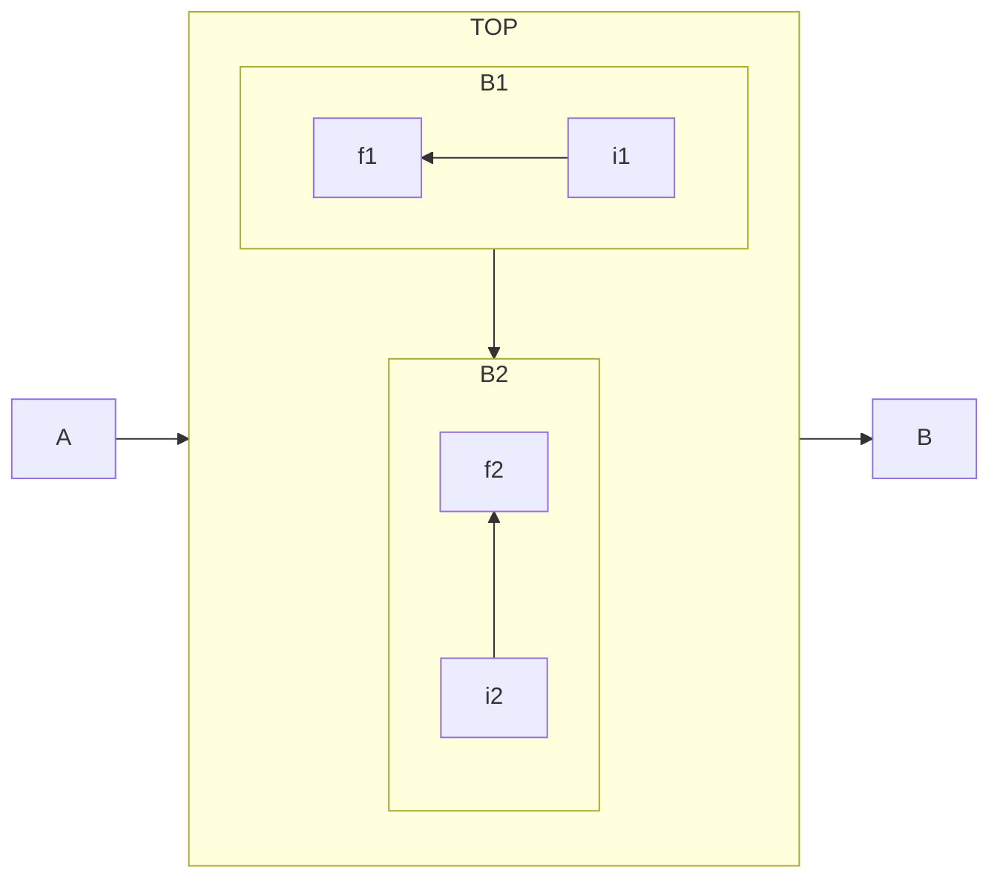
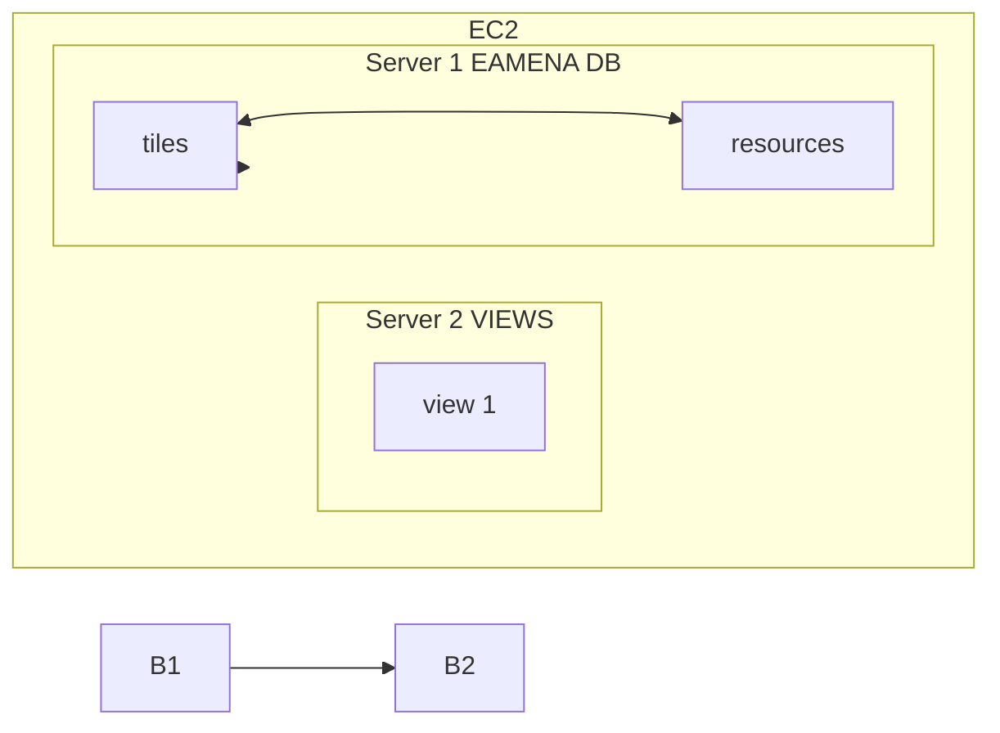
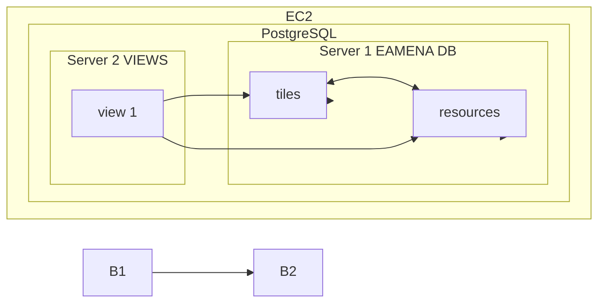

# Dev


## PostgreSQL Views








```mermaid
flowchart LR
  subgraph [EC2 on AWS]
    direction RL
    subgraph [PostgreSQL]
      direction RL
      subgraph [Server 1 is EAMENA]
        direction RL
          A[tiles]
          B[resources]
      end
      subgraph [Server 2]
        direction RL
          C[VIEWS]
      end
    end
```


```mermaid
flowchart LR
  subgraph EC2 [EC2 on AWS]
    subgraph PG [PostgreSQL]
      subgraph EA [Server 1 is EAMENA]
        A[tiles]
        B[resources]
      end
      subgraph VIEW [Server 2]
        C[VIEWS]
      end
  end
```